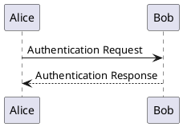
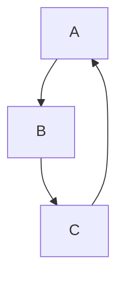

# Markdown記法 完全マスター教材 📝
## 初心者から超上級者まで最速キャッチアップ - GitHub・VS Code完全対応版

---

## 📚 目次
1. [基礎編：Markdownの世界へようこそ](#基礎編)
2. [初級編：基本記法をマスター](#初級編)
3. [中級編：実践的なテクニック](#中級編)
4. [上級編：プロレベルの応用技術](#上級編)
5. [実践編：現場で使える超実用テクニック](#実践編)
6. [プラットフォーム別対応表](#プラットフォーム別対応表)
7. [チートシート：いつでも使える早見表](#チートシート)
8. [トラブルシューティング：実戦対応版](#トラブルシューティング)

---

## 🌟 基礎編：Markdownの世界へようこそ

### Markdownとは？
Markdownは**軽量マークアップ言語**の革命的ツールです。HTMLの煩雑さを排除し、**読みやすく、書きやすく、管理しやすい**文書作成を実現します。GitHubでのREADME、技術文書、設計書まで、エンジニアの日常業務に欠かせない技術です。

### なぜMarkdownが重要なのか？
- **🚀 高速作成**: HTMLより10倍速く書ける
- **🔧 バージョン管理**: Gitで完璧に差分管理
- **🌍 プラットフォーム共通**: GitHub、GitLab、Notion、Slack等で共通記法
- **👀 可読性**: プレーンテキストでも十分読める
- **⚡ 変換性**: HTML、PDF、Wordに簡単変換

### 基本的な書き方の例
```markdown
# これは見出し1
## これは見出し2

**太字** と *斜体* と `コード`

- リスト項目1
- リスト項目2

[リンク](https://example.com)
```

### 🎯 学習の進め方
各コードブロックを**VS Code**や**Typora**等のMarkdownエディタでリアルタイムプレビューしながら実践してください。習うより慣れろが鉄則です。

---

## 🚀 初級編：基本記法をマスター

### 1. 見出し（Heading）- 文書構造の基本

#### ■ 基本的な見出し
```markdown
# 見出し1（h1） - ページタイトル用
## 見出し2（h2） - 大セクション用
### 見出し3（h3） - 中セクション用
#### 見出し4（h4） - 小セクション用
##### 見出し5（h5） - 詳細項目用
###### 見出し6（h6） - 最小見出し用
```

#### ■ 見出しのベストプラクティス
```markdown
# API設計書

## 1. 概要
### 1.1 目的
### 1.2 スコープ

## 2. 認証
### 2.1 JWT認証
### 2.2 APIキー認証

## 3. エンドポイント
### 3.1 ユーザー管理
#### 3.1.1 ユーザー作成
#### 3.1.2 ユーザー取得
```

### 2. テキスト装飾 - 情報の強調表現

#### ■ 基本的な装飾
```markdown
**太字（Bold）** - 重要な情報
*斜体（Italic）* - 補足的な情報
***太字斜体*** - 最重要情報
~~取り消し線~~ - 削除された情報
`インラインコード` - 変数名や関数名
```

**太字（Bold）** - 重要な情報  
*斜体（Italic）* - 補足的な情報  
***太字斜体*** - 最重要情報  
~~取り消し線~~ - 削除された情報  
`インラインコード` - 変数名や関数名

#### ■ 実践的な使用例
```markdown
**重要**: `API_KEY`環境変数の設定を*忘れずに*行ってください。
~~古いバージョン1.0は使用しないでください。~~

現在の推奨バージョン: ***v2.1.0以上***
```

### 3. リスト - 情報の整理整頓

#### ■ 順不同リスト（箇条書き）
```markdown
- メインアイテム1
  - サブアイテム1-1
  - サブアイテム1-2
    - さらに深いレベル
- メインアイテム2
- メインアイテム3

* アスタリスク記法も可能
+ プラス記法も可能
```

- メインアイテム1
  - サブアイテム1-1
  - サブアイテム1-2
    - さらに深いレベル
- メインアイテム2
- メインアイテム3

#### ■ 順序付きリスト（番号付き）
```markdown
1. 第一段階：要件定義
   1. ユーザーストーリー作成
   2. 受け入れ条件定義
2. 第二段階：設計
   1. アーキテクチャ設計
   2. データベース設計
3. 第三段階：実装
```

1. 第一段階：要件定義
   1. ユーザーストーリー作成
   2. 受け入れ条件定義
2. 第二段階：設計
   1. アーキテクチャ設計
   2. データベース設計
3. 第三段階：実装

#### ■ タスクリスト（GitHub拡張）
```markdown
- [x] 基本機能実装完了
- [x] 単体テスト作成
- [ ] 統合テスト実行
- [ ] ドキュメント更新
- [ ] コードレビュー
```

- [x] 基本機能実装完了
- [x] 単体テスト作成
- [ ] 統合テスト実行
- [ ] ドキュメント更新
- [ ] コードレビュー

### 4. リンク - 情報をつなぐ

#### ■ 基本的なリンク
```markdown
[GitHub](https://github.com)
[相対パスリンク](./docs/api.md)
[アンカーリンク](#見出しへのジャンプ)
```

#### ■ 参照スタイルリンク（管理しやすい）
```markdown
[GitHub][1]での開発フローについて[公式ドキュメント][2]を参照してください。

[1]: https://github.com
[2]: https://docs.github.com
```

#### ■ 自動リンク
```markdown
<https://github.com>
<user@example.com>
```

### 5. 画像 - ビジュアル情報の挿入

#### ■ 基本的な画像挿入
```markdown


```

#### ■ 画像サイズ調整（HTML記法併用）
```markdown

```

#### ■ 参照スタイル画像
```markdown
![アーキテクチャ図][architecture]

[architecture]: ./images/architecture.png "システムアーキテクチャ"
```

### 6. コードブロック - エンジニアの必須技能

#### ■ インラインコード
```markdown
`npm install`コマンドを実行してください。
```

#### ■ コードブロック
````markdown
```javascript
const express = require('express');
const app = express();

app.get('/api/users', (req, res) => {
  res.json({ users: [] });
});

app.listen(3000, () => {
  console.log('Server is running on port 3000');
});
```
````

```javascript
const express = require('express');
const app = express();

app.get('/api/users', (req, res) => {
  res.json({ users: [] });
});

app.listen(3000, () => {
  console.log('Server is running on port 3000');
});
```

#### ■ 言語別ハイライト例
````markdown
```python
def fibonacci(n):
    if n <= 1:
        return n
    return fibonacci(n-1) + fibonacci(n-2)
```

```sql
SELECT u.name, COUNT(o.id) as order_count
FROM users u
LEFT JOIN orders o ON u.id = o.user_id
GROUP BY u.id, u.name
ORDER BY order_count DESC;
```

```yaml
version: '3.8'
services:
  app:
    build: .
    ports:
      - "3000:3000"
    environment:
      - NODE_ENV=production
```
````

---

## 🎓 中級編：実践的なテクニック

### 1. テーブル - データの構造化表現

#### ■ 基本的なテーブル
```markdown
| 機能 | 状態 | 担当者 | 期限 |
|------|------|--------|------|
| ログイン機能 | 完了 | 田中 | 2024-06-01 |
| ユーザー管理 | 開発中 | 佐藤 | 2024-06-15 |
| 注文処理 | 未着手 | 鈴木 | 2024-06-30 |
```

| 機能 | 状態 | 担当者 | 期限 |
|------|------|--------|------|
| ログイン機能 | 完了 | 田中 | 2024-06-01 |
| ユーザー管理 | 開発中 | 佐藤 | 2024-06-15 |
| 注文処理 | 未着手 | 鈴木 | 2024-06-30 |

#### ■ 列の配置調整
```markdown
| 左寄せ | 中央寄せ | 右寄せ |
|:-------|:--------:|-------:|
| Left | Center | Right |
| データ1 | データ2 | データ3 |
```

| 左寄せ | 中央寄せ | 右寄せ |
|:-------|:--------:|-------:|
| Left | Center | Right |
| データ1 | データ2 | データ3 |

#### ■ 複雑なテーブル例（API仕様書）
```markdown
| エンドポイント | メソッド | 説明 | パラメータ | レスポンス |
|:--------------|:--------:|------|-----------|-----------|
| `/api/users` | GET | ユーザー一覧取得 | `page`, `limit` | `200 OK` |
| `/api/users/{id}` | GET | ユーザー詳細取得 | `id`: ユーザーID | `200 OK`, `404 Not Found` |
| `/api/users` | POST | ユーザー作成 | `name`, `email` | `201 Created`, `400 Bad Request` |
| `/api/users/{id}` | PUT | ユーザー更新 | `id`, `name`, `email` | `200 OK`, `404 Not Found` |
```

### 2. 引用 - 情報源の明示

#### ■ 基本的な引用
```markdown
> これは重要な引用文です。
> 複数行にわたって書くことも可能です。

> **注意**: この機能は実験的なものです。
```

> これは重要な引用文です。
> 複数行にわたって書くことも可能です。

> **注意**: この機能は実験的なものです。

#### ■ ネストした引用
```markdown
> 元の引用
>> 引用に対する引用
>>> さらに深い引用
```

> 元の引用
>> 引用に対する引用
>>> さらに深い引用

### 3. 水平線 - セクションの区切り

```markdown
---
***
___
```

---

### 4. 改行とスペース - レイアウトの制御

#### ■ 改行の種類
```markdown
通常の改行（段落分け）

行末に2つのスペース  
を入れると行内改行

HTML記法での改行<br>
も使用可能
```

通常の改行（段落分け）

行末に2つのスペース  
を入れると行内改行

HTML記法での改行<br>
も使用可能

### 5. エスケープ - 特殊文字の表示

```markdown
\*この文字は太字になりません\*
\[これはリンクになりません\]
\`これはコードになりません\`

バックスラッシュ自体を表示: \\
```

\*この文字は太字になりません\*  
\[これはリンクになりません\]  
\`これはコードになりません\`

### 6. 数式表記（GitHub拡張）

#### ■ インライン数式
```markdown
質量エネルギー等価性: $E = mc^2$
```

#### ■ ブロック数式
```markdown
$$
\sum_{i=1}^{n} x_i = x_1 + x_2 + \ldots + x_n
$$
```

---

## 🏆 上級編：プロレベルの応用技術

### 1. HTML記法との併用 - 柔軟性の極致

#### ■ 詳細情報の折りたたみ
```markdown
<details>
<summary>クリックして詳細を表示</summary>

ここに詳細な情報を記載します。
- 項目1
- 項目2
- 項目3

```javascript
console.log('コードも書けます');
```

</details>
```

<details>
<summary>クリックして詳細を表示</summary>

ここに詳細な情報を記載します。
- 項目1
- 項目2
- 項目3

```javascript
console.log('コードも書けます');
```

</details>

#### ■ カスタムスタイリング
```markdown
<div style="background-color: #f0f8ff; padding: 10px; border-left: 4px solid #007acc;">

**💡 Pro Tip**: この方法でカスタムボックスを作成できます

</div>
```

#### ■ キーボードショートカット表記
```markdown
<kbd>Ctrl</kbd> + <kbd>C</kbd> でコピー
<kbd>Cmd</kbd> + <kbd>V</kbd> で貼り付け
```

<kbd>Ctrl</kbd> + <kbd>C</kbd> でコピー  
<kbd>Cmd</kbd> + <kbd>V</kbd> で貼り付け

### 2. 絵文字活用法 - 可読性向上の秘技

#### ■ セクション分類用絵文字
```markdown
## 📋 計画フェーズ
## 🛠️ 開発フェーズ
## 🧪 テストフェーズ
## 🚀 デプロイフェーズ
## 📊 監視フェーズ

### ✅ 完了タスク
### ⏳ 進行中タスク
### ❌ 問題発生タスク
### 🔄 再試行中タスク
```

#### ■ 優先度・重要度表現
```markdown
🔥 **緊急**: 本番環境でエラー発生
⚠️ **警告**: パフォーマンス劣化を検知
💡 **提案**: 新機能アイディア
📝 **メモ**: 設計時の注意点
🎯 **目標**: 今四半期の達成目標
```

### 3. アンカーリンク - 文書内ナビゲーション

#### ■ 目次作成
```markdown
## 目次
- [概要](#概要)
- [インストール方法](#インストール方法)
- [使用方法](#使用方法)
- [トラブルシューティング](#トラブルシューティング)

## 概要
...

## インストール方法
...

## 使用方法
...

## トラブルシューティング
...
```

#### ■ カスタムアンカー
```markdown
<a name="custom-anchor"></a>
## カスタムアンカー付きセクション

[このセクションへのリンク](#custom-anchor)
```

### 4. メタデータとFrontmatter

#### ■ Jekyll/Hugo用Frontmatter
```markdown
---
title: "API設計書"
date: 2024-06-09
author: "開発チーム"
version: "1.0.0"
tags: ["API", "設計", "ドキュメント"]
---

# API設計書

本文がここから始まります...
```

### 5. 高度なコードブロック技法

#### ■ ファイル名付きコードブロック
````markdown
**`package.json`**
```json
{
  "name": "my-app",
  "version": "1.0.0",
  "scripts": {
    "start": "node server.js",
    "test": "jest"
  }
}
```
````

#### ■ 行番号とハイライト（GitHubサポート）
````markdown
```javascript {1,3-5}
const express = require('express'); // この行がハイライト
const app = express();
const port = process.env.PORT || 3000; // この行もハイライト
const router = express.Router(); // この行もハイライト
const middleware = require('./middleware'); // この行もハイライト

app.listen(port, () => {
  console.log(`Server running on port ${port}`);
});
```
````

#### ■ 差分表示
````markdown
```diff
const config = {
- baseURL: 'http://localhost:3000',
+ baseURL: process.env.API_BASE_URL || 'http://localhost:3000',
  timeout: 5000,
+ retries: 3
};
```
````

### 6. 複雑なテーブル技法

#### ■ テーブル内でのMarkdown使用
```markdown
| 機能 | 説明 | 実装状況 | 備考 |
|------|------|----------|------|
| **ユーザー認証** | JWT実装 | ✅ 完了 | [仕様書](./auth.md) |
| **API制限** | レート制限 | 🔄 実装中 | `express-rate-limit`使用 |
| **ログ出力** | 構造化ログ | ❌ 未実装 | *Winston*を予定 |
```

#### ■ テーブル内での改行
```markdown
| 項目 | 詳細説明 |
|------|----------|
| 要件 | 1. 高パフォーマンス<br>2. スケーラビリティ<br>3. セキュリティ |
| 制約 | ・予算上限: 100万円<br>・期限: 3ヶ月<br>・チーム: 5名 |
```

---

## 💼 実践編：現場で使える超実用テクニック

### 1. README.md テンプレート集

#### ■ プロジェクト用README.md
```markdown
# プロジェクト名

[](https://travis-ci.org/user/repo)
[](https://coveralls.io/github/user/repo?branch=main)
[](https://opensource.org/licenses/MIT)

## 📋 概要

簡潔なプロジェクト説明をここに記載します。

## 🚀 クイックスタート

### 前提条件
- Node.js 18.0.0以上
- npm 8.0.0以上

### インストール
```bash
# リポジトリのクローン
git clone https://github.com/user/repo.git
cd repo

# 依存関係のインストール
npm install

# 環境変数の設定
cp .env.example .env
```

### 実行
```bash
# 開発サーバー起動
npm run dev

# 本番環境ビルド
npm run build
```

## 📖 使用方法

基本的な使用方法の例：

```javascript
const MyApp = require('my-app');

const app = new MyApp({
  apiKey: 'your-api-key',
  debug: true
});

app.start();
```

## 🛠️ 開発

### ディレクトリ構造
```
project-root/
├── src/
│   ├── components/
│   ├── services/
│   └── utils/
├── tests/
├── docs/
└── package.json
```

### テスト実行
```bash
# 全テスト実行
npm test

# カバレッジ付きテスト
npm run test:coverage

# E2Eテスト
npm run test:e2e
```

## 📚 API ドキュメント

詳細なAPIドキュメントは[こちら](./docs/api.md)を参照してください。

## 🤝 コントリビューション

1. Forkする
2. Feature branchを作成 (`git checkout -b feature/AmazingFeature`)
3. 変更をコミット (`git commit -m 'Add some AmazingFeature'`)
4. Branchにプッシュ (`git push origin feature/AmazingFeature`)
5. Pull Requestを作成

## 📄 ライセンス

このプロジェクトは[MIT License](LICENSE)の下で配布されています。

## 👥 メンテナー

- [@username](https://github.com/username) - メインメンテナー
- [@contributor](https://github.com/contributor) - コントリビューター

## 🙏 謝辞

- [Library Name](https://example.com) - 重要な機能を提供
- [Another Tool](https://example.com) - 開発効率化に貢献
```

#### ■ ライブラリ・フレームワーク用README.md
```markdown
# 🔧 ライブラリ名

> 一行での簡潔な説明

## ✨ 特徴

- 🚀 高性能
- 📦 軽量（5KB gzipped）
- 🔧 設定不要
- 📱 レスポンシブ対応
- ♿ アクセシビリティ対応

## 📦 インストール

```bash
npm install library-name
# or
yarn add library-name
```

## 🔧 基本的な使用方法

### ES6 Modules
```javascript
import LibraryName from 'library-name';

const instance = new LibraryName({
  option1: 'value1',
  option2: true
});
```

### CommonJS
```javascript
const LibraryName = require('library-name');
```

### CDN
```html
<script src="https://unpkg.com/library-name@latest/dist/library-name.min.js"></script>
```

## 📋 API リファレンス

### コンストラクタ

#### `new LibraryName(options)`

| パラメータ | 型 | デフォルト | 説明 |
|-----------|----|-----------|----- |
| `option1` | `string` | `'default'` | オプション1の説明 |
| `option2` | `boolean` | `false` | オプション2の説明 |
| `option3` | `number` | `100` | オプション3の説明 |

### メソッド

#### `.start()`
ライブラリを開始します。

```javascript
instance.start();
```

#### `.stop()`
ライブラリを停止します。

```javascript
instance.stop();
```

#### `.configure(options)`
設定を更新します。

```javascript
instance.configure({
  option1: 'newValue'
});
```

### イベント

#### `ready`
初期化完了時に発火

```javascript
instance.on('ready', () => {
  console.log('Ready!');
});
```

#### `error`
エラー発生時に発火

```javascript
instance.on('error', (error) => {
  console.error('Error:', error);
});
```

## 🌐 ブラウザサポート

| Chrome | Firefox | Safari | Edge | IE |
|--------|---------|--------|------|----| 
| ✅ 60+ | ✅ 55+ | ✅ 12+ | ✅ 79+ | ❌ |

## 📊 パフォーマンス

| メトリック | 値 |
|-----------|-----|
| バンドルサイズ | 5KB (gzipped) |
| 初期化時間 | < 10ms |
| メモリ使用量 | < 1MB |

## 🔍 例

### 基本的な例
```javascript
const lib = new LibraryName();
lib.start();
```

### 高度な設定例
```javascript
const lib = new LibraryName({
  mode: 'advanced',
  callbacks: {
    onSuccess: (data) => console.log(data),
    onError: (error) => console.error(error)
  },
  advanced: {
    cacheSize: 1000,
    timeout: 5000
  }
});
```

## ❓ FAQ

<details>
<summary>Q: ライブラリが動作しない場合は？</summary>

A: 以下を確認してください：
1. 正しいバージョンを使用しているか
2. 必要な依存関係がインストールされているか
3. ブラウザがサポートされているか
</details>

<details>
<summary>Q: TypeScriptサポートはありますか？</summary>

A: はい、型定義ファイルが含まれています。
</details>

## 🛣️ ロードマップ

- [ ] v2.0.0 - 新しいAPIデザイン
- [ ] TypeScript完全サポート
- [ ] プラグインシステム
- [ ] SSRサポート

## 📄 ライセンス

[MIT](LICENSE) © [Your Name](https://github.com/yourusername)
```

### 2. API設計書テンプレート

```markdown
# 📡 API設計書

## 📋 概要

### API情報
- **Base URL**: `https://api.example.com/v1`
- **Authentication**: Bearer Token
- **Response Format**: JSON
- **API Version**: v1.0.0

### ステータスコード
| コード | 説明 |
|--------|------|
| 200 | 成功 |
| 201 | 作成成功 |
| 400 | リクエストエラー |
| 401 | 認証エラー |
| 403 | 権限エラー |
| 404 | リソース未発見 |
| 500 | サーバーエラー |

## 🔐 認証

### JWT認証
```bash
curl -H "Authorization: Bearer YOUR_JWT_TOKEN" \
     -H "Content-Type: application/json" \
     https://api.example.com/v1/users
```

### トークン取得
```http
POST /auth/login
Content-Type: application/json

{
  "email": "user@example.com",
  "password": "password"
}
```

**Response:**
```json
{
  "token": "eyJhbGciOiJIUzI1NiIsInR5cCI6IkpXVCJ9...",
  "expires_in": 3600,
  "user": {
    "id": 1,
    "email": "user@example.com",
    "name": "John Doe"
  }
}
```

## 👥 ユーザー管理

### ユーザー一覧取得

```http
GET /users?page=1&limit=10&sort=created_at&order=desc
```

**Parameters:**
| パラメータ | 型 | 必須 | デフォルト | 説明 |
|-----------|----|----|-----------|------|
| `page` | integer | ❌ | 1 | ページ番号 |
| `limit` | integer | ❌ | 20 | 1ページあたりの件数 |
| `sort` | string | ❌ | id | ソートフィールド |
| `order` | string | ❌ | asc | ソート順（asc/desc） |

**Response:**
```json
{
  "data": [
    {
      "id": 1,
      "name": "John Doe",
      "email": "john@example.com",
      "created_at": "2024-06-09T10:00:00Z",
      "updated_at": "2024-06-09T10:00:00Z"
    }
  ],
  "meta": {
    "page": 1,
    "limit": 10,
    "total": 100,
    "total_pages": 10
  }
}
```

### ユーザー詳細取得

```http
GET /users/{id}
```

**Path Parameters:**
| パラメータ | 型 | 説明 |
|-----------|----|----- |
| `id` | integer | ユーザーID |

**Response:**
```json
{
  "id": 1,
  "name": "John Doe",
  "email": "john@example.com",
  "profile": {
    "bio": "Software Engineer",
    "avatar_url": "https://example.com/avatar.jpg"
  },
  "created_at": "2024-06-09T10:00:00Z",
  "updated_at": "2024-06-09T10:00:00Z"
}
```

### ユーザー作成

```http
POST /users
Content-Type: application/json

{
  "name": "Jane Doe",
  "email": "jane@example.com",
  "password": "secure_password"
}
```

**Request Body:**
| フィールド | 型 | 必須 | 説明 |
|-----------|----|----|------|
| `name` | string | ✅ | ユーザー名（3-50文字） |
| `email` | string | ✅ | メールアドレス |
| `password` | string | ✅ | パスワード（8文字以上） |

**Response:**
```json
{
  "id": 2,
  "name": "Jane Doe",
  "email": "jane@example.com",
  "created_at": "2024-06-09T10:00:00Z"
}
```

**Error Response:**
```json
{
  "error": "Validation Error",
  "message": "The given data was invalid.",
  "errors": {
    "email": ["The email has already been taken."],
    "password": ["The password must be at least 8 characters."]
  }
}
```

## 📝 共通レスポンス形式

### 成功レスポンス
```json
{
  "data": {},
  "meta": {},
  "links": {}
}
```

### エラーレスポンス
```json
{
  "error": "Error Type",
  "message": "Human readable message",
  "code": "ERROR_CODE",
  "details": {}
}
```

## 🔍 フィルタリング・検索

### クエリパラメータ
```http
GET /users?filter[name]=John&filter[status]=active&search=engineer
```

### 使用可能なフィルタ
| フィルタ | 説明 | 例 |
|---------|------|-----|
| `filter[name]` | 名前で部分一致 | `filter[name]=John` |
| `filter[status]` | ステータスで完全一致 | `filter[status]=active` |
| `filter[created_at]` | 作成日で範囲指定 | `filter[created_at]=2024-01-01,2024-12-31` |
| `search` | 全文検索 | `search=engineer` |

## 📊 レート制限

| 認証レベル | リクエスト数 | 期間 |
|-----------|------------|------|
| 未認証 | 100 | 1時間 |
| 認証済み | 1000 | 1時間 |
| プレミアム | 10000 | 1時間 |

**レスポンスヘッダー:**
```
X-RateLimit-Limit: 1000
X-RateLimit-Remaining: 999
X-RateLimit-Reset: 1640995200
```

## 🧪 テスト用データ

### テストユーザー
```json
{
  "id": 999,
  "name": "Test User",
  "email": "test@example.com",
  "token": "test_token_12345"
}
```

### Postmanコレクション
[📥 Postmanコレクションをダウンロード](./postman/api-collection.json)

## 📚 SDK・ライブラリ

| 言語 | ライブラリ | リンク |
|------|-----------|--------|
| JavaScript | api-client-js | [npm](https://npmjs.com/package/api-client-js) |
| Python | api-client-py | [PyPI](https://pypi.org/project/api-client-py/) |
| PHP | api-client-php | [Packagist](https://packagist.org/packages/api-client-php) |

## 🔄 変更履歴

### v1.0.0 (2024-06-09)
- ✨ 初版リリース
- 👥 ユーザー管理API
- 🔐 JWT認証

### v1.1.0 (予定)
- 📁 ファイルアップロードAPI
- 🔍 高度な検索機能
- 📊 分析API
```

### 3. 技術仕様書テンプレート

```markdown
# 🏗️ システム技術仕様書

## 📋 文書情報

| 項目 | 内容 |
|------|------|
| **文書名** | ○○システム技術仕様書 |
| **バージョン** | 1.0.0 |
| **作成日** | 2024-06-09 |
| **最終更新** | 2024-06-09 |
| **承認者** | 技術リーダー |
| **ステータス** | 確定 |

## 🎯 概要

### システム概要
本システムは○○を目的とした○○システムです。

### 対象読者
- 開発チーム
- インフラエンジニア
- プロジェクトマネージャー

## 🏛️ システムアーキテクチャ

### 全体構成
```
┌─────────────────┐    ┌─────────────────┐    ┌─────────────────┐
│   Frontend      │    │   Backend       │    │   Database      │
│   React App     │◄──►│   Node.js API   │◄──►│   PostgreSQL    │
│   Port: 3000    │    │   Port: 8080    │    │   Port: 5432    │
└─────────────────┘    └─────────────────┘    └─────────────────┘
          │                        │                        │
          ▼                        ▼                        ▼
┌─────────────────┐    ┌─────────────────┐    ┌─────────────────┐
│   CDN           │    │   Load Balancer │    │   Redis Cache   │
│   CloudFront    │    │   Application   │    │   Port: 6379    │
│                 │    │   Load Balancer │    │                 │
└─────────────────┘    └─────────────────┘    └─────────────────┘
```

### 技術スタック

#### フロントエンド
| 技術 | バージョン | 用途 |
|------|-----------|------|
| React | 18.2.0 | UIフレームワーク |
| TypeScript | 5.0.0 | 型安全性 |
| Vite | 4.3.0 | ビルドツール |
| Tailwind CSS | 3.3.0 | スタイリング |
| React Router | 6.11.0 | ルーティング |
| React Query | 4.29.0 | データフェッチ |

#### バックエンド
| 技術 | バージョン | 用途 |
|------|-----------|------|
| Node.js | 18.16.0 | ランタイム |
| Express.js | 4.18.0 | Webフレームワーク |
| TypeScript | 5.0.0 | 型安全性 |
| Prisma | 4.15.0 | ORM |
| JWT | 9.0.0 | 認証 |
| Jest | 29.5.0 | テストフレームワーク |

#### インフラ
| 技術 | バージョン | 用途 |
|------|-----------|------|
| AWS ECS | - | コンテナオーケストレーション |
| AWS RDS | PostgreSQL 15 | データベース |
| AWS ElastiCache | Redis 7.0 | キャッシュ |
| AWS CloudFront | - | CDN |
| AWS ALB | - | ロードバランサー |
| Docker | 24.0.0 | コンテナ化 |

## 🗄️ データベース設計

### ER図
```
┌─────────────────┐    ┌─────────────────┐    ┌─────────────────┐
│      Users      │    │      Posts      │    │    Comments     │
├─────────────────┤    ├─────────────────┤    ├─────────────────┤
│ id (PK)         │◄──┐│ id (PK)         │◄──┐│ id (PK)         │
│ email (UNIQUE)  │   ││ user_id (FK)    │   ││ post_id (FK)    │
│ password_hash   │   ││ title           │   ││ user_id (FK)    │
│ name            │   ││ content         │   ││ content         │
│ created_at      │   ││ published_at    │   ││ created_at      │
│ updated_at      │   ││ created_at      │   ││ updated_at      │
└─────────────────┘   │└─────────────────┘   │└─────────────────┘
                      │                      │
                      └──────────────────────┘
```

### テーブル定義

#### users テーブル
```sql
CREATE TABLE users (
    id SERIAL PRIMARY KEY,
    email VARCHAR(255) UNIQUE NOT NULL,
    password_hash VARCHAR(255) NOT NULL,
    name VARCHAR(100) NOT NULL,
    created_at TIMESTAMP DEFAULT CURRENT_TIMESTAMP,
    updated_at TIMESTAMP DEFAULT CURRENT_TIMESTAMP
);

CREATE INDEX idx_users_email ON users(email);
CREATE INDEX idx_users_created_at ON users(created_at);
```

#### posts テーブル
```sql
CREATE TABLE posts (
    id SERIAL PRIMARY KEY,
    user_id INTEGER REFERENCES users(id) ON DELETE CASCADE,
    title VARCHAR(255) NOT NULL,
    content TEXT NOT NULL,
    published_at TIMESTAMP,
    created_at TIMESTAMP DEFAULT CURRENT_TIMESTAMP,
    updated_at TIMESTAMP DEFAULT CURRENT_TIMESTAMP
);

CREATE INDEX idx_posts_user_id ON posts(user_id);
CREATE INDEX idx_posts_published_at ON posts(published_at);
```

## 🔧 API設計

### RESTful設計原則
- リソース指向のURL設計
- HTTPメソッドの適切な使用
- ステータスコードの統一
- JSON形式でのデータ交換

### エンドポイント一覧
| メソッド | エンドポイント | 説明 | 認証 |
|---------|---------------|------|------|
| GET | `/api/health` | ヘルスチェック | ❌ |
| POST | `/api/auth/login` | ログイン | ❌ |
| POST | `/api/auth/register` | ユーザー登録 | ❌ |
| GET | `/api/users/me` | 自分の情報取得 | ✅ |
| GET | `/api/posts` | 投稿一覧取得 | ❌ |
| POST | `/api/posts` | 投稿作成 | ✅ |
| GET | `/api/posts/:id` | 投稿詳細取得 | ❌ |
| PUT | `/api/posts/:id` | 投稿更新 | ✅ |
| DELETE | `/api/posts/:id` | 投稿削除 | ✅ |

## 🔐 セキュリティ

### 認証・認可
- **JWT Bearer Token**: APIアクセス制御
- **Password Hashing**: bcrypt（ラウンド数: 12）
- **HTTPS**: 全通信の暗号化
- **CORS**: オリジン制限

### セキュリティヘッダー
```javascript
app.use(helmet({
  contentSecurityPolicy: {
    directives: {
      defaultSrc: ["'self'"],
      styleSrc: ["'self'", "'unsafe-inline'"],
      scriptSrc: ["'self'"],
      imgSrc: ["'self'", "data:", "https:"]
    }
  },
  hsts: {
    maxAge: 31536000,
    includeSubDomains: true,
    preload: true
  }
}));
```

### 入力値検証
```javascript
const userSchema = Joi.object({
  email: Joi.string().email().required(),
  password: Joi.string().min(8).required(),
  name: Joi.string().min(2).max(50).required()
});
```

## 📊 パフォーマンス要件

### レスポンス時間
| 操作 | 目標 | 最大許容 |
|------|------|----------|
| ページ読み込み | < 2秒 | < 5秒 |
| API応答 | < 500ms | < 2秒 |
| データベースクエリ | < 100ms | < 500ms |

### スループット
| メトリック | 目標値 |
|-----------|--------|
| 同時ユーザー数 | 1,000人 |
| API リクエスト/秒 | 500 RPS |
| データベース接続数 | 100 |

### キャッシュ戦略
```javascript
// Redis設定
const redis = new Redis({
  host: process.env.REDIS_HOST,
  port: process.env.REDIS_PORT,
  retryDelayOnFailover: 100,
  lazyConnect: true
});

// キャッシュヘルパー
async function getWithCache(key, fetchFunction, ttl = 3600) {
  const cached = await redis.get(key);
  if (cached) return JSON.parse(cached);
  
  const data = await fetchFunction();
  await redis.setex(key, ttl, JSON.stringify(data));
  return data;
}
```

## 🚀 デプロイ・運用

### Docker設定

#### Dockerfile
```dockerfile
FROM node:18-alpine AS builder

WORKDIR /app
COPY package*.json ./
RUN npm ci --only=production

FROM node:18-alpine AS runtime

RUN addgroup -g 1001 -S nodejs
RUN adduser -S nextjs -u 1001

WORKDIR /app
COPY --from=builder /app/node_modules ./node_modules
COPY . .

USER nextjs
EXPOSE 3000

CMD ["npm", "start"]
```

#### docker-compose.yml
```yaml
version: '3.8'
services:
  app:
    build: .
    ports:
      - "3000:3000"
    environment:
      - NODE_ENV=production
      - DATABASE_URL=postgresql://user:pass@db:5432/mydb
    depends_on:
      - db
      - redis

  db:
    image: postgres:15-alpine
    environment:
      POSTGRES_DB: mydb
      POSTGRES_USER: user
      POSTGRES_PASSWORD: pass
    volumes:
      - db_data:/var/lib/postgresql/data

  redis:
    image: redis:7-alpine
    command: redis-server --appendonly yes
    volumes:
      - redis_data:/data

volumes:
  db_data:
  redis_data:
```

### CI/CD パイプライン

#### GitHub Actions
```yaml
name: CI/CD Pipeline

on:
  push:
    branches: [main, develop]
  pull_request:
    branches: [main]

jobs:
  test:
    runs-on: ubuntu-latest
    steps:
      - uses: actions/checkout@v3
      - uses: actions/setup-node@v3
        with:
          node-version: '18'
          cache: 'npm'
      
      - run: npm ci
      - run: npm run lint
      - run: npm run test:coverage
      - run: npm run build
      
      - name: Upload coverage to Codecov
        uses: codecov/codecov-action@v3

  deploy:
    needs: test
    runs-on: ubuntu-latest
    if: github.ref == 'refs/heads/main'
    steps:
      - uses: actions/checkout@v3
      
      - name: Configure AWS credentials
        uses: aws-actions/configure-aws-credentials@v2
        with:
          aws-access-key-id: ${{ secrets.AWS_ACCESS_KEY_ID }}
          aws-secret-access-key: ${{ secrets.AWS_SECRET_ACCESS_KEY }}
          aws-region: ap-northeast-1
      
      - name: Deploy to ECS
        run: |
          aws ecs update-service \
            --cluster production \
            --service my-app \
            --force-new-deployment
```

## 📈 監視・ログ

### メトリクス監視
```javascript
const prometheus = require('prom-client');

// カスタムメトリクス
const httpRequestDuration = new prometheus.Histogram({
  name: 'http_request_duration_seconds',
  help: 'Duration of HTTP requests in seconds',
  labelNames: ['method', 'route', 'status_code']
});

const activeConnections = new prometheus.Gauge({
  name: 'active_connections',
  help: 'Number of active connections'
});
```

### ログ設定
```javascript
const winston = require('winston');

const logger = winston.createLogger({
  level: 'info',
  format: winston.format.combine(
    winston.format.timestamp(),
    winston.format.errors({ stack: true }),
    winston.format.json()
  ),
  transports: [
    new winston.transports.File({ filename: 'error.log', level: 'error' }),
    new winston.transports.File({ filename: 'combined.log' }),
    new winston.transports.Console({
      format: winston.format.simple()
    })
  ]
});
```

## 🧪 テスト戦略

### テストピラミッド
```
        /\
       /  \
      /E2E \     ← 少数の重要なユーザーフロー
     /Tests\
    /______\
   /        \
  /Integration\   ← API、DB連携テスト
 /   Tests     \
/______________\
/              \
/  Unit Tests   \  ← 大部分（80%以上）
/________________\
```

### テスト設定

#### Jest設定（jest.config.js）
```javascript
module.exports = {
  preset: 'ts-jest',
  testEnvironment: 'node',
  roots: ['<rootDir>/src'],
  testMatch: ['**/__tests__/**/*.test.ts'],
  collectCoverageFrom: [
    'src/**/*.ts',
    '!src/**/*.d.ts',
    '!src/types/**/*'
  ],
  coverageThreshold: {
    global: {
      branches: 80,
      functions: 80,
      lines: 80,
      statements: 80
    }
  }
};
```

#### 単体テスト例
```javascript
describe('UserService', () => {
  let userService: UserService;
  let mockUserRepository: jest.Mocked<UserRepository>;

  beforeEach(() => {
    mockUserRepository = {
      create: jest.fn(),
      findById: jest.fn(),
      findByEmail: jest.fn()
    } as any;
    
    userService = new UserService(mockUserRepository);
  });

  describe('createUser', () => {
    it('should create user successfully', async () => {
      // Arrange
      const userData = {
        email: 'test@example.com',
        password: 'password123',
        name: 'Test User'
      };
      
      const expectedUser = { id: 1, ...userData };
      mockUserRepository.create.mockResolvedValue(expectedUser);

      // Act
      const result = await userService.createUser(userData);

      // Assert
      expect(result).toEqual(expectedUser);
      expect(mockUserRepository.create).toHaveBeenCalledWith(userData);
    });
  });
});
```

## 🚨 エラーハンドリング

### エラー分類
| レベル | 説明 | 対応 |
|--------|------|------|
| **Fatal** | システム停止レベル | 即座にアラート、緊急対応 |
| **Error** | 機能不全 | ログ記録、監視チーム通知 |
| **Warning** | 潜在的問題 | ログ記録、定期確認 |
| **Info** | 一般情報 | ログ記録のみ |

### エラーレスポンス形式
```javascript
class AppError extends Error {
  constructor(
    public message: string,
    public statusCode: number,
    public code: string,
    public isOperational = true
  ) {
    super(message);
    Object.setPrototypeOf(this, AppError.prototype);
  }
}

// エラーハンドラー
app.use((error: AppError, req: Request, res: Response, next: NextFunction) => {
  logger.error({
    error: error.message,
    stack: error.stack,
    url: req.url,
    method: req.method,
    ip: req.ip
  });

  res.status(error.statusCode || 500).json({
    error: error.message,
    code: error.code,
    timestamp: new Date().toISOString(),
    path: req.path
  });
});
```

## 📋 運用チェックリスト

### デプロイ前チェック
- [ ] 全テストが成功している
- [ ] セキュリティスキャンを実行済み
- [ ] パフォーマンステストを実行済み
- [ ] データベースマイグレーションが準備済み
- [ ] 環境変数が正しく設定されている
- [ ] ロールバック手順が確認済み

### 本番リリース後チェック
- [ ] アプリケーションが正常に起動している
- [ ] ヘルスチェックが成功している
- [ ] 主要機能が動作している
- [ ] ログが正常に出力されている
- [ ] メトリクスが正常に収集されている
- [ ] アラートが正常に動作している
```

### 4. チーム開発用ドキュメントテンプレート

```markdown
# 👥 開発チームガイド

## 📋 プロジェクト情報

| 項目 | 内容 |
|------|------|
| **プロジェクト名** | ○○システム |
| **開発期間** | 2024年6月〜2024年12月 |
| **チームサイズ** | 8名 |
| **スクラムマスター** | 田中太郎 |
| **プロダクトオーナー** | 佐藤花子 |

## 🎯 プロジェクト概要

### ビジョン
○○を通じて、○○な価値を提供する

### 目標
- 📈 ユーザー数: 10,000人
- ⚡ ページ表示速度: 2秒以内
- 💯 品質: バグ報告率 1%以下
- 🚀 リリース: 2024年12月末

## 👨‍💻 チームメンバー

| 名前 | 役割 | 専門分野 | GitHub | Slack |
|------|------|----------|--------|-------|
| 田中太郎 | Tech Lead | Backend, DevOps | @tanaka | @tanaka.taro |
| 佐藤花子 | PO | Product, UX | @sato | @sato.hanako |
| 鈴木次郎 | Frontend | React, TypeScript | @suzuki | @suzuki.jiro |
| 高橋三郎 | Backend | Node.js, DB | @takahashi | @takahashi.saburo |
| 渡辺四郎 | QA | Test, Automation | @watanabe | @watanabe.shiro |
| 伊藤五郎 | Designer | UI/UX | @ito | @ito.goro |

## 🛠️ 開発環境

### 必要ツール
- [ ] **Git**: バージョン管理
- [ ] **Node.js 18+**: ランタイム
- [ ] **VS Code**: 推奨エディタ
- [ ] **Docker**: コンテナ環境
- [ ] **Postman**: API テスト

### VS Code拡張機能
```json
{
  "recommendations": [
    "ms-vscode.vscode-typescript-next",
    "bradlc.vscode-tailwindcss",
    "esbenp.prettier-vscode",
    "ms-vscode.vscode-eslint",
    "ms-playwright.playwright",
    "ms-vscode-remote.remote-containers"
  ]
}
```

### セットアップ手順
```bash
# 1. リポジトリクローン
git clone https://github.com/company/project.git
cd project

# 2. 依存関係インストール
npm install

# 3. 環境変数設定
cp .env.example .env.local
# .env.localを編集

# 4. データベースセットアップ
npm run db:setup

# 5. 開発サーバー起動
npm run dev
```

## 🔄 開発フロー

### Git フロー
```
main (本番)
 ↑
develop (開発)
 ↑
feature/xxx (機能開発)
```

### ブランチ命名規則
- `feature/LOGIN-123-user-authentication` - 新機能
- `bugfix/LOGIN-456-password-validation` - バグ修正
- `hotfix/URGENT-789-security-patch` - 緊急修正
- `refactor/improve-user-service` - リファクタリング

### コミットメッセージ規則
```
<type>(<scope>): <description>

[optional body]

[optional footer]
```

**例:**
```
feat(auth): add JWT token validation

Implement middleware to validate JWT tokens for protected routes.
- Add token verification logic
- Handle expired tokens
- Return appropriate error responses

Closes #123
```

**Type一覧:**
- `feat`: 新機能
- `fix`: バグ修正
- `docs`: ドキュメント
- `style`: コードフォーマット
- `refactor`: リファクタリング
- `test`: テスト
- `chore`: その他

### プルリクエスト手順

#### 1. 事前準備
```bash
# developから最新を取得
git checkout develop
git pull origin develop

# 新しいbranchを作成
git checkout -b feature/LOGIN-123-user-authentication
```

#### 2. 開発・テスト
```bash
# 開発
# ...コード書く

# テスト実行
npm run test
npm run lint
npm run type-check

# コミット
git add .
git commit -m "feat(auth): add user authentication"
```

#### 3. プルリクエスト作成
```bash
# プッシュ
git push origin feature/LOGIN-123-user-authentication

# GitHub上でPR作成
```

#### 4. PRテンプレート
```markdown
## 📋 概要
この変更の概要を記載

## 🎯 関連Issue
Closes #123

## 🔧 変更内容
- [ ] 機能A を追加
- [ ] バグB を修正
- [ ] テストC を追加

## 📸 スクリーンショット
（UI変更がある場合）

## ✅ テスト
- [ ] 単体テスト
- [ ] 統合テスト
- [ ] 手動テスト

## 📝 レビューポイント
特に確認してほしい点を記載

## 🚨 破壊的変更
（ある場合のみ）
```

## 📅 スクラム運用

### スプリント概要
- **期間**: 2週間
- **開始**: 毎週月曜日 10:00
- **終了**: 翌々週金曜日 17:00

### 定例会議

#### デイリースクラム（毎日 9:00-9:15）
**フォーマット:**
1. 昨日やったこと
2. 今日やること  
3. 困っていること・ブロッカー

#### スプリントプランニング（月曜日 10:00-12:00）
**アジェンダ:**
1. 前スプリント振り返り
2. 今スプリント目標設定
3. タスク見積もり・アサイン
4. スプリントバックログ確定

#### スプリントレビュー（金曜日 15:00-16:00）
**内容:**
- デモンストレーション
- ステークホルダーフィードバック
- 完了・未完了の確認

#### レトロスペクティブ（金曜日 16:00-17:00）
**フォーマット（KPT）:**
- **Keep**: 続けること
- **Problem**: 問題・課題
- **Try**: 次に試すこと

### タスク管理

#### ストーリーポイント見積もり
| ポイント | 目安時間 | 説明 |
|---------|----------|------|
| 1 | 1-2時間 | 簡単なタスク |
| 2 | 半日 | 小さなタスク |
| 3 | 1日 | 標準的なタスク |
| 5 | 2-3日 | 中程度のタスク |
| 8 | 1週間 | 大きなタスク |
| 13 | 2週間+ | 分割が必要 |

#### ユーザーストーリー書き方
```
As a [ユーザータイプ]
I want [機能・目標]
So that [価値・理由]

受け入れ条件:
- [ ] 条件1
- [ ] 条件2
- [ ] 条件3
```

**例:**
```
As a ログインユーザー
I want メールアドレスとパスワードでログインしたい
So that 個人データにアクセスできる

受け入れ条件:
- [ ] 正しい認証情報でログイン成功
- [ ] 間違った認証情報でエラー表示
- [ ] ログイン状態が保持される
- [ ] ログアウト機能が動作する
```

## 🧪 品質管理

### コード品質基準
- **テストカバレッジ**: 80%以上
- **TypeScript**: 必須（anyは原則禁止）
- **ESLint**: エラー0、警告最小限
- **Prettier**: 自動フォーマット
- **コードレビュー**: 必須（最低1名承認）

### テスト戦略
```
E2E Tests (5%)      ← 重要ユーザーフロー
     ↑
Integration (15%)   ← API・コンポーネント結合
     ↑  
Unit Tests (80%)    ← 関数・メソッド単位
```

### 定義完了（Definition of Done）
- [ ] 機能が完全に実装されている
- [ ] 単体テストが書かれている
- [ ] コードレビューが完了している
- [ ] ドキュメントが更新されている
- [ ] デザインチェックが完了している
- [ ] QAテストが完了している
- [ ] ステージング環境で動作確認済み

## 📞 コミュニケーション

### Slack チャンネル
| チャンネル | 用途 |
|-----------|------|
| `#general` | 一般的な連絡 |
| `#dev-frontend` | フロントエンド開発 |
| `#dev-backend` | バックエンド開発 |
| `#qa-testing` | QA・テスト関連 |
| `#design` | デザイン関連 |
| `#alerts` | システムアラート |
| `#random` | 雑談 |

### 連絡ルール
- **緊急時**: 電話・Slack DM
- **通常時**: 該当チャンネル
- **長期休暇**: 事前にチームに連絡
- **遅刻・早退**: デイリースクラム前に連絡

### ドキュメント管理
| 種類 | 場所 | 更新頻度 |
|------|------|----------|
| 技術仕様 | GitHub Wiki | 機能追加時 |
| API仕様 | Swagger/OpenAPI | 毎リリース |
| デザイン | Figma | 随時 |
| 議事録 | Notion | 会議後24時間以内 |

## 🚀 リリース管理

### リリースサイクル
- **メジャーリリース**: 3ヶ月毎
- **マイナーリリース**: 2週間毎
- **パッチリリース**: 緊急時

### リリース手順
1. **コードフリーズ** (リリース3日前)
2. **QAテスト** (2日間)
3. **ステージング検証** (1日間)
4. **本番デプロイ** (決められた時間)
5. **本番動作確認** (デプロイ後1時間)

### ロールバック手順
```bash
# 緊急時のロールバック
kubectl rollout undo deployment/app --to-revision=2

# データベースロールバック（慎重に！）
npm run db:rollback
```

## 📚 学習・成長

### 技術学習
- **読書会**: 月1回（技術書）
- **LT大会**: 月1回（15分発表）
- **外部勉強会**: 参加推奨・費用補助あり
- **資格取得**: 支援制度あり

### 推奨学習リソース
#### 書籍
- 📖 リーダブルコード
- 📖 Clean Architecture
- 📖 Effective TypeScript
- 📖 システム設計の面接試験

#### オンライン
- 🌐 Udemy
- 🌐 Pluralsight  
- 🌐 Frontend Masters
- 🌐 LeetCode（アルゴリズム）

## 🔧 トラブルシューティング

### よくある問題

#### 開発環境
<details>
<summary>npm install が失敗する</summary>

```bash
# node_modules削除
rm -rf node_modules package-lock.json

# キャッシュクリア
npm cache clean --force

# 再インストール
npm install
```
</details>

<details>
<summary>Dockerコンテナが起動しない</summary>

```bash
# コンテナ・イメージ削除
docker-compose down
docker system prune -a

# 再ビルド
docker-compose up --build
```
</details>

#### Git操作
<details>
<summary>コンフリクト解決</summary>

```bash
# 現在の状態確認
git status

# ファイル編集してコンフリクト解決
# <<<<<<< ======= >>>>>>> を削除

# 解決後
git add .
git commit -m "resolve conflict"
```
</details>

### 緊急連絡先
| 担当 | 平日 | 夜間・休日 |
|------|------|-----------|
| **Tech Lead** | Slack DM | 電話 |
| **DevOps** | Slack DM | 電話 |
| **PO** | Slack DM | メール |

## 📝 新メンバーオンボーディング

### 初日
- [ ] アカウント設定（GitHub, Slack, AWS等）
- [ ] 開発環境セットアップ
- [ ] チーム紹介・役割説明
- [ ] プロジェクト概要説明

### 1週目
- [ ] コードベース理解
- [ ] 簡単なタスクアサイン
- [ ] メンタリング開始
- [ ] 定例会議参加

### 1ヶ月目
- [ ] 本格的な開発参加
- [ ] コードレビュー実施
- [ ] フィードバック・改善点整理

## 🏆 チーム文化・価値観

### 大切にしていること
- 🤝 **相互尊重**: 多様な意見を歓迎
- 🎯 **品質重視**: 妥協しない品質
- 📈 **継続改善**: 常により良い方法を模索
- 🚀 **スピード**: 迅速な意思決定と実行
- 🎉 **失敗を恐れない**: 失敗から学ぶ文化

### チームルール
- 定時に帰る（残業は例外的）
- 困ったときは遠慮なく相談
- 新しいことにチャレンジを推奨
- コードレビューは建設的に
- 成功も失敗もチーム全体で共有

---

**Happy Coding! 🚀**
```

---

## 📊 プラットフォーム別対応表

### 主要プラットフォーム対応状況

| 記法 | GitHub | GitLab | Bitbucket | Notion | Slack | Discord |
|------|--------|--------|-----------|--------|-------|---------|
| **基本記法** | ✅ | ✅ | ✅ | ✅ | ✅ | ✅ |
| **テーブル** | ✅ | ✅ | ✅ | ✅ | ❌ | ❌ |
| **タスクリスト** | ✅ | ✅ | ✅ | ✅ | ❌ | ❌ |
| **数式** | ✅ | ✅ | ❌ | ✅ | ❌ | ❌ |
| **Mermaid** | ✅ | ✅ | ❌ | ❌ | ❌ | ❌ |
| **HTML** | ✅ | ✅ | ⚠️ | ⚠️ | ❌ | ❌ |
| **絵文字** | ✅ | ✅ | ✅ | ✅ | ✅ | ✅ |

**凡例:**
- ✅ 完全サポート
- ⚠️ 部分サポート  
- ❌ 未サポート

### プラットフォーム固有機能

#### GitHub拡張
```markdown
```suggestion
console.log('Hello World');
```

@username #123 SHA: a5c3785ed8d6a35868bc169f07e40e889087fd2e

:+1: :shipit: :octocat:
```

#### GitLab拡張
```markdown



```

#### Notion拡張
```markdown
# カラムレイアウト
:::{.column}
左カラム内容
:::

:::{.column}
右カラム内容
:::

// データベース埋め込み
/database [database-id]

// カレンダー埋め込み
/calendar
```

---

## 📋 チートシート：いつでも使える早見表

### 基本記法クイックリファレンス

```markdown
# 見出し1-6
## 見出し2
### 見出し3

**太字** *斜体* ***太字斜体***
~~取り消し線~~ `コード`

- 箇条書き
  - ネスト可能
1. 番号付きリスト
   1. ネスト可能

[リンク](URL) 

> 引用文
>> ネスト引用

---

| テーブル | ヘッダー |
|----------|----------|
| セル1    | セル2    |

- [x] 完了タスク
- [ ] 未完了タスク

```javascript
// コードブロック
console.log('Hello World');
```

<details>
<summary>折りたたみ</summary>
詳細内容
</details>
```

### エディタ別ショートカット

#### VS Code
| 操作 | Windows/Linux | Mac |
|------|---------------|-----|
| プレビュー | `Ctrl+Shift+V` | `Cmd+Shift+V` |
| サイドプレビュー | `Ctrl+K V` | `Cmd+K V` |
| 太字 | `Ctrl+B` | `Cmd+B` |
| 斜体 | `Ctrl+I` | `Cmd+I` |

#### Typora
| 操作 | ショートカット |
|------|---------------|
| 見出し1-6 | `Ctrl+1-6` |
| テーブル挿入 | `Ctrl+T` |
| コードブロック | `Ctrl+Shift+K` |
| リンク挿入 | `Ctrl+K` |

### 実用的なスニペット

#### README.md基本構造
```markdown
# プロジェクト名

## 概要
## インストール
## 使用方法
## コントリビューション
## ライセンス
```

#### API仕様書構造
```markdown
# API仕様書

## 認証
## エンドポイント
### GET /resource
### POST /resource
## エラーコード
## 例
```

#### 技術文書構造
```markdown
# 文書タイトル

## 概要
## 背景・課題
## 提案・解決策
## 実装詳細
## テスト
## まとめ
```

---

## 🔧 トラブルシューティング：実戦対応版

### よくあるMarkdown問題と解決法

#### 1. リスト表示がおかしい
**❌ NG例:**
```markdown
1.最初の項目
2.2番目の項目
```

**✅ OK例:**
```markdown
1. 最初の項目
2. 2番目の項目
```

**解決法:** 番号の後に必ずスペースを入れる

#### 2. テーブルの罫線が表示されない
**❌ NG例:**
```markdown
|ヘッダー1|ヘッダー2|
|データ1|データ2|
```

**✅ OK例:**
```markdown
| ヘッダー1 | ヘッダー2 |
|----------|----------|
| データ1  | データ2  |
```

**解決法:** セパレータ行（`---`）が必須

#### 3. コードブロックが表示されない
**❌ NG例:**
```
```javascript
console.log('hello');
```

**✅ OK例:**
````markdown
```javascript
console.log('hello');
```
````

**解決法:** バッククォート3つを正確に配置

#### 4. 改行が効かない
**❌ NG例:**
```markdown
1行目
2行目
```

**✅ OK例:**
```markdown
1行目  
2行目

または

1行目

2行目
```

**解決法:** 行末に2つのスペース、または空行を挿入

#### 5. 日本語とMarkdown記号の問題
**❌ NG例:**
```markdown
これは*重要*です。
```

**✅ OK例:**
```markdown
これは *重要* です。
```

**解決法:** 日本語と記号の間にスペースを入れる

### プラットフォーム別注意点

#### GitHub Issues/PR
- [ ] タスクリストはIssue番号と連動
- メンションは@ユーザー名
- ラベルは自動カラーリング
- プレビュータブで事前確認

#### GitLab
- Mermaid図表をサポート
- PlantUMLも使用可能
- GitLab固有のキーワードあり

#### Notion
- データベース埋め込み可能
- カラムレイアウトサポート
- 数式記法（LaTeX）サポート

#### Slack
- 基本的な記法のみサポート
- コードブロックは```で囲む
- 改行は改行コードそのまま

### パフォーマンス最適化

#### 大きなMarkdownファイルの処理
```markdown
<!-- TOC -->
- [セクション1](#セクション1)
- [セクション2](#セクション2)
<!-- /TOC -->

<!-- ファイル分割推奨 -->
- docs/api.md
- docs/setup.md
- docs/contributing.md
```

#### 画像の最適化
```markdown
<!-- サイズ指定 -->


<!-- 遅延読み込み -->


<!-- レスポンシブ -->
<picture>
  <source media="(max-width: 600px)" srcset="small.jpg">
  
</picture>
```

---

## 🎯 実践課題

### 課題1：基本レベル
自分のプロフィールREADME.mdを作成してください。
- 見出し、リスト、リンク、画像を使用
- GitHubプロフィールに公開

### 課題2：中級レベル
APIドキュメントを作成してください。
- テーブルを使ったパラメータ仕様
- コードブロックでリクエスト例
- 折りたたみで詳細情報

### 課題3：上級レベル
プロジェクトの技術仕様書を作成してください。
- 複雑なテーブル構造
- HTML記法との併用
- アンカーリンクで目次機能

### 課題4：実践レベル
チーム開発ガイドを作成してください。
- 新メンバー向けオンボーディング
- 開発フロー・ルール
- トラブルシューティング

---

## 📚 さらなる学習リソース

### 公式ドキュメント
1. **CommonMark仕様**: https://commonmark.org/
2. **GitHub Flavored Markdown**: https://github.github.com/gfm/
3. **GitLab Flavored Markdown**: https://docs.gitlab.com/ee/user/markdown.html

### エディタ・ツール
1. **Typora**: リアルタイムプレビューエディタ
2. **Mark Text**: 軽量Markdownエディタ
3. **Obsidian**: ナレッジベース
4. **Notion**: オールインワン
5. **VS Code**: 豊富な拡張機能

### 便利な拡張機能・サービス
1. **Mermaid Live Editor**: 図表作成
2. **TableFlip**: テーブル編集
3. **Pandoc**: 形式変換
4. **GitBook**: ドキュメントホスティング

---

## 💡 プロからのアドバイス

### ✅ Do（推奨）
- **読みやすさ優先**: 見た目より可読性
- **一貫性を保持**: スタイルルールを統一
- **適切な見出し階層**: h1→h2→h3の順序を守る
- **プレビューで確認**: 必ず事前にプレビュー
- **プラットフォーム考慮**: 対象環境に応じた記法選択
- **アクセシビリティ**: 画像にalt属性、適切な見出し構造

### ❌ Don't（非推奨）
- **記法の混在**: HTML、Markdown記法を無秩序に混ぜない
- **巨大ファイル**: 1ファイルに全てを詰め込まない
- **意味のない装飾**: 過度な太字・斜体の使用
- **リンク切れ**: 相対パス・外部リンクの管理不備
- **プラットフォーム依存**: 特定環境でしか動作しない記法

### 🚀 生産性向上テクニック

#### 1. テンプレート活用
```bash
# GitHub CLI でテンプレート作成
gh repo create my-project --template my-org/template-repo

# ローカルテンプレート
mkdir templates
# templates/README.md, templates/CONTRIBUTING.md 等
```

#### 2. 自動化ツール
```javascript
// prettier設定でMarkdown自動フォーマット
{
  "overrides": [
    {
      "files": "*.md",
      "options": {
        "proseWrap": "always",
        "printWidth": 80
      }
    }
  ]
}
```

#### 3. VS Code スニペット
```json
{
  "API Endpoint": {
    "prefix": "api",
    "body": [
      "### ${1:HTTP_METHOD} ${2:endpoint}",
      "",
      "**Parameters:**",
      "| Parameter | Type | Required | Description |",
      "|-----------|------|----------|-------------|",
      "| `${3:param}` | `${4:type}` | ${5:✅/❌} | ${6:description} |",
      "",
      "**Response:**",
      "```json",
      "{",
      "  \"${7:key}\": \"${8:value}\"",
      "}",
      "```"
    ]
  }
}
```

#### 4. 文書管理戦略
```
docs/
├── README.md              # プロジェクト概要
├── CONTRIBUTING.md         # コントリビューションガイド
├── CHANGELOG.md           # 変更履歴
├── api/
│   ├── README.md          # API概要
│   ├── authentication.md  # 認証
│   └── endpoints/         # エンドポイント別詳細
├── guides/
│   ├── getting-started.md # 始め方
│   ├── deployment.md      # デプロイ
│   └── troubleshooting.md # トラブルシューティング
└── architecture/
    ├── overview.md        # アーキテクチャ概要
    ├── database.md        # DB設計
    └── security.md        # セキュリティ
```

---

## 🎊 まとめ

この教材を完了したあなたは、もう立派なMarkdownマスターです！

### 習得したスキル
- ✅ 基本記法完全マスター（見出し、リスト、リンク、画像、テーブル）
- ✅ 応用技術習得（HTML併用、数式、折りたたみ、タスクリスト）
- ✅ プラットフォーム別対応知識
- ✅ 実践的なドキュメント作成技術
- ✅ チーム開発での活用方法
- ✅ トラブルシューティング能力

### あなたができること
1. **READMEマスター**: 魅力的なプロジェクト説明文書
2. **API設計者**: 分かりやすいAPI仕様書
3. **技術文書エキスパート**: 保守性の高い技術文書
4. **チームビルダー**: 効率的な開発ガイド作成
5. **情報設計者**: 構造化された情報アーキテクチャ

### 次のステップ
1. **実際のプロジェクトで活用**: 学んだことを即実践
2. **チーム標準化**: Markdownルールをチーム全体で統一
3. **継続的改善**: フィードバックを元に文書品質向上
4. **新機能キャッチアップ**: GitHub、Notion等の新機能を継続学習
5. **コミュニティ貢献**: オープンソースプロジェクトでの文書貢献

### 最後に
Markdownは単なる記法ではなく、**思考を整理し、知識を共有し、チームを強化する**強力なツールです。あなたが作る文書が、誰かの学習を助け、プロジェクトの成功に貢献し、チーム全体の生産性を向上させることを願っています。

**Perfect! 🚀**

---

*「文書は書く人のためではなく、読む人のために書く」*

これを心に刻み、素晴らしいMarkdown文書を作り続けてください！