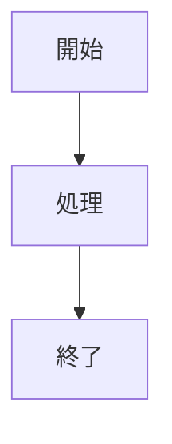
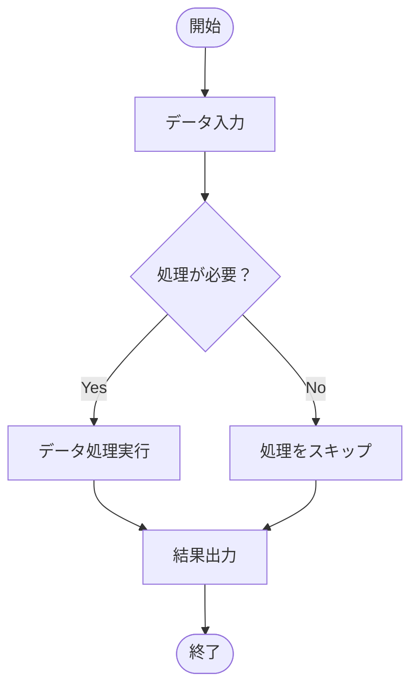
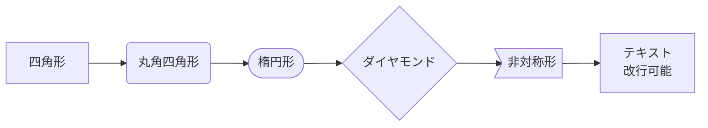
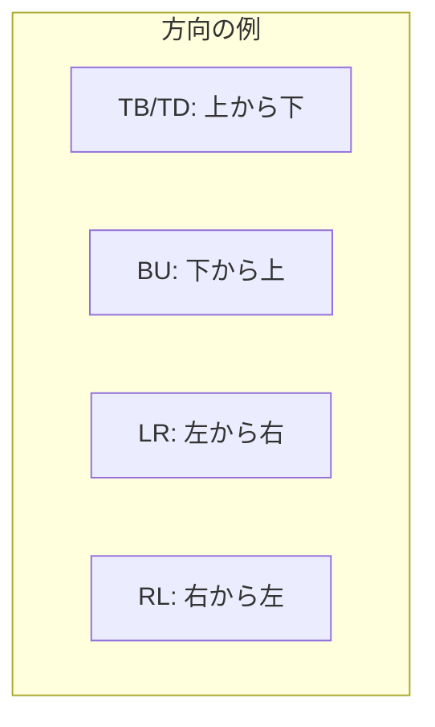
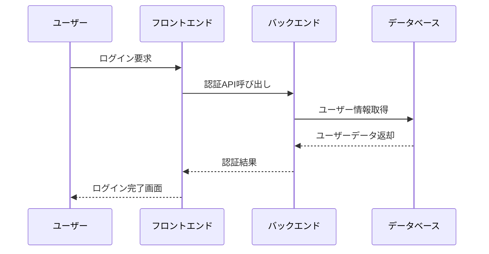
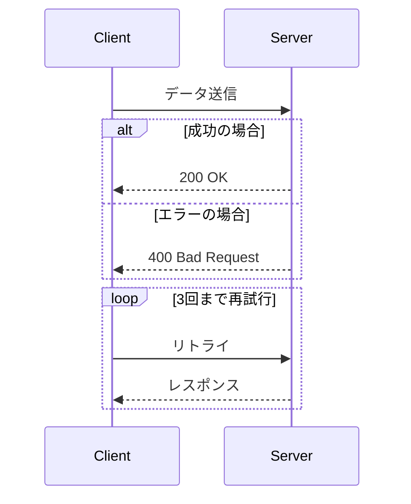
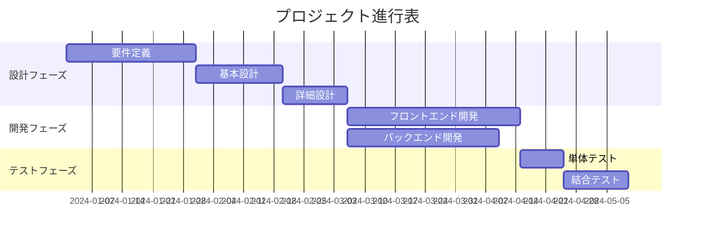
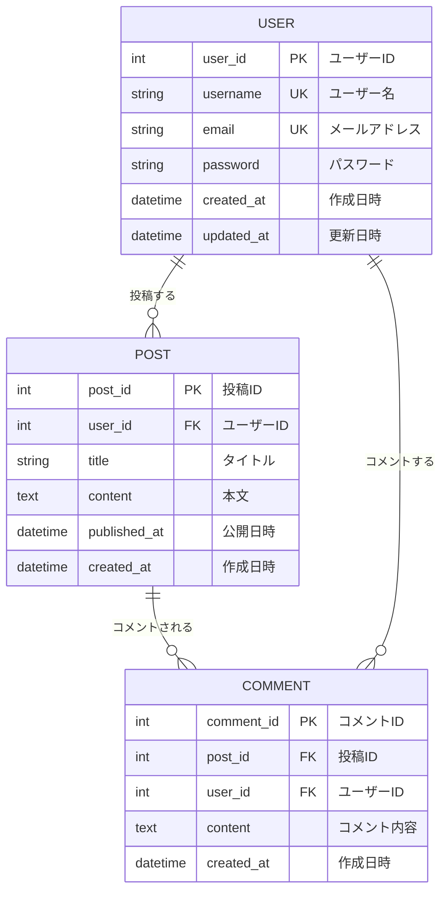
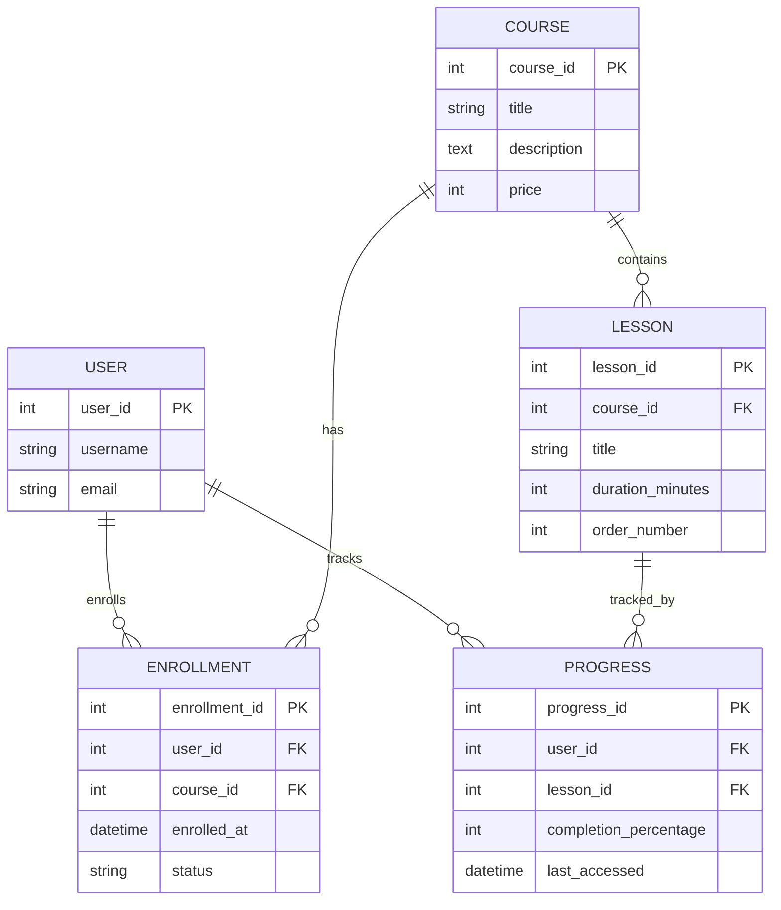

# TakayukiPR
Applying for development, I introduce as self-PR.

# Mermaid記法 完全マスター教材 🚀
## 初級エンジニアから中上級レベルまで最速キャッチアップ

---

## 📚 目次
1. [基礎編：Mermaidの世界へようこそ](#基礎編)
2. [初級編：基本図表をマスター](#初級編)
3. [中級編：複雑な図表に挑戦](#中級編)
4. [上級編：プロレベルの技術](#上級編)
5. [実践編：現場で使える応用技術](#実践編)
6. [チートシート：いつでも使える早見表](#チートシート)

---

## 🌟 基礎編：Mermaidの世界へようこそ

### Mermaidとは？
Mermaidは**テキストベースで図表を作成**できる革命的なツールです。コードを書くように図を描けるため、バージョン管理が可能で、ドキュメントと一緒に管理できます。

### 基本的な書き方



### 🎯 学習の進め方
各コードブロックを**そのままコピー&ペースト**して、Mermaid対応ツール（GitHub、GitLab、Notion、Mermaid Live Editor等）で試してください。

---

## 🚀 初級編：基本図表をマスター

### 1. フローチャート（基本中の基本）

#### ■ シンプルなフロー




#### ■ ノードの形状バリエーション



#### ■ 方向指定



### 2. シーケンス図（システム間のやりとり）

#### ■ 基本的なシーケンス



#### ■ 条件分岐とループ



### 3. ガントチャート（プロジェクト管理）




---

## 🎓 中級編：複雑な図表に挑戦

### 1. ER図（データベース設計の必須技術）

#### ■ 基本的なER図



#### ■ 多対多の関係を含む複雑なER図



### 2. クラス図（オブジェクト指向設計）

```mermaid
classDiagram
    class User {
        -int userId
        -string username
        -string email
        -string passwordHash
        +login(password: string) boolean
        +updateProfile(data: UserData) void
        +getProfile() UserProfile
    }
    
    class Post {
        -int postId
        -int authorId
        -string title
        -string content
        -datetime createdAt
        +publish() void
        +edit(content: string) void
        +delete() void
    }
    
    class Comment {
        -int commentId
        -int postId
        -int authorId
        -string content
        +edit(content: string) void
        +delete() void
    }
    
    User ||--o{ Post : creates
    Post ||--o{ Comment : has
    User ||--o{ Comment : writes
    
    class UserRepository {
        <<interface>>
        +findById(id: int) User
        +save(user: User) void
        +delete(id: int) void
    }
    
    User ..> UserRepository : uses
```

```mermaid
classDiagram
    class User {
        -int userId
        -string username
        -string email
        -string passwordHash
        +login(password: string) boolean
        +updateProfile(data: UserData) void
        +getProfile() UserProfile
    }
    
    class Post {
        -int postId
        -int authorId
        -string title
        -string content
        -datetime createdAt
        +publish() void
        +edit(content: string) void
        +delete() void
    }
    
    class Comment {
        -int commentId
        -int postId
        -int authorId
        -string content
        +edit(content: string) void
        +delete() void
    }
    
    User ||--o{ Post : creates
    Post ||--o{ Comment : has
    User ||--o{ Comment : writes
    
    class UserRepository {
        <<interface>>
        +findById(id: int) User
        +save(user: User) void
        +delete(id: int) void
    }
    
    User ..> UserRepository : uses
```

### 3. 状態図（状態遷移の可視化）

```mermaid
stateDiagram-v2
    [*] --> 未ログイン
    
    未ログイン --> ログイン中 : ログイン試行
    ログイン中 --> ログイン済み : 認証成功
    ログイン中 --> 未ログイン : 認証失敗
    
    ログイン済み --> 編集中 : 投稿作成開始
    編集中 --> ログイン済み : 保存/キャンセル
    
    ログイン済み --> コメント中 : コメント入力
    コメント中 --> ログイン済み : コメント投稿
    
    ログイン済み --> 未ログイン : ログアウト
    
    note right of ログイン中
        認証処理中は
        他の操作を制限
    end note
```

```mermaid
stateDiagram-v2
    [*] --> 未ログイン
    
    未ログイン --> ログイン中 : ログイン試行
    ログイン中 --> ログイン済み : 認証成功
    ログイン中 --> 未ログイン : 認証失敗
    
    ログイン済み --> 編集中 : 投稿作成開始
    編集中 --> ログイン済み : 保存/キャンセル
    
    ログイン済み --> コメント中 : コメント入力
    コメント中 --> ログイン済み : コメント投稿
    
    ログイン済み --> 未ログイン : ログアウト
    
    note right of ログイン中
        認証処理中は
        他の操作を制限
    end note
```

---

## 🏆 上級編：プロレベルの技術

### 1. 複雑なフローチャート（サブグラフとスタイリング）

```mermaid
flowchart TD
    subgraph "認証システム"
        A[ログイン要求] --> B{認証情報確認}
        B -->|有効| C[JWTトークン生成]
        B -->|無効| D[エラーレスポンス]
    end
    
    subgraph "API Gateway"
        E[API要求] --> F{トークン検証}
        F -->|有効| G[リクエスト転送]
        F -->|無効| H[401エラー]
    end
    
    subgraph "マイクロサービス"
        I[ユーザーサービス]
        J[注文サービス]
        K[商品サービス]
    end
    
    C --> E
    G --> I
    G --> J
    G --> K
    
    classDef authBox fill:#e1f5fe,stroke:#01579b,stroke-width:2px
    classDef apiBox fill:#f3e5f5,stroke:#4a148c,stroke-width:2px
    classDef serviceBox fill:#e8f5e8,stroke:#1b5e20,stroke-width:2px
    
    class A,B,C,D authBox
    class E,F,G,H apiBox
    class I,J,K serviceBox
```

```mermaid
flowchart TD
    subgraph "認証システム"
        A[ログイン要求] --> B{認証情報確認}
        B -->|有効| C[JWTトークン生成]
        B -->|無効| D[エラーレスポンス]
    end
    
    subgraph "API Gateway"
        E[API要求] --> F{トークン検証}
        F -->|有効| G[リクエスト転送]
        F -->|無効| H[401エラー]
    end
    
    subgraph "マイクロサービス"
        I[ユーザーサービス]
        J[注文サービス]
        K[商品サービス]
    end
    
    C --> E
    G --> I
    G --> J
    G --> K
    
    classDef authBox fill:#e1f5fe,stroke:#01579b,stroke-width:2px
    classDef apiBox fill:#f3e5f5,stroke:#4a148c,stroke-width:2px
    classDef serviceBox fill:#e8f5e8,stroke:#1b5e20,stroke-width:2px
    
    class A,B,C,D authBox
    class E,F,G,H apiBox
    class I,J,K serviceBox
```

### 2. アーキテクチャ図（C4モデル風）

```mermaid
flowchart TB
    subgraph "フロントエンド層"
        ReactApp[React Application]
        MobileApp[Mobile App]
    end
    
    subgraph "API Gateway層"
        Gateway[API Gateway<br/>- 認証<br/>- レート制限<br/>- ロードバランシング]
    end
    
    subgraph "マイクロサービス層"
        UserService[User Service<br/>- ユーザー管理<br/>- 認証]
        OrderService[Order Service<br/>- 注文処理<br/>- 決済]
        ProductService[Product Service<br/>- 商品管理<br/>- 在庫]
        NotificationService[Notification Service<br/>- メール送信<br/>- プッシュ通知]
    end
    
    subgraph "データ層"
        UserDB[(User Database<br/>PostgreSQL)]
        OrderDB[(Order Database<br/>PostgreSQL)]
        ProductDB[(Product Database<br/>MongoDB)]
        Cache[(Redis Cache)]
    end
    
    subgraph "外部サービス"
        PaymentAPI[Payment API]
        EmailService[Email Service]
    end
    
    ReactApp --> Gateway
    MobileApp --> Gateway
    
    Gateway --> UserService
    Gateway --> OrderService
    Gateway --> ProductService
    Gateway --> NotificationService
    
    UserService --> UserDB
    OrderService --> OrderDB
    ProductService --> ProductDB
    
    UserService --> Cache
    OrderService --> Cache
    ProductService --> Cache
    
    OrderService --> PaymentAPI
    NotificationService --> EmailService
    
    classDef frontend fill:#e3f2fd,stroke:#1976d2
    classDef gateway fill:#fff3e0,stroke:#f57c00
    classDef service fill:#e8f5e8,stroke:#388e3c
    classDef database fill:#fce4ec,stroke:#c2185b
    classDef external fill:#f3e5f5,stroke:#7b1fa2
    
    class ReactApp,MobileApp frontend
    class Gateway gateway
    class UserService,OrderService,ProductService,NotificationService service
    class UserDB,OrderDB,ProductDB,Cache database
    class PaymentAPI,EmailService external
```

```mermaid
flowchart TB
    subgraph "フロントエンド層"
        ReactApp[React Application]
        MobileApp[Mobile App]
    end
    
    subgraph "API Gateway層"
        Gateway[API Gateway<br/>- 認証<br/>- レート制限<br/>- ロードバランシング]
    end
    
    subgraph "マイクロサービス層"
        UserService[User Service<br/>- ユーザー管理<br/>- 認証]
        OrderService[Order Service<br/>- 注文処理<br/>- 決済]
        ProductService[Product Service<br/>- 商品管理<br/>- 在庫]
        NotificationService[Notification Service<br/>- メール送信<br/>- プッシュ通知]
    end
    
    subgraph "データ層"
        UserDB[(User Database<br/>PostgreSQL)]
        OrderDB[(Order Database<br/>PostgreSQL)]
        ProductDB[(Product Database<br/>MongoDB)]
        Cache[(Redis Cache)]
    end
    
    subgraph "外部サービス"
        PaymentAPI[Payment API]
        EmailService[Email Service]
    end
    
    ReactApp --> Gateway
    MobileApp --> Gateway
    
    Gateway --> UserService
    Gateway --> OrderService
    Gateway --> ProductService
    Gateway --> NotificationService
    
    UserService --> UserDB
    OrderService --> OrderDB
    ProductService --> ProductDB
    
    UserService --> Cache
    OrderService --> Cache
    ProductService --> Cache
    
    OrderService --> PaymentAPI
    NotificationService --> EmailService
    
    classDef frontend fill:#e3f2fd,stroke:#1976d2
    classDef gateway fill:#fff3e0,stroke:#f57c00
    classDef service fill:#e8f5e8,stroke:#388e3c
    classDef database fill:#fce4ec,stroke:#c2185b
    classDef external fill:#f3e5f5,stroke:#7b1fa2
    
    class ReactApp,MobileApp frontend
    class Gateway gateway
    class UserService,OrderService,ProductService,NotificationService service
    class UserDB,OrderDB,ProductDB,Cache database
    class PaymentAPI,EmailService external
```

### 3. 詳細なシーケンス図（エラーハンドリング込み）

```mermaid
sequenceDiagram
    participant U as User
    participant F as Frontend
    participant G as API Gateway
    participant A as Auth Service
    participant O as Order Service
    participant P as Payment Service
    participant D as Database
    
    U->>F: 商品購入ボタンクリック
    F->>G: 注文作成API呼び出し
    
    rect rgb(240, 248, 255)
        Note over G,A: 認証フェーズ
        G->>A: トークン検証
        A-->>G: 認証OK
    end
    
    rect rgb(248, 255, 240)
        Note over G,O: 注文処理フェーズ
        G->>O: 注文作成要求
        O->>D: 在庫確認
        D-->>O: 在庫あり
        O->>D: 注文データ保存
        D-->>O: 保存完了
    end
    
    rect rgb(255, 248, 240)
        Note over O,P: 決済フェーズ
        O->>P: 決済処理要求
        P->>P: 決済処理
        
        alt 決済成功
            P-->>O: 決済完了
            O->>D: 注文ステータス更新
            D-->>O: 更新完了
            O-->>G: 注文作成成功
            G-->>F: 200 OK
            F-->>U: 購入完了画面
        else 決済失敗
            P-->>O: 決済失敗
            O->>D: 注文キャンセル
            D-->>O: キャンセル完了
            O-->>G: 注文失敗
            G-->>F: 400 Bad Request
            F-->>U: エラーメッセージ
        end
    end
```

```mermaid
sequenceDiagram
    participant U as User
    participant F as Frontend
    participant G as API Gateway
    participant A as Auth Service
    participant O as Order Service
    participant P as Payment Service
    participant D as Database
    
    U->>F: 商品購入ボタンクリック
    F->>G: 注文作成API呼び出し
    
    rect rgb(240, 248, 255)
        Note over G,A: 認証フェーズ
        G->>A: トークン検証
        A-->>G: 認証OK
    end
    
    rect rgb(248, 255, 240)
        Note over G,O: 注文処理フェーズ
        G->>O: 注文作成要求
        O->>D: 在庫確認
        D-->>O: 在庫あり
        O->>D: 注文データ保存
        D-->>O: 保存完了
    end
    
    rect rgb(255, 248, 240)
        Note over O,P: 決済フェーズ
        O->>P: 決済処理要求
        P->>P: 決済処理
        
        alt 決済成功
            P-->>O: 決済完了
            O->>D: 注文ステータス更新
            D-->>O: 更新完了
            O-->>G: 注文作成成功
            G-->>F: 200 OK
            F-->>U: 購入完了画面
        else 決済失敗
            P-->>O: 決済失敗
            O->>D: 注文キャンセル
            D-->>O: キャンセル完了
            O-->>G: 注文失敗
            G-->>F: 400 Bad Request
            F-->>U: エラーメッセージ
        end
    end
```

---

## 💼 実践編：現場で使える応用技術

### 1. リリースプロセスの可視化

```mermaid
gitgraph:
    options:
        theme: base
        mainBranchName: main
    commit id: "Initial"
    
    branch develop
    checkout develop
    commit id: "Feature A"
    commit id: "Feature B"
    
    branch feature/user-auth
    checkout feature/user-auth
    commit id: "Auth logic"
    commit id: "Tests"
    
    checkout develop
    merge feature/user-auth
    commit id: "Integration"
    
    branch release/v1.0
    checkout release/v1.0
    commit id: "Bug fixes"
    commit id: "Documentation"
    
    checkout main
    merge release/v1.0
    commit id: "v1.0.0" tag: "v1.0.0"
    
    checkout develop
    merge main
```

```mermaid
gitgraph:
    options:
        theme: base
        mainBranchName: main
    commit id: "Initial"
    
    branch develop
    checkout develop
    commit id: "Feature A"
    commit id: "Feature B"
    
    branch feature/user-auth
    checkout feature/user-auth
    commit id: "Auth logic"
    commit id: "Tests"
    
    checkout develop
    merge feature/user-auth
    commit id: "Integration"
    
    branch release/v1.0
    checkout release/v1.0
    commit id: "Bug fixes"
    commit id: "Documentation"
    
    checkout main
    merge release/v1.0
    commit id: "v1.0.0" tag: "v1.0.0"
    
    checkout develop
    merge main
```

### 2. DevOpsパイプライン

```mermaid
flowchart LR
    subgraph "開発"
        Code[コード作成] --> Commit[Git Commit]
        Commit --> Push[Git Push]
    end
    
    subgraph "CI/CD Pipeline"
        Push --> Build[ビルド]
        Build --> Test[自動テスト]
        Test --> Security[セキュリティスキャン]
        Security --> Deploy[デプロイ]
    end
    
    subgraph "環境"
        Deploy --> Dev[開発環境]
        Dev --> Staging[ステージング環境]
        Staging --> Prod[本番環境]
    end
    
    subgraph "監視"
        Prod --> Monitor[監視]
        Monitor --> Alert[アラート]
        Alert --> Action[対応]
    end
    
    Test -->|失敗| Notification[開発者通知]
    Security -->|脆弱性発見| Block[デプロイ停止]
    Monitor -->|異常検知| Rollback[ロールバック]
    
    classDef dev fill:#e3f2fd,stroke:#1976d2
    classDef pipeline fill:#e8f5e8,stroke:#388e3c
    classDef env fill:#fff3e0,stroke:#f57c00
    classDef monitor fill:#fce4ec,stroke:#c2185b
    
    class Code,Commit,Push dev
    class Build,Test,Security,Deploy pipeline
    class Dev,Staging,Prod env
    class Monitor,Alert,Action monitor
```

```mermaid
flowchart LR
    subgraph "開発"
        Code[コード作成] --> Commit[Git Commit]
        Commit --> Push[Git Push]
    end
    
    subgraph "CI/CD Pipeline"
        Push --> Build[ビルド]
        Build --> Test[自動テスト]
        Test --> Security[セキュリティスキャン]
        Security --> Deploy[デプロイ]
    end
    
    subgraph "環境"
        Deploy --> Dev[開発環境]
        Dev --> Staging[ステージング環境]
        Staging --> Prod[本番環境]
    end
    
    subgraph "監視"
        Prod --> Monitor[監視]
        Monitor --> Alert[アラート]
        Alert --> Action[対応]
    end
    
    Test -->|失敗| Notification[開発者通知]
    Security -->|脆弱性発見| Block[デプロイ停止]
    Monitor -->|異常検知| Rollback[ロールバック]
    
    classDef dev fill:#e3f2fd,stroke:#1976d2
    classDef pipeline fill:#e8f5e8,stroke:#388e3c
    classDef env fill:#fff3e0,stroke:#f57c00
    classDef monitor fill:#fce4ec,stroke:#c2185b
    
    class Code,Commit,Push dev
    class Build,Test,Security,Deploy pipeline
    class Dev,Staging,Prod env
    class Monitor,Alert,Action monitor
```

### 3. ユーザージャーニーマップ

```mermaid
journey
    title ユーザーのオンラインショッピング体験
    section 発見
      Google検索: 3: User
      サイト訪問: 4: User
      商品閲覧: 5: User
    section 検討
      レビュー確認: 4: User
      価格比較: 3: User
      お気に入り追加: 4: User
    section 購入
      カート追加: 5: User
      会員登録: 2: User
      決済処理: 3: User
      注文確認: 4: User
    section フォロー
      配送追跡: 4: User
      商品受け取り: 5: User
      レビュー投稿: 3: User
```

```mermaid
journey
    title ユーザーのオンラインショッピング体験
    section 発見
      Google検索: 3: User
      サイト訪問: 4: User
      商品閲覧: 5: User
    section 検討
      レビュー確認: 4: User
      価格比較: 3: User
      お気に入り追加: 4: User
    section 購入
      カート追加: 5: User
      会員登録: 2: User
      決済処理: 3: User
      注文確認: 4: User
    section フォロー
      配送追跡: 4: User
      商品受け取り: 5: User
      レビュー投稿: 3: User
```

### 4. システム障害対応フロー

```mermaid
flowchart TD
    Alert[アラート発生] --> Triage{重要度判定}
    
    Triage -->|P1 Critical| Emergency[緊急対応チーム招集]
    Triage -->|P2 High| Urgent[当番エンジニア対応]
    Triage -->|P3 Medium| Normal[通常対応]
    Triage -->|P4 Low| Schedule[スケジュール対応]
    
    Emergency --> Investigate[原因調査]
    Urgent --> Investigate
    Normal --> Investigate
    
    Investigate --> Identify{原因特定？}
    Identify -->|Yes| Fix[修正実施]
    Identify -->|No| Escalate[エスカレーション]
    
    Fix --> Test[動作確認]
    Test --> Monitor[監視強化]
    
    Escalate --> Expert[専門家投入]
    Expert --> Fix
    
    Monitor --> PostMortem[ポストモーテム]
    PostMortem --> Improve[改善策実装]
    
    classDef critical fill:#ffebee,stroke:#d32f2f,stroke-width:3px
    classDef high fill:#fff3e0,stroke:#f57c00,stroke-width:2px
    classDef normal fill:#e8f5e8,stroke:#388e3c
    classDef process fill:#e3f2fd,stroke:#1976d2
    
    class Alert,Emergency critical
    class Urgent,Investigate high
    class Normal,Schedule normal
    class Fix,Test,Monitor,PostMortem,Improve process
```

```mermaid
flowchart TD
    Alert[アラート発生] --> Triage{重要度判定}
    
    Triage -->|P1 Critical| Emergency[緊急対応チーム招集]
    Triage -->|P2 High| Urgent[当番エンジニア対応]
    Triage -->|P3 Medium| Normal[通常対応]
    Triage -->|P4 Low| Schedule[スケジュール対応]
    
    Emergency --> Investigate[原因調査]
    Urgent --> Investigate
    Normal --> Investigate
    
    Investigate --> Identify{原因特定？}
    Identify -->|Yes| Fix[修正実施]
    Identify -->|No| Escalate[エスカレーション]
    
    Fix --> Test[動作確認]
    Test --> Monitor[監視強化]
    
    Escalate --> Expert[専門家投入]
    Expert --> Fix
    
    Monitor --> PostMortem[ポストモーテム]
    PostMortem --> Improve[改善策実装]
    
    classDef critical fill:#ffebee,stroke:#d32f2f,stroke-width:3px
    classDef high fill:#fff3e0,stroke:#f57c00,stroke-width:2px
    classDef normal fill:#e8f5e8,stroke:#388e3c
    classDef process fill:#e3f2fd,stroke:#1976d2
    
    class Alert,Emergency critical
    class Urgent,Investigate high
    class Normal,Schedule normal
    class Fix,Test,Monitor,PostMortem,Improve process
```

---

## 📋 チートシート：いつでも使える早見表

### 基本構文

| 図表タイプ | 開始コマンド | 用途 |
|----------|------------|------|
| フローチャート | `flowchart TD` | プロセスフロー |
| シーケンス図 | `sequenceDiagram` | システム間通信 |
| ER図 | `erDiagram` | データベース設計 |
| クラス図 | `classDiagram` | オブジェクト設計 |
| 状態図 | `stateDiagram-v2` | 状態遷移 |
| ガントチャート | `gantt` | プロジェクト管理 |

### よく使うノード形状

```mermaid
flowchart LR
    A[四角形] --> B(丸角四角形)
    B --> C([楕円])
    C --> D{ダイヤモンド}
    D --> E>非対称]
    E --> F[["サブルーチン"]]
    F --> G[(データベース)]
    G --> H((円形))
```

```mermaid
flowchart LR
    A[四角形] --> B(丸角四角形)
    B --> C([楕円])
    C --> D{ダイヤモンド}
    D --> E>非対称]
    E --> F[["サブルーチン"]]
    F --> G[(データベース)]
    G --> H((円形))
```

### 矢印の種類

```mermaid
flowchart LR
    A --> B
    C --- D
    E -.-> F
    G ==> H
    I -.-.-> J
    K ====> L
```

```mermaid
flowchart LR
    A --> B
    C --- D
    E -.-> F
    G ==> H
    I -.-.-> J
    K ====> L
```

### スタイリング例

```mermaid
flowchart TD
    A[Normal] --> B[Styled]
    
    classDef redBox fill:#ff9999,stroke:#333,stroke-width:2px
    classDef blueBox fill:#9999ff,stroke:#333,stroke-width:2px
    
    class A redBox
    class B blueBox
```

```mermaid
flowchart TD
    A[Normal] --> B[Styled]
    
    classDef redBox fill:#ff9999,stroke:#333,stroke-width:2px
    classDef blueBox fill:#9999ff,stroke:#333,stroke-width:2px
    
    class A redBox
    class B blueBox
```

---

## 🎯 実践課題

### 課題1：基本レベル
あなたの会社の「新入社員研修プロセス」をフローチャートで描いてください。

### 課題2：中級レベル
ECサイトのユーザー、商品、注文のER図を作成してください。

### 課題3：上級レベル
マイクロサービス間の商品注文処理をシーケンス図で表現してください。

---

## 📚 さらなる学習リソース

1. **Mermaid公式ドキュメント**: https://mermaid.js.org/
2. **Mermaid Live Editor**: https://mermaid.live/
3. **GitHubでのMermaid活用**: README.mdに直接埋め込み可能
4. **VS Code拡張**: Mermaid Preview

---

## 💡 プロからのアドバイス

### ✅ Do（推奨）
- **シンプルに保つ**: 複雑すぎる図は理解が困難
- **一貫性を保つ**: 命名規則とスタイルを統一
- **段階的に作成**: 大きな図は小さなパーツから組み立て
- **定期的な更新**: システム変更時は図も更新

### ❌ Don't（非推奨）
- **情報の詰め込みすぎ**: 1つの図に多すぎる要素
- **不明確なラベル**: 略語だけの説明
- **古い図の放置**: 実装と乖離した図

---

**🎊 おめでとうございます！**

この教材を完了したあなたは、もう立派なMermaidエキスパートです。実際のプロジェクトで積極的に活用し、チーム全体のドキュメント品質向上に貢献してください！
