# Mermaid記法 完全ãƒã‚¹ã‚¿ãƒ¼æ•™æ 🚀
## åˆç´šã‚¨ãƒ³ã‚¸ãƒ‹ã‚¢ã‹ã‚‰ä¸­ä¸Šç´šãƒ¬ãƒ™ãƒ«ã¾ã§æœ€é€Ÿã‚­ãƒ£ãƒƒãƒã‚¢ãƒƒãƒ— - GitHub完全対応版

---

## 📚 目次
1. [基ç¤ç·¨ï¼šMermaidã®ä¸–ç•Œã¸ã‚ˆã†ã“ã](#基ç¤ç·¨)
2. [åˆç´šç·¨ï¼šåŸºæœ¬å›³è¡¨ã‚’ãƒã‚¹ã‚¿ãƒ¼](#åˆç´šç·¨)
3. [中級編：複雑ãªå›³è¡¨ã«æŒ‘戦](#中級編)
4. [上級編：プロレベルã®æŠ€è¡“](#上級編)
5. [実践編：ç¾å ´ã§ä½¿ãˆã‚‹å¿œç”¨æŠ€è¡“](#実践編)
6. [ãƒãƒ¼ãƒˆã‚·ãƒ¼ãƒˆï¼šã„ã¤ã§ã‚‚使ãˆã‚‹æ—©è¦‹è¡¨](#ãƒãƒ¼ãƒˆã‚·ãƒ¼ãƒˆ)
7. [トラブルシューティング：GitHub対応版](#トラブルシューティング)

---

## 🌟 基ç¤ç·¨ï¼šMermaidã®ä¸–ç•Œã¸ã‚ˆã†ã“ã

### Mermaidã¨ã¯ï¼Ÿ
Mermaidã¯**テキストベースã§å›³è¡¨ã‚’作æˆ**ã§ãã‚‹é©å‘½çš„ãªãƒ„ールã§ã™ã€‚コードを書ãよã†ã«å›³ã‚’æã‘ã‚‹ãŸã‚ã€ãƒãƒ¼ã‚¸ãƒ§ãƒ³ç®¡ç†ãŒå¯èƒ½ã§ã€ãƒ‰ã‚­ãƒ¥ãƒ¡ãƒ³ãƒˆã¨ä¸€ç·’ã«ç®¡ç†ã§ãã¾ã™ã€‚

### 基本的ãªæ›¸ãæ–¹
```
graph TD
    A[開始] --> B[処ç†]
    B --> C[終了]
```

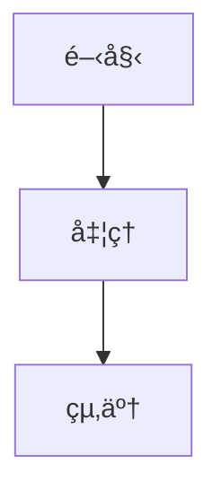
```mermaid
graph TD
    A[開始] --> B[処ç†]
    B --> C[終了]
```

### 🯠学習ã®é€²ã‚æ–¹
å„コードブロックを**ãã®ã¾ã¾ã‚³ãƒ”ー&ペースト**ã—ã¦ã€Mermaid対応ツール（GitHubã€GitLabã€Notionã€Mermaid Live Editor等）ã§è©¦ã—ã¦ãã ã•ã„。

---

## 🚀 åˆç´šç·¨ï¼šåŸºæœ¬å›³è¡¨ã‚’ãƒã‚¹ã‚¿ãƒ¼

### 1. フローãƒãƒ£ãƒ¼ãƒˆï¼ˆåŸºæœ¬ä¸­ã®åŸºæœ¬ï¼‰

#### â–  シンプルãªãƒ•ãƒ­ãƒ¼
```
flowchart TD
    Start([開始]) --> Input[データ入力]
    Input --> Process{処ç†ãŒå¿…è¦ï¼Ÿ}
    Process -->|Yes| Action[データ処ç†å®Ÿè¡Œ]
    Process -->|No| Skip[処ç†ã‚’スキップ]
    Action --> Output[çµæœå‡ºåŠ›]
    Skip --> Output
    Output --> End([終了])
```

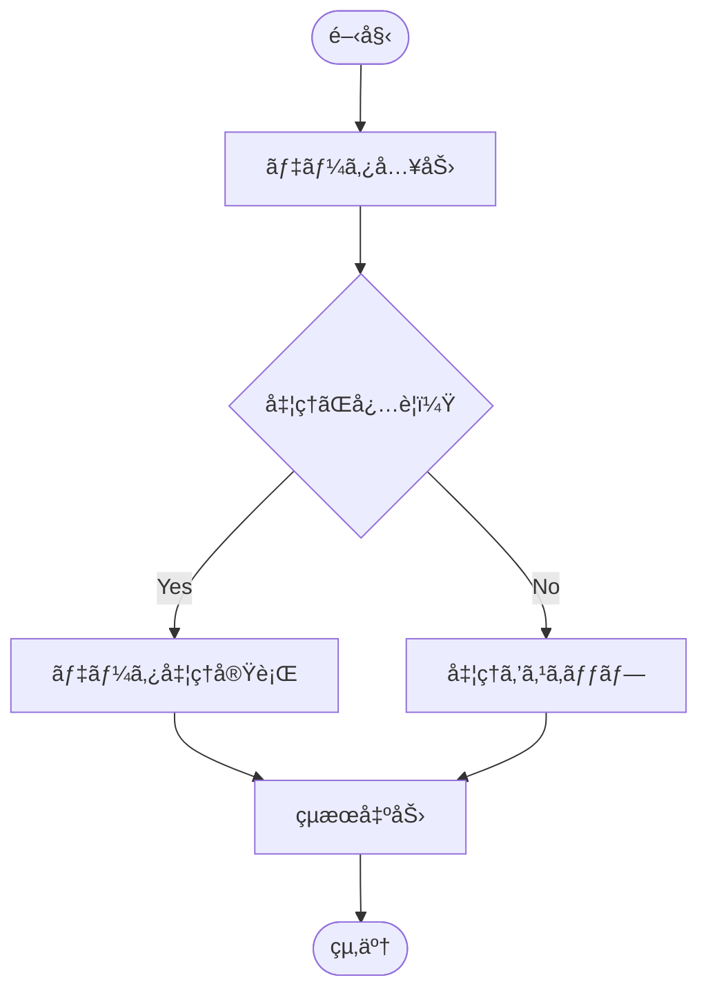
```mermaid
flowchart TD
    Start([開始]) --> Input[データ入力]
    Input --> Process{処ç†ãŒå¿…è¦ï¼Ÿ}
    Process -->|Yes| Action[データ処ç†å®Ÿè¡Œ]
    Process -->|No| Skip[処ç†ã‚’スキップ]
    Action --> Output[çµæœå‡ºåŠ›]
    Skip --> Output
    Output --> End([終了])
```

#### â–  ãƒãƒ¼ãƒ‰ã®å½¢çŠ¶ãƒãƒªã‚¨ãƒ¼ã‚·ãƒ§ãƒ³
```
flowchart LR
    A[四角形] --> B(丸角四角形)
    B --> C([楕円形])
    C --> D{ダイヤモンド}
    D --> E["テキスト<br/>改行å¯èƒ½"]
    E --> F[("円形")]
    F --> G[["サブルーãƒãƒ³"]]
    G --> H[(データベース)]
```

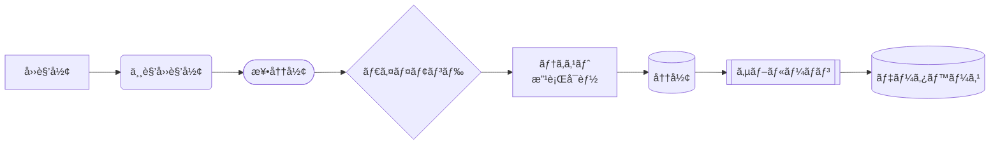
```mermaid
flowchart LR
    A[四角形] --> B(丸角四角形)
    B --> C([楕円形])
    C --> D{ダイヤモンド}
    D --> E["テキスト<br/>改行å¯èƒ½"]
    E --> F[("円形")]
    F --> G[["サブルーãƒãƒ³"]]
    G --> H[(データベース)]
```

#### â–  æ–¹å‘指定ã¨ã‚µãƒ–グラフ
```
flowchart TB
    subgraph "フロー方å‘ã®ä¾‹"
        direction TB
        A1[TB: 上ã‹ã‚‰ä¸‹] --> A2[デフォルト]
    end
    
    subgraph "å·¦å³æ–¹å‘"
        direction LR
        B1[LR: å·¦ã‹ã‚‰å³] --> B2[横並ã³]
    end
    
    A2 --> B1
```

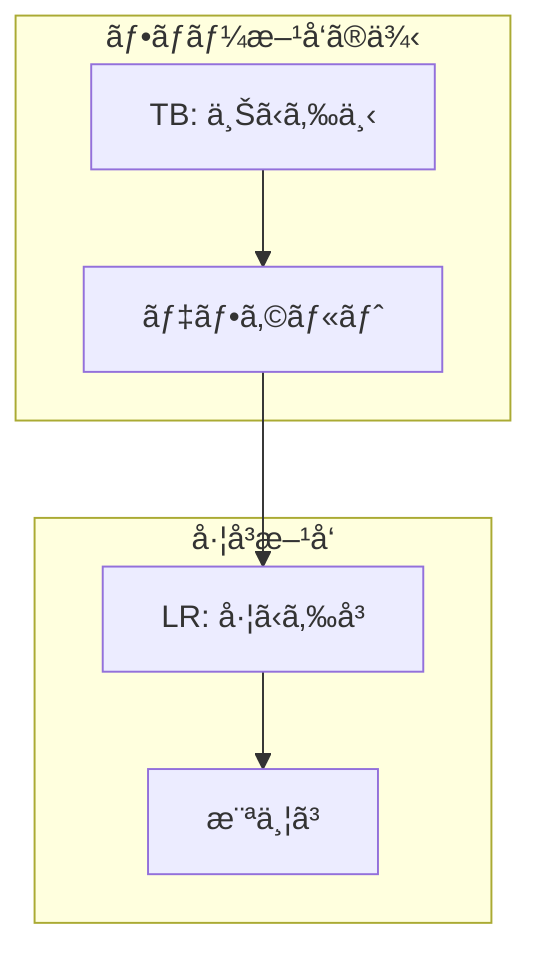
```mermaid
flowchart TB
    subgraph "フロー方å‘ã®ä¾‹"
        direction TB
        A1[TB: 上ã‹ã‚‰ä¸‹] --> A2[デフォルト]
    end
    
    subgraph "å·¦å³æ–¹å‘"
        direction LR
        B1[LR: å·¦ã‹ã‚‰å³] --> B2[横並ã³]
    end
    
    A2 --> B1
```

### 2. シーケンス図（システム間ã®ã‚„ã‚Šã¨ã‚Šï¼‰

#### â–  基本的ãªã‚·ãƒ¼ã‚±ãƒ³ã‚¹
```
sequenceDiagram
    participant U as ユーザー
    participant F as フロントエンド
    participant B as ãƒãƒƒã‚¯ã‚¨ãƒ³ãƒ‰
    participant D as データベース
    
    U->>F: ログインè¦æ±‚
    F->>B: èªè¨¼API呼ã³å‡ºã—
    B->>D: ユーザー情報å–å¾—
    D-->>B: ユーザーデータ返å´
    B-->>F: èªè¨¼çµæœ
    F-->>U: ログイン完了画é¢
```

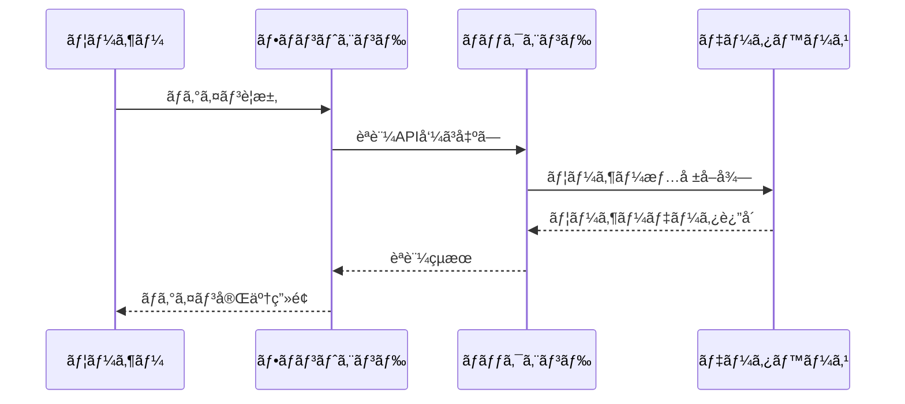
```mermaid
sequenceDiagram
    participant U as ユーザー
    participant F as フロントエンド
    participant B as ãƒãƒƒã‚¯ã‚¨ãƒ³ãƒ‰
    participant D as データベース
    
    U->>F: ログインè¦æ±‚
    F->>B: èªè¨¼API呼ã³å‡ºã—
    B->>D: ユーザー情報å–å¾—
    D-->>B: ユーザーデータ返å´
    B-->>F: èªè¨¼çµæœ
    F-->>U: ログイン完了画é¢
```

#### â–  æ¡ä»¶åˆ†å²ã¨ãƒ«ãƒ¼ãƒ—
```
sequenceDiagram
    participant A as Client
    participant B as Server
    
    A->>B: データé€ä¿¡
    
    alt æˆåŠŸã®å ´åˆ
        B-->>A: 200 OK
    else エラーã®å ´åˆ
        B-->>A: 400 Bad Request
    end
    
    loop 3å›ã¾ã§å†è©¦è¡Œ
        A->>B: リトライ
        B-->>A: レスãƒãƒ³ã‚¹
    end
    
    Note over A,B: 処ç†å®Œäº†
```

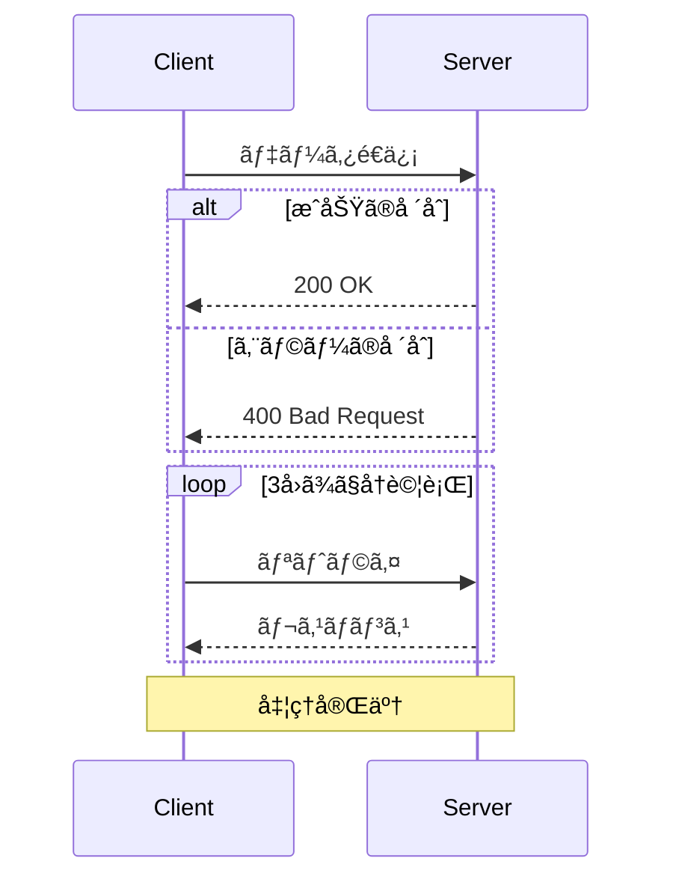
```mermaid
sequenceDiagram
    participant A as Client
    participant B as Server
    
    A->>B: データé€ä¿¡
    
    alt æˆåŠŸã®å ´åˆ
        B-->>A: 200 OK
    else エラーã®å ´åˆ
        B-->>A: 400 Bad Request
    end
    
    loop 3å›ã¾ã§å†è©¦è¡Œ
        A->>B: リトライ
        B-->>A: レスãƒãƒ³ã‚¹
    end
    
    Note over A,B: 処ç†å®Œäº†
```

### 3. ガントãƒãƒ£ãƒ¼ãƒˆï¼ˆãƒ—ロジェクト管ç†ï¼‰

```
gantt
    title プロジェクト進行表
    dateFormat  YYYY-MM-DD
    section 設計フェーズ
    è¦ä»¶å®šç¾©          :a1, 2024-01-01, 30d
    基本設計          :a2, after a1, 20d
    詳細設計          :a3, after a2, 15d
    
    section 開発フェーズ
    フロントエンド開発    :b1, after a3, 40d
    ãƒãƒƒã‚¯ã‚¨ãƒ³ãƒ‰é–‹ç™º     :b2, after a3, 35d
    
    section テストフェーズ
    å˜ä½“テスト        :c1, after b1, 10d
    çµåˆãƒ†ã‚¹ãƒˆ        :c2, after c1, 15d
```

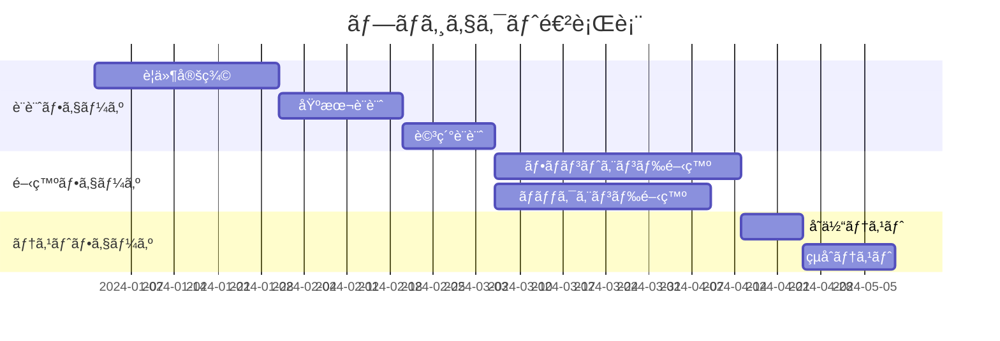
```mermaid
gantt
    title プロジェクト進行表
    dateFormat  YYYY-MM-DD
    section 設計フェーズ
    è¦ä»¶å®šç¾©          :a1, 2024-01-01, 30d
    基本設計          :a2, after a1, 20d
    詳細設計          :a3, after a2, 15d
    
    section 開発フェーズ
    フロントエンド開発    :b1, after a3, 40d
    ãƒãƒƒã‚¯ã‚¨ãƒ³ãƒ‰é–‹ç™º     :b2, after a3, 35d
    
    section テストフェーズ
    å˜ä½“テスト        :c1, after b1, 10d
    çµåˆãƒ†ã‚¹ãƒˆ        :c2, after c1, 15d
```

---

## 📠中級編：複雑ãªå›³è¡¨ã«æŒ‘戦

### 1. ER図（データベース設計ã®å¿…須技術）

#### â–  基本的ãªER図
```
erDiagram
    USER {
        int user_id PK "ユーザーID"
        string username UK "ユーザーå"
        string email UK "メールアドレス"
        string password "パスワード"
        datetime created_at "作æˆæ—¥æ™‚"
        datetime updated_at "更新日時"
    }
    
    POST {
        int post_id PK "投稿ID"
        int user_id FK "ユーザーID"
        string title "タイトル"
        text content "本文"
        datetime published_at "公開日時"
        datetime created_at "作æˆæ—¥æ™‚"
    }
    
    COMMENT {
        int comment_id PK "コメントID"
        int post_id FK "投稿ID"
        int user_id FK "ユーザーID"
        text content "コメント内容"
        datetime created_at "作æˆæ—¥æ™‚"
    }
    
    USER ||--o{ POST : "投稿ã™ã‚‹"
    POST ||--o{ COMMENT : "コメントã•ã‚Œã‚‹"
    USER ||--o{ COMMENT : "コメントã™ã‚‹"
```

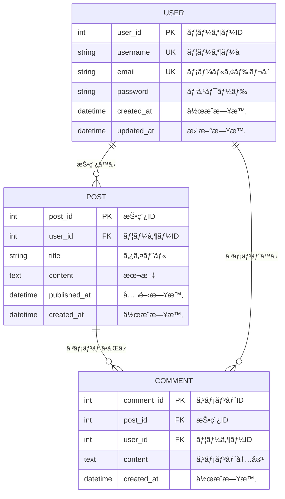
```mermaid
erDiagram
    USER {
        int user_id PK "ユーザーID"
        string username UK "ユーザーå"
        string email UK "メールアドレス"
        string password "パスワード"
        datetime created_at "作æˆæ—¥æ™‚"
        datetime updated_at "更新日時"
    }
    
    POST {
        int post_id PK "投稿ID"
        int user_id FK "ユーザーID"
        string title "タイトル"
        text content "本文"
        datetime published_at "公開日時"
        datetime created_at "作æˆæ—¥æ™‚"
    }
    
    COMMENT {
        int comment_id PK "コメントID"
        int post_id FK "投稿ID"
        int user_id FK "ユーザーID"
        text content "コメント内容"
        datetime created_at "作æˆæ—¥æ™‚"
    }
    
    USER ||--o{ POST : "投稿ã™ã‚‹"
    POST ||--o{ COMMENT : "コメントã•ã‚Œã‚‹"
    USER ||--o{ COMMENT : "コメントã™ã‚‹"
```

#### â–  ECサイトã®è¤‡é›‘ãªER図
```
erDiagram
    USER {
        int user_id PK
        string username
        string email
        string phone
        datetime created_at
    }
    
    PRODUCT {
        int product_id PK
        string name
        text description
        decimal price
        int stock_quantity
        string category
    }
    
    ORDER {
        int order_id PK
        int user_id FK
        datetime order_date
        decimal total_amount
        string status
    }
    
    ORDER_ITEM {
        int order_item_id PK
        int order_id FK
        int product_id FK
        int quantity
        decimal price
    }
    
    CART {
        int cart_id PK
        int user_id FK
        int product_id FK
        int quantity
        datetime added_at
    }
    
    USER ||--o{ ORDER : places
    USER ||--o{ CART : has
    ORDER ||--o{ ORDER_ITEM : contains
    PRODUCT ||--o{ ORDER_ITEM : included_in
    PRODUCT ||--o{ CART : added_to
```

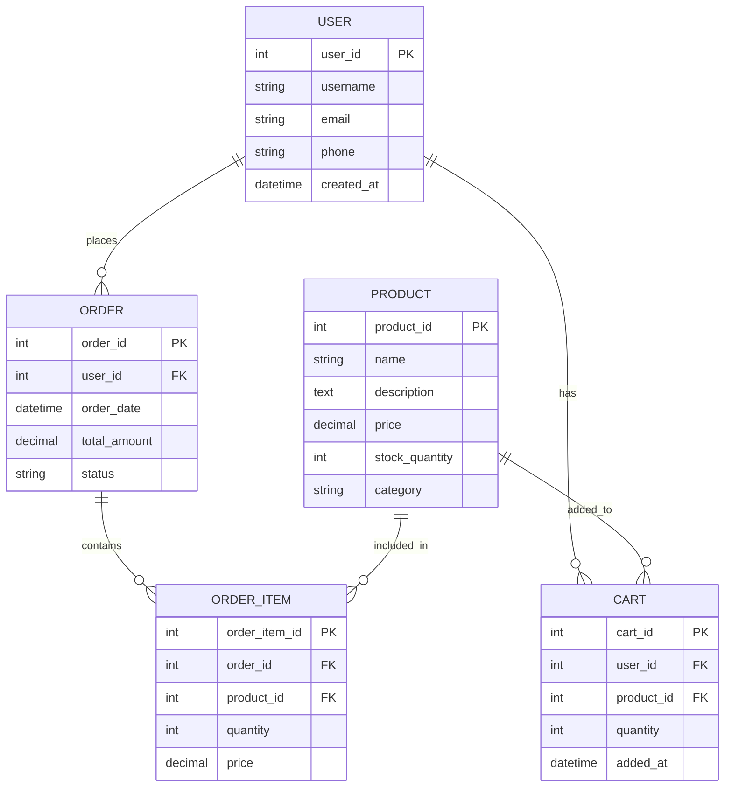
```mermaid
erDiagram
    USER {
        int user_id PK
        string username
        string email
        string phone
        datetime created_at
    }
    
    PRODUCT {
        int product_id PK
        string name
        text description
        decimal price
        int stock_quantity
        string category
    }
    
    ORDER {
        int order_id PK
        int user_id FK
        datetime order_date
        decimal total_amount
        string status
    }
    
    ORDER_ITEM {
        int order_item_id PK
        int order_id FK
        int product_id FK
        int quantity
        decimal price
    }
    
    CART {
        int cart_id PK
        int user_id FK
        int product_id FK
        int quantity
        datetime added_at
    }
    
    USER ||--o{ ORDER : places
    USER ||--o{ CART : has
    ORDER ||--o{ ORDER_ITEM : contains
    PRODUCT ||--o{ ORDER_ITEM : included_in
    PRODUCT ||--o{ CART : added_to
```

### 2. クラス図（オブジェクト指å‘設計）- GitHub対応版

```
classDiagram
    class User {
        -int userId
        -string username
        -string email
        -string passwordHash
        +login(password) boolean
        +updateProfile(data) void
        +getProfile() UserProfile
    }
    
    class Post {
        -int postId
        -int authorId
        -string title
        -string content
        -datetime createdAt
        +publish() void
        +edit(content) void
        +delete() void
    }
    
    class Comment {
        -int commentId
        -int postId
        -int authorId
        -string content
        +edit(content) void
        +delete() void
    }
    
    class UserRepository {
        <<interface>>
        +findById(id) User
        +save(user) void
        +delete(id) void
    }
    
    User --> Post : creates
    Post --> Comment : has
    User --> Comment : writes
    User --> UserRepository : uses
```

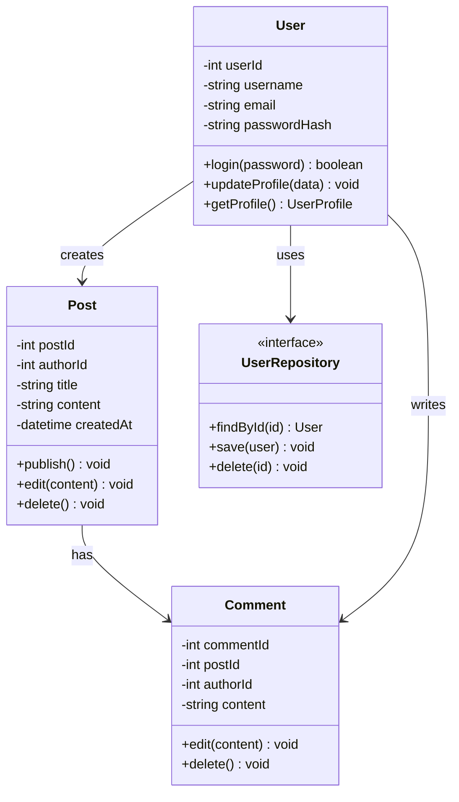
```mermaid
classDiagram
    class User {
        -int userId
        -string username
        -string email
        -string passwordHash
        +login(password) boolean
        +updateProfile(data) void
        +getProfile() UserProfile
    }
    
    class Post {
        -int postId
        -int authorId
        -string title
        -string content
        -datetime createdAt
        +publish() void
        +edit(content) void
        +delete() void
    }
    
    class Comment {
        -int commentId
        -int postId
        -int authorId
        -string content
        +edit(content) void
        +delete() void
    }
    
    class UserRepository {
        <<interface>>
        +findById(id) User
        +save(user) void
        +delete(id) void
    }
    
    User --> Post : creates
    Post --> Comment : has
    User --> Comment : writes
    User --> UserRepository : uses
```

### 3. 状態図（状態é·ç§»ã®å¯è¦–化）

```
stateDiagram-v2
    [*] --> 未ログイン
    
    未ログイン --> ログイン中 : ログイン試行
    ログイン中 --> ログイン済㿠: èªè¨¼æˆåŠŸ
    ログイン中 --> 未ログイン : èªè¨¼å¤±æ•—
    
    ログイン済㿠--> 編集中 : 投稿作æˆé–‹å§‹
    編集中 --> ログイン済㿠: ä¿å­˜/キャンセル
    
    ログイン済㿠--> コメント中 : コメント入力
    コメント中 --> ログイン済㿠: コメント投稿
    
    ログイン済㿠--> 未ログイン : ログアウト
    
    note right of ログイン中
        èªè¨¼å‡¦ç†ä¸­ã¯
        ä»–ã®æ“作を制é™
    end note
```

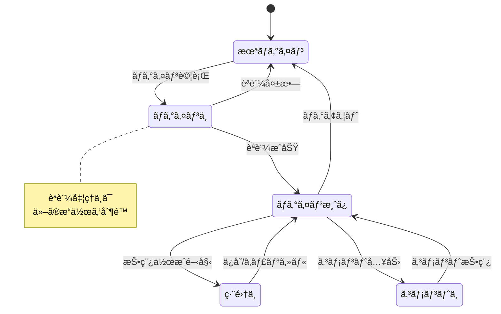
```mermaid
stateDiagram-v2
    [*] --> 未ログイン
    
    未ログイン --> ログイン中 : ログイン試行
    ログイン中 --> ログイン済㿠: èªè¨¼æˆåŠŸ
    ログイン中 --> 未ログイン : èªè¨¼å¤±æ•—
    
    ログイン済㿠--> 編集中 : 投稿作æˆé–‹å§‹
    編集中 --> ログイン済㿠: ä¿å­˜/キャンセル
    
    ログイン済㿠--> コメント中 : コメント入力
    コメント中 --> ログイン済㿠: コメント投稿
    
    ログイン済㿠--> 未ログイン : ログアウト
    
    note right of ログイン中
        èªè¨¼å‡¦ç†ä¸­ã¯
        ä»–ã®æ“作を制é™
    end note
```

### 4. ãƒã‚¤ãƒ³ãƒ‰ãƒãƒƒãƒ—（アイディア整ç†ï¼‰

```
mindmap
  root((プロダクト開発))
    計画
      è¦ä»¶å®šç¾©
      設計
      スケジュール
    開発
      フロントエンド
        React
        TypeScript
        Tailwind
      ãƒãƒƒã‚¯ã‚¨ãƒ³ãƒ‰
        Node.js
        Express
        PostgreSQL
    テスト
      å˜ä½“テスト
      çµ±åˆãƒ†ã‚¹ãƒˆ
      E2Eテスト
    é‹ç”¨
      デプロイ
      監視
      ä¿å®ˆ
```

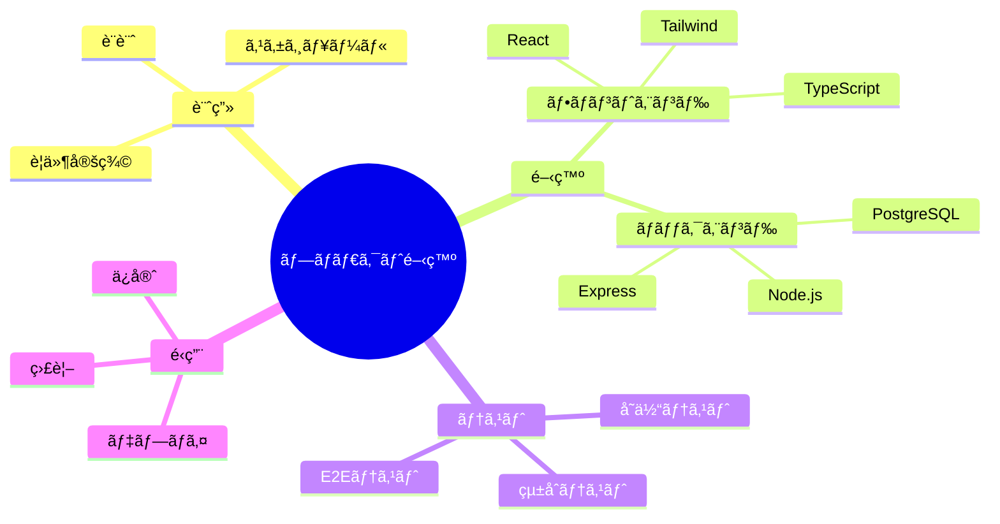
```mermaid
mindmap
  root((プロダクト開発))
    計画
      è¦ä»¶å®šç¾©
      設計
      スケジュール
    開発
      フロントエンド
        React
        TypeScript
        Tailwind
      ãƒãƒƒã‚¯ã‚¨ãƒ³ãƒ‰
        Node.js
        Express
        PostgreSQL
    テスト
      å˜ä½“テスト
      çµ±åˆãƒ†ã‚¹ãƒˆ
      E2Eテスト
    é‹ç”¨
      デプロイ
      監視
      ä¿å®ˆ
```

---

## 🆠上級編：プロレベルã®æŠ€è¡“

### 1. 複雑ãªãƒ•ãƒ­ãƒ¼ãƒãƒ£ãƒ¼ãƒˆï¼ˆã‚µãƒ–グラフã¨ã‚¹ã‚¿ã‚¤ãƒªãƒ³ã‚°ï¼‰

```
flowchart TD
    subgraph "èªè¨¼ã‚·ã‚¹ãƒ†ãƒ "
        A[ログインè¦æ±‚] --> B{èªè¨¼æƒ…報確èª}
        B -->|有効| C[JWTトークン生æˆ]
        B -->|無効| D[エラーレスãƒãƒ³ã‚¹]
    end
    
    subgraph "API Gateway"
        E[APIè¦æ±‚] --> F{トークン検証}
        F -->|有効| G[リクエスト転é€]
        F -->|無効| H[401エラー]
    end
    
    subgraph "ãƒã‚¤ã‚¯ãƒ­ã‚µãƒ¼ãƒ“ス"
        I[ユーザーサービス]
        J[注文サービス]
        K[商å“サービス]
    end
    
    C --> E
    G --> I
    G --> J
    G --> K
    
    classDef authBox fill:#e1f5fe,stroke:#01579b,stroke-width:2px
    classDef apiBox fill:#f3e5f5,stroke:#4a148c,stroke-width:2px
    classDef serviceBox fill:#e8f5e8,stroke:#1b5e20,stroke-width:2px
    
    class A,B,C,D authBox
    class E,F,G,H apiBox
    class I,J,K serviceBox
```

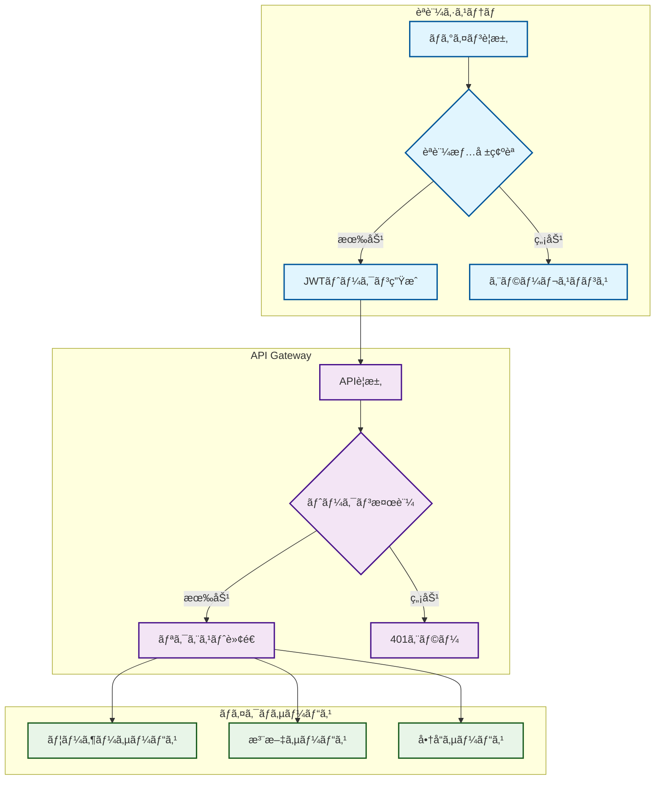
```mermaid
flowchart TD
    subgraph "èªè¨¼ã‚·ã‚¹ãƒ†ãƒ "
        A[ログインè¦æ±‚] --> B{èªè¨¼æƒ…報確èª}
        B -->|有効| C[JWTトークン生æˆ]
        B -->|無効| D[エラーレスãƒãƒ³ã‚¹]
    end
    
    subgraph "API Gateway"
        E[APIè¦æ±‚] --> F{トークン検証}
        F -->|有効| G[リクエスト転é€]
        F -->|無効| H[401エラー]
    end
    
    subgraph "ãƒã‚¤ã‚¯ãƒ­ã‚µãƒ¼ãƒ“ス"
        I[ユーザーサービス]
        J[注文サービス]
        K[商å“サービス]
    end
    
    C --> E
    G --> I
    G --> J
    G --> K
    
    classDef authBox fill:#e1f5fe,stroke:#01579b,stroke-width:2px
    classDef apiBox fill:#f3e5f5,stroke:#4a148c,stroke-width:2px
    classDef serviceBox fill:#e8f5e8,stroke:#1b5e20,stroke-width:2px
    
    class A,B,C,D authBox
    class E,F,G,H apiBox
    class I,J,K serviceBox
```

### 2. アーキテクãƒãƒ£å›³ï¼ˆã‚·ã‚¹ãƒ†ãƒ å…¨ä½“åƒï¼‰

```
flowchart TB
    subgraph "フロントエンド層"
        ReactApp[React Application]
        MobileApp[Mobile App]
    end
    
    subgraph "API Gateway層"
        Gateway[API Gateway<br/>- èªè¨¼<br/>- レート制é™<br/>- ロードãƒãƒ©ãƒ³ã‚·ãƒ³ã‚°]
    end
    
    subgraph "ãƒã‚¤ã‚¯ãƒ­ã‚µãƒ¼ãƒ“ス層"
        UserService[User Service<br/>- ユーザー管ç†<br/>- èªè¨¼]
        OrderService[Order Service<br/>- 注文処ç†<br/>- 決済]
        ProductService[Product Service<br/>- 商å“管ç†<br/>- 在庫]
        NotificationService[Notification Service<br/>- メールé€ä¿¡<br/>- プッシュ通知]
    end
    
    subgraph "データ層"
        UserDB[(User Database<br/>PostgreSQL)]
        OrderDB[(Order Database<br/>PostgreSQL)]
        ProductDB[(Product Database<br/>MongoDB)]
        Cache[(Redis Cache)]
    end
    
    subgraph "外部サービス"
        PaymentAPI[Payment API]
        EmailService[Email Service]
    end
    
    ReactApp --> Gateway
    MobileApp --> Gateway
    
    Gateway --> UserService
    Gateway --> OrderService
    Gateway --> ProductService
    Gateway --> NotificationService
    
    UserService --> UserDB
    OrderService --> OrderDB
    ProductService --> ProductDB
    
    UserService --> Cache
    OrderService --> Cache
    ProductService --> Cache
    
    OrderService --> PaymentAPI
    NotificationService --> EmailService
    
    classDef frontend fill:#e3f2fd,stroke:#1976d2
    classDef gateway fill:#fff3e0,stroke:#f57c00
    classDef service fill:#e8f5e8,stroke:#388e3c
    classDef database fill:#fce4ec,stroke:#c2185b
    classDef external fill:#f3e5f5,stroke:#7b1fa2
    
    class ReactApp,MobileApp frontend
    class Gateway gateway
    class UserService,OrderService,ProductService,NotificationService service
    class UserDB,OrderDB,ProductDB,Cache database
    class PaymentAPI,EmailService external
```

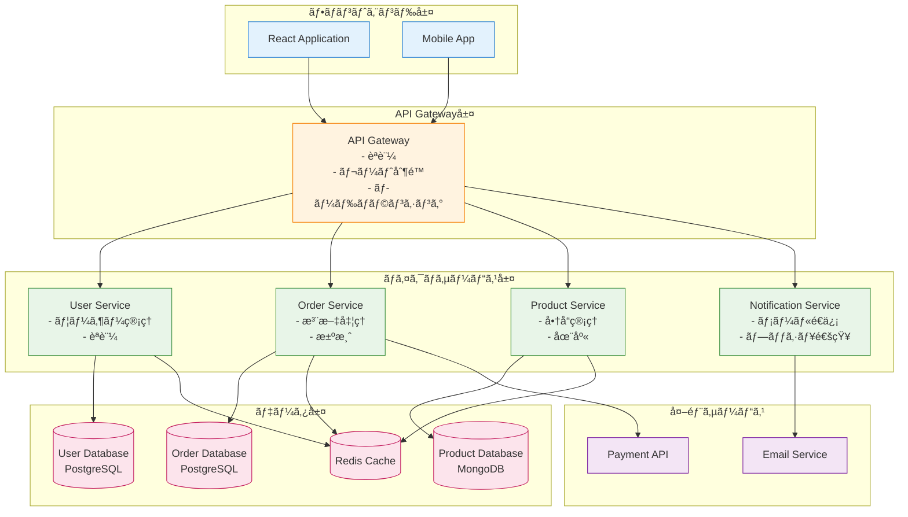
```mermaid
flowchart TB
    subgraph "フロントエンド層"
        ReactApp[React Application]
        MobileApp[Mobile App]
    end
    
    subgraph "API Gateway層"
        Gateway[API Gateway<br/>- èªè¨¼<br/>- レート制é™<br/>- ロードãƒãƒ©ãƒ³ã‚·ãƒ³ã‚°]
    end
    
    subgraph "ãƒã‚¤ã‚¯ãƒ­ã‚µãƒ¼ãƒ“ス層"
        UserService[User Service<br/>- ユーザー管ç†<br/>- èªè¨¼]
        OrderService[Order Service<br/>- 注文処ç†<br/>- 決済]
        ProductService[Product Service<br/>- 商å“管ç†<br/>- 在庫]
        NotificationService[Notification Service<br/>- メールé€ä¿¡<br/>- プッシュ通知]
    end
    
    subgraph "データ層"
        UserDB[(User Database<br/>PostgreSQL)]
        OrderDB[(Order Database<br/>PostgreSQL)]
        ProductDB[(Product Database<br/>MongoDB)]
        Cache[(Redis Cache)]
    end
    
    subgraph "外部サービス"
        PaymentAPI[Payment API]
        EmailService[Email Service]
    end
    
    ReactApp --> Gateway
    MobileApp --> Gateway
    
    Gateway --> UserService
    Gateway --> OrderService
    Gateway --> ProductService
    Gateway --> NotificationService
    
    UserService --> UserDB
    OrderService --> OrderDB
    ProductService --> ProductDB
    
    UserService --> Cache
    OrderService --> Cache
    ProductService --> Cache
    
    OrderService --> PaymentAPI
    NotificationService --> EmailService
    
    classDef frontend fill:#e3f2fd,stroke:#1976d2
    classDef gateway fill:#fff3e0,stroke:#f57c00
    classDef service fill:#e8f5e8,stroke:#388e3c
    classDef database fill:#fce4ec,stroke:#c2185b
    classDef external fill:#f3e5f5,stroke:#7b1fa2
    
    class ReactApp,MobileApp frontend
    class Gateway gateway
    class UserService,OrderService,ProductService,NotificationService service
    class UserDB,OrderDB,ProductDB,Cache database
    class PaymentAPI,EmailService external
```

### 3. 詳細ãªã‚·ãƒ¼ã‚±ãƒ³ã‚¹å›³ï¼ˆã‚¨ãƒ©ãƒ¼ãƒãƒ³ãƒ‰ãƒªãƒ³ã‚°è¾¼ã¿ï¼‰

```
sequenceDiagram
    participant U as User
    participant F as Frontend
    participant G as API Gateway
    participant A as Auth Service
    participant O as Order Service
    participant P as Payment Service
    participant D as Database
    
    U->>F: 商å“購入ボタンクリック
    F->>G: 注文作æˆAPI呼ã³å‡ºã—
    
    rect rgb(240, 248, 255)
        Note over G,A: èªè¨¼ãƒ•ã‚§ãƒ¼ã‚º
        G->>A: トークン検証
        A-->>G: èªè¨¼OK
    end
    
    rect rgb(248, 255, 240)
        Note over G,O: 注文処ç†ãƒ•ã‚§ãƒ¼ã‚º
        G->>O: 注文作æˆè¦æ±‚
        O->>D: 在庫確èª
        D-->>O: 在庫ã‚ã‚Š
        O->>D: 注文データä¿å­˜
        D-->>O: ä¿å­˜å®Œäº†
    end
    
    rect rgb(255, 248, 240)
        Note over O,P: 決済フェーズ
        O->>P: 決済処ç†è¦æ±‚
        P->>P: 決済処ç†
        
        alt 決済æˆåŠŸ
            P-->>O: 決済完了
            O->>D: 注文ステータス更新
            D-->>O: 更新完了
            O-->>G: 注文作æˆæˆåŠŸ
            G-->>F: 200 OK
            F-->>U: 購入完了画é¢
        else 決済失敗
            P-->>O: 決済失敗
            O->>D: 注文キャンセル
            D-->>O: キャンセル完了
            O-->>G: 注文失敗
            G-->>F: 400 Bad Request
            F-->>U: エラーメッセージ
        end
    end
```

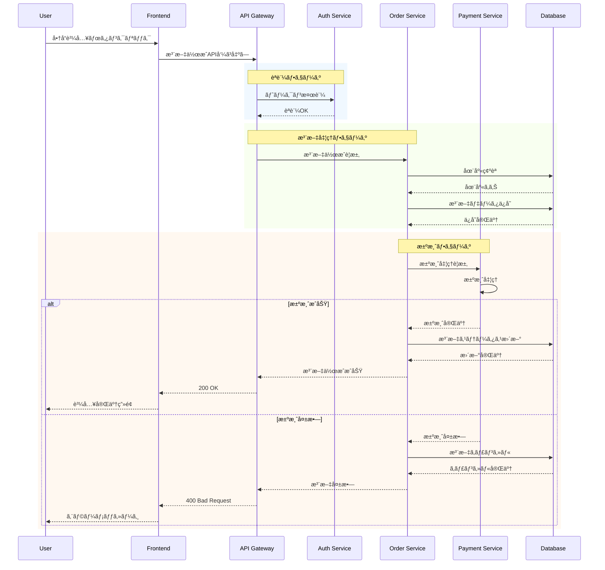
```mermaid
sequenceDiagram
    participant U as User
    participant F as Frontend
    participant G as API Gateway
    participant A as Auth Service
    participant O as Order Service
    participant P as Payment Service
    participant D as Database
    
    U->>F: 商å“購入ボタンクリック
    F->>G: 注文作æˆAPI呼ã³å‡ºã—
    
    rect rgb(240, 248, 255)
        Note over G,A: èªè¨¼ãƒ•ã‚§ãƒ¼ã‚º
        G->>A: トークン検証
        A-->>G: èªè¨¼OK
    end
    
    rect rgb(248, 255, 240)
        Note over G,O: 注文処ç†ãƒ•ã‚§ãƒ¼ã‚º
        G->>O: 注文作æˆè¦æ±‚
        O->>D: 在庫確èª
        D-->>O: 在庫ã‚ã‚Š
        O->>D: 注文データä¿å­˜
        D-->>O: ä¿å­˜å®Œäº†
    end
    
    rect rgb(255, 248, 240)
        Note over O,P: 決済フェーズ
        O->>P: 決済処ç†è¦æ±‚
        P->>P: 決済処ç†
        
        alt 決済æˆåŠŸ
            P-->>O: 決済完了
            O->>D: 注文ステータス更新
            D-->>O: 更新完了
            O-->>G: 注文作æˆæˆåŠŸ
            G-->>F: 200 OK
            F-->>U: 購入完了画é¢
        else 決済失敗
            P-->>O: 決済失敗
            O->>D: 注文キャンセル
            D-->>O: キャンセル完了
            O-->>G: 注文失敗
            G-->>F: 400 Bad Request
            F-->>U: エラーメッセージ
        end
    end
```

---

## 💼 実践編：ç¾å ´ã§ä½¿ãˆã‚‹å¿œç”¨æŠ€è¡“

### 1. リリースプロセスã®å¯è¦–化 - GitHub対応版

```
flowchart TD
    subgraph "開発ブランãƒ"
        develop[develop branch]
        feature1[feature/login]
        feature2[feature/payment]
        feature3[feature/ui-update]
    end
    
    subgraph "リリースプロセス"
        release[release/v1.0]
        hotfix[hotfix/urgent-fix]
    end
    
    subgraph "本番ブランãƒ"
        main[main branch]
        tag1[v1.0.0]
        tag2[v1.0.1]
    end
    
    feature1 --> develop
    feature2 --> develop
    feature3 --> develop
    
    develop --> release
    release --> main
    main --> tag1
    
    main --> hotfix
    hotfix --> main
    main --> tag2
    
    classDef devBranch fill:#e3f2fd,stroke:#1976d2
    classDef releaseBranch fill:#fff3e0,stroke:#f57c00
    classDef mainBranch fill:#e8f5e8,stroke:#388e3c
    classDef tagStyle fill:#fce4ec,stroke:#c2185b
    
    class develop,feature1,feature2,feature3 devBranch
    class release,hotfix releaseBranch
    class main mainBranch
    class tag1,tag2 tagStyle
```

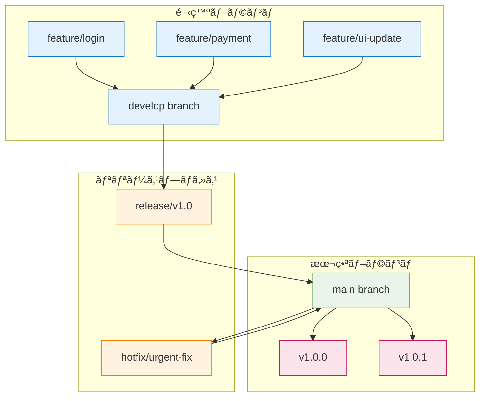
```mermaid
flowchart TD
    subgraph "開発ブランãƒ"
        develop[develop branch]
        feature1[feature/login]
        feature2[feature/payment]
        feature3[feature/ui-update]
    end
    
    subgraph "リリースプロセス"
        release[release/v1.0]
        hotfix[hotfix/urgent-fix]
    end
    
    subgraph "本番ブランãƒ"
        main[main branch]
        tag1[v1.0.0]
        tag2[v1.0.1]
    end
    
    feature1 --> develop
    feature2 --> develop
    feature3 --> develop
    
    develop --> release
    release --> main
    main --> tag1
    
    main --> hotfix
    hotfix --> main
    main --> tag2
    
    classDef devBranch fill:#e3f2fd,stroke:#1976d2
    classDef releaseBranch fill:#fff3e0,stroke:#f57c00
    classDef mainBranch fill:#e8f5e8,stroke:#388e3c
    classDef tagStyle fill:#fce4ec,stroke:#c2185b
    
    class develop,feature1,feature2,feature3 devBranch
    class release,hotfix releaseBranch
    class main mainBranch
    class tag1,tag2 tagStyle
```

### 2. DevOpsパイプライン

```
flowchart LR
    subgraph "開発"
        Code[コード作æˆ] --> Commit[Git Commit]
        Commit --> Push[Git Push]
    end
    
    subgraph "CI/CD Pipeline"
        Push --> Build[ビルド]
        Build --> Test[自動テスト]
        Test --> Security[セキュリティスキャン]
        Security --> Deploy[デプロイ]
    end
    
    subgraph "環境"
        Deploy --> Dev[開発環境]
        Dev --> Staging[ステージング環境]
        Staging --> Prod[本番環境]
    end
    
    subgraph "監視"
        Prod --> Monitor[監視]
        Monitor --> Alert[アラート]
        Alert --> Action[対応]
    end
    
    Test -->|失敗| Notification[開発者通知]
    Security -->|脆弱性発見| Block[デプロイåœæ­¢]
    Monitor -->|異常検知| Rollback[ロールãƒãƒƒã‚¯]
    
    classDef dev fill:#e3f2fd,stroke:#1976d2
    classDef pipeline fill:#e8f5e8,stroke:#388e3c
    classDef env fill:#fff3e0,stroke:#f57c00
    classDef monitor fill:#fce4ec,stroke:#c2185b
    
    class Code,Commit,Push dev
    class Build,Test,Security,Deploy pipeline
    class Dev,Staging,Prod env
    class Monitor,Alert,Action monitor
```


```mermaid
flowchart LR
    subgraph "開発"
        Code[コード作æˆ] --> Commit[Git Commit]
        Commit --> Push[Git Push]
    end
    
    subgraph "CI/CD Pipeline"
        Push --> Build[ビルド]
        Build --> Test[自動テスト]
        Test --> Security[セキュリティスキャン]
        Security --> Deploy[デプロイ]
    end
    
    subgraph "環境"
        Deploy --> Dev[開発環境]
        Dev --> Staging[ステージング環境]
        Staging --> Prod[本番環境]
    end
    
    subgraph "監視"
        Prod --> Monitor[監視]
        Monitor --> Alert[アラート]
        Alert --> Action[対応]
    end
    
    Test -->|失敗| Notification[開発者通知]
    Security -->|脆弱性発見| Block[デプロイåœæ­¢]
    Monitor -->|異常検知| Rollback[ロールãƒãƒƒã‚¯]
    
    classDef dev fill:#e3f2fd,stroke:#1976d2
    classDef pipeline fill:#e8f5e8,stroke:#388e3c
    classDef env fill:#fff3e0,stroke:#f57c00
    classDef monitor fill:#fce4ec,stroke:#c2185b
    
    class Code,Commit,Push dev
    class Build,Test,Security,Deploy pipeline
    class Dev,Staging,Prod env
    class Monitor,Alert,Action monitor
```

### 3. ユーザージャーニーãƒãƒƒãƒ—

```
journey
    title ユーザーã®ã‚ªãƒ³ãƒ©ã‚¤ãƒ³ã‚·ãƒ§ãƒƒãƒ”ング体験
    section 発見
      Google検索: 3: User
      サイト訪å•: 4: User
      商å“閲覧: 5: User
    section 検è¨
      レビュー確èª: 4: User
      価格比較: 3: User
      ãŠæ°—ã«å…¥ã‚Šè¿½åŠ : 4: User
    section 購入
      カート追加: 5: User
      会員登録: 2: User
      決済処ç†: 3: User
      注文確èª: 4: User
    section フォロー
      é…é€è¿½è·¡: 4: User
      商å“å—ã‘å–ã‚Š: 5: User
      レビュー投稿: 3: User
```

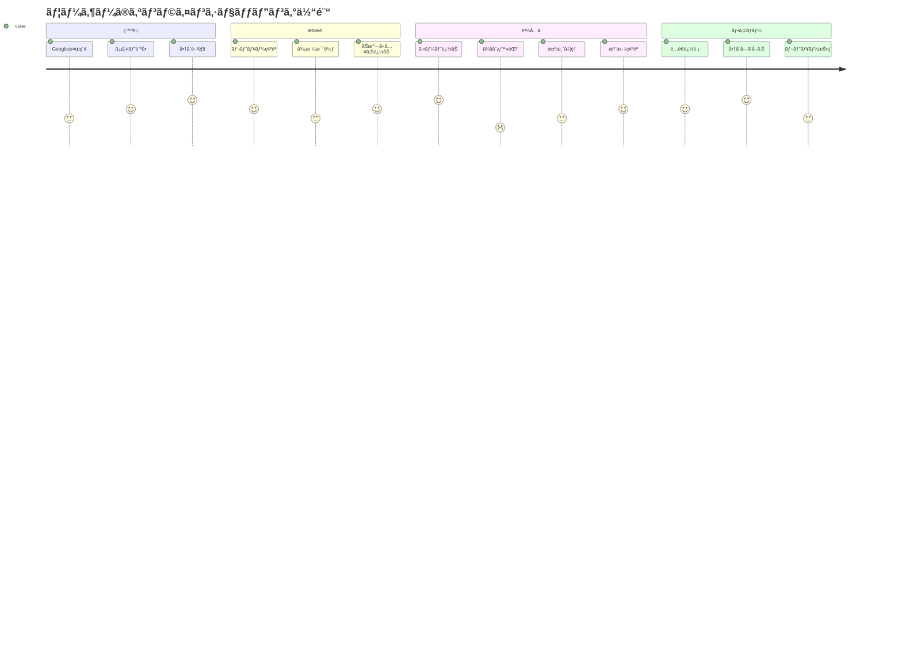
```mermaid
journey
    title ユーザーã®ã‚ªãƒ³ãƒ©ã‚¤ãƒ³ã‚·ãƒ§ãƒƒãƒ”ング体験
    section 発見
      Google検索: 3: User
      サイト訪å•: 4: User
      商å“閲覧: 5: User
    section 検è¨
      レビュー確èª: 4: User
      価格比較: 3: User
      ãŠæ°—ã«å…¥ã‚Šè¿½åŠ : 4: User
    section 購入
      カート追加: 5: User
      会員登録: 2: User
      決済処ç†: 3: User
      注文確èª: 4: User
    section フォロー
      é…é€è¿½è·¡: 4: User
      商å“å—ã‘å–ã‚Š: 5: User
      レビュー投稿: 3: User
```

### 4. システム障害対応フロー

```
flowchart TD
    Alert[アラート発生] --> Triage{é‡è¦åº¦åˆ¤å®š}
    
    Triage -->|P1 Critical| Emergency[緊急対応ãƒãƒ¼ãƒ æ‹›é›†]
    Triage -->|P2 High| Urgent[当番エンジニア対応]
    Triage -->|P3 Medium| Normal[通常対応]
    Triage -->|P4 Low| Schedule[スケジュール対応]
    
    Emergency --> Investigate[åŸå› èª¿æŸ»]
    Urgent --> Investigate
    Normal --> Investigate
    
    Investigate --> Identify{åŸå› ç‰¹å®šï¼Ÿ}
    Identify -->|Yes| Fix[修正実施]
    Identify -->|No| Escalate[エスカレーション]
    
    Fix --> Test[動作確èª]
    Test --> Monitor[監視強化]
    
    Escalate --> Expert[専門家投入]
    Expert --> Fix
    
    Monitor --> PostMortem[ãƒã‚¹ãƒˆãƒ¢ãƒ¼ãƒ†ãƒ ]
    PostMortem --> Improve[改善策実装]
    
    classDef critical fill:#ffebee,stroke:#d32f2f,stroke-width:3px
    classDef high fill:#fff3e0,stroke:#f57c00,stroke-width:2px
    classDef normal fill:#e8f5e8,stroke:#388e3c
    classDef process fill:#e3f2fd,stroke:#1976d2
    
    class Alert,Emergency critical
    class Urgent,Investigate high
    class Normal,Schedule normal
    class Fix,Test,Monitor,PostMortem,Improve process
```

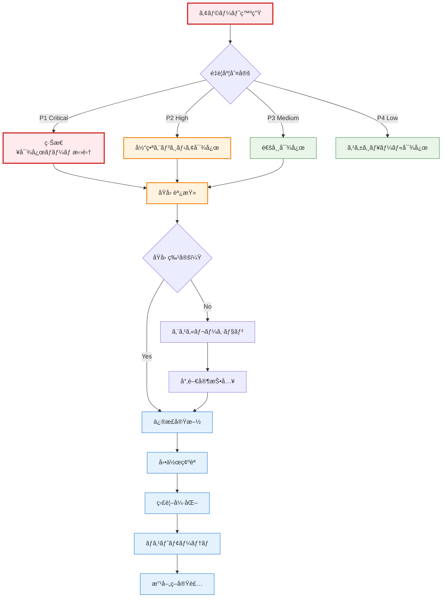
```mermaid
flowchart TD
    Alert[アラート発生] --> Triage{é‡è¦åº¦åˆ¤å®š}
    
    Triage -->|P1 Critical| Emergency[緊急対応ãƒãƒ¼ãƒ æ‹›é›†]
    Triage -->|P2 High| Urgent[当番エンジニア対応]
    Triage -->|P3 Medium| Normal[通常対応]
    Triage -->|P4 Low| Schedule[スケジュール対応]
    
    Emergency --> Investigate[åŸå› èª¿æŸ»]
    Urgent --> Investigate
    Normal --> Investigate
    
    Investigate --> Identify{åŸå› ç‰¹å®šï¼Ÿ}
    Identify -->|Yes| Fix[修正実施]
    Identify -->|No| Escalate[エスカレーション]
    
    Fix --> Test[動作確èª]
    Test --> Monitor[監視強化]
    
    Escalate --> Expert[専門家投入]
    Expert --> Fix
    
    Monitor --> PostMortem[ãƒã‚¹ãƒˆãƒ¢ãƒ¼ãƒ†ãƒ ]
    PostMortem --> Improve[改善策実装]
    
    classDef critical fill:#ffebee,stroke:#d32f2f,stroke-width:3px
    classDef high fill:#fff3e0,stroke:#f57c00,stroke-width:2px
    classDef normal fill:#e8f5e8,stroke:#388e3c
    classDef process fill:#e3f2fd,stroke:#1976d2
    
    class Alert,Emergency critical
    class Urgent,Investigate high
    class Normal,Schedule normal
    class Fix,Test,Monitor,PostMortem,Improve process
```

### 5. アジャイル開発プロセス

```
flowchart LR
    subgraph "スプリント1"
        Planning1[スプリント計画] --> Daily1[デイリースクラム]
        Daily1 --> Review1[スプリントレビュー]
        Review1 --> Retro1[レトロスペクティブ]
    end
    
    subgraph "スプリント2"
        Planning2[スプリント計画] --> Daily2[デイリースクラム]
        Daily2 --> Review2[スプリントレビュー]
        Review2 --> Retro2[レトロスペクティブ]
    end
    
    subgraph "スプリント3"
        Planning3[スプリント計画] --> Daily3[デイリースクラム]
        Daily3 --> Review3[スプリントレビュー]
        Review3 --> Retro3[レトロスペクティブ]
    end
    
    Retro1 --> Planning2
    Retro2 --> Planning3
    
    classDef planning fill:#e3f2fd,stroke:#1976d2
    classDef daily fill:#e8f5e8,stroke:#388e3c
    classDef review fill:#fff3e0,stroke:#f57c00
    classDef retro fill:#fce4ec,stroke:#c2185b
    
    class Planning1,Planning2,Planning3 planning
    class Daily1,Daily2,Daily3 daily
    class Review1,Review2,Review3 review
    class Retro1,Retro2,Retro3 retro
```


```mermaid
flowchart LR
    subgraph "スプリント1"
        Planning1[スプリント計画] --> Daily1[デイリースクラム]
        Daily1 --> Review1[スプリントレビュー]
        Review1 --> Retro1[レトロスペクティブ]
    end
    
    subgraph "スプリント2"
        Planning2[スプリント計画] --> Daily2[デイリースクラム]
        Daily2 --> Review2[スプリントレビュー]
        Review2 --> Retro2[レトロスペクティブ]
    end
    
    subgraph "スプリント3"
        Planning3[スプリント計画] --> Daily3[デイリースクラム]
        Daily3 --> Review3[スプリントレビュー]
        Review3 --> Retro3[レトロスペクティブ]
    end
    
    Retro1 --> Planning2
    Retro2 --> Planning3
    
    classDef planning fill:#e3f2fd,stroke:#1976d2
    classDef daily fill:#e8f5e8,stroke:#388e3c
    classDef review fill:#fff3e0,stroke:#f57c00
    classDef retro fill:#fce4ec,stroke:#c2185b
    
    class Planning1,Planning2,Planning3 planning
    class Daily1,Daily2,Daily3 daily
    class Review1,Review2,Review3 review
    class Retro1,Retro2,Retro3 retro
```

---

## 📋 ãƒãƒ¼ãƒˆã‚·ãƒ¼ãƒˆï¼šã„ã¤ã§ã‚‚使ãˆã‚‹æ—©è¦‹è¡¨

### 基本構文

| 図表タイプ | 開始コãƒãƒ³ãƒ‰ | 用途 |
|----------|------------|------|
| フローãƒãƒ£ãƒ¼ãƒˆ | `flowchart TD` | プロセスフロー |
| シーケンス図 | `sequenceDiagram` | システム間通信 |
| ER図 | `erDiagram` | データベース設計 |
| クラス図 | `classDiagram` | オブジェクト設計 |
| 状態図 | `stateDiagram-v2` | 状態é·ç§» |
| ガントãƒãƒ£ãƒ¼ãƒˆ | `gantt` | ãƒ—ãƒ­ã‚¸ã‚§ã‚¯ãƒˆç®¡ç† |
| ãƒã‚¤ãƒ³ãƒ‰ãƒãƒƒãƒ— | `mindmap` | ã‚¢ã‚¤ãƒ‡ã‚£ã‚¢æ•´ç† |
| ジャーニーãƒãƒƒãƒ— | `journey` | ユーザー体験 |

### よã使ã†ãƒãƒ¼ãƒ‰å½¢çŠ¶

```
flowchart LR
    A[四角形] --> B(丸角四角形)
    B --> C([楕円])
    C --> D{ダイヤモンド}
    D --> E[["サブルーãƒãƒ³"]]
    E --> F[(データベース)]
    F --> G[("円形")]
    G --> H>"é対称"]
```

```mermaid
flowchart LR
    A[四角形] --> B(丸角四角形)
    B --> C([楕円])
    C --> D{ダイヤモンド}
    D --> E[["サブルーãƒãƒ³"]]
    E --> F[(データベース)]
    F --> G[("円形")]
    G --> H>"é対称"]
```

### 矢å°ã®ç¨®é¡ - GitHub対応版

```
flowchart LR
    A -->|実線矢å°| B
    C ---|実線| D
    E -.->|点線矢å°| F
    G ==>|太矢å°| H
```

```mermaid
flowchart LR
    A -->|実線矢å°| B
    C ---|実線| D
    E -.->|点線矢å°| F
    G ==>|太矢å°| H
```

### スタイリング例

```
flowchart TD
    A[Normal] --> B[Styled]
    
    classDef redBox fill:#ff9999,stroke:#333,stroke-width:2px
    classDef blueBox fill:#9999ff,stroke:#333,stroke-width:2px
    
    class A redBox
    class B blueBox
```

```mermaid
flowchart TD
    A[Normal] --> B[Styled]
    
    classDef redBox fill:#ff9999,stroke:#333,stroke-width:2px
    classDef blueBox fill:#9999ff,stroke:#333,stroke-width:2px
    
    class A redBox
    class B blueBox
```

### 色パレットæ¨å¥¨

```
flowchart TD
    subgraph "æ¨å¥¨ã‚«ãƒ©ãƒ¼ãƒ‘レット"
        A[プライãƒãƒª<br/>#1976d2] --> B[セカンダリ<br/>#388e3c]
        B --> C[アクセント<br/>#f57c00]
        C --> D[エラー<br/>#d32f2f]
        D --> E[警告<br/>#f9a825]
        E --> F[情報<br/>#0288d1]
    end
    
    classDef primary fill:#e3f2fd,stroke:#1976d2
    classDef secondary fill:#e8f5e8,stroke:#388e3c
    classDef accent fill:#fff3e0,stroke:#f57c00
    classDef error fill:#ffebee,stroke:#d32f2f
    classDef warning fill:#fff8e1,stroke:#f9a825
    classDef info fill:#e1f5fe,stroke:#0288d1
    
    class A primary
    class B secondary
    class C accent
    class D error
    class E warning
    class F info
```

```mermaid
flowchart TD
    subgraph "æ¨å¥¨ã‚«ãƒ©ãƒ¼ãƒ‘レット"
        A[プライãƒãƒª<br/>#1976d2] --> B[セカンダリ<br/>#388e3c]
        B --> C[アクセント<br/>#f57c00]
        C --> D[エラー<br/>#d32f2f]
        D --> E[警告<br/>#f9a825]
        E --> F[情報<br/>#0288d1]
    end
    
    classDef primary fill:#e3f2fd,stroke:#1976d2
    classDef secondary fill:#e8f5e8,stroke:#388e3c
    classDef accent fill:#fff3e0,stroke:#f57c00
    classDef error fill:#ffebee,stroke:#d32f2f
    classDef warning fill:#fff8e1,stroke:#f9a825
    classDef info fill:#e1f5fe,stroke:#0288d1
    
    class A primary
    class B secondary
    class C accent
    class D error
    class E warning
    class F info
```

---

## 🔧 トラブルシューティング：GitHub対応版

### よãã‚るエラーã¨å¯¾å‡¦æ³•

#### 1. クラス図ã§ã®ãƒ¡ã‚½ãƒƒãƒ‰è¨˜è¿°ã‚¨ãƒ©ãƒ¼
**⌠NG例:**
```
+login(password: string): boolean
```

**✅ OK例:**
```
+login(password) boolean
```

#### 2. GitgraphãŒè¡¨ç¤ºã•ã‚Œãªã„
GitHubã§ã¯gitgraphãŒã‚µãƒãƒ¼ãƒˆã•ã‚Œã¦ã„ãªã„ãŸã‚ã€ãƒ•ãƒ­ãƒ¼ãƒãƒ£ãƒ¼ãƒˆã§ä»£æ›¿ï¼š

**⌠NG例:**
```
gitgraph:
    commit id: "Initial"
```

**✅ OK例:**
```
flowchart TD
    A[Initial Commit] --> B[Feature Branch]
    B --> C[Merge to Main]
```

#### 3. 複雑ãªçŸ¢å°ãŒè¡¨ç¤ºã•ã‚Œãªã„
一部ã®çŸ¢å°è¨˜æ³•ã¯ã‚µãƒãƒ¼ãƒˆã•ã‚Œã¦ã„ã¾ã›ã‚“：

**⌠NG例:**
```
A -.-.-> B
A ====> B
```

**✅ OK例:**
```
A -.-> B
A ==> B
```

#### 4. 日本èªãƒ•ã‚©ãƒ³ãƒˆã®å•é¡Œ
日本èªã‚’使用ã™ã‚‹éš›ã¯ã€çŸ­ã„文章を心ãŒã‘ã€å¿…è¦ã«å¿œã˜ã¦è‹±èªä½µè¨˜ï¼š

**✅ æ¨å¥¨:**
```
A[ユーザー登録<br/>User Registration] --> B[èªè¨¼<br/>Authentication]
```

---

## 🯠実践課題

### 課題1：基本レベル
ã‚ãªãŸã®ä¼šç¤¾ã®ã€Œæ–°å…¥ç¤¾å“¡ç ”修プロセスã€ã‚’フローãƒãƒ£ãƒ¼ãƒˆã§æã„ã¦ãã ã•ã„。

### 課題2：中級レベル
ECサイトã®ãƒ¦ãƒ¼ã‚¶ãƒ¼ã€å•†å“ã€æ³¨æ–‡ã®ER図を作æˆã—ã¦ãã ã•ã„。

### 課題3：上級レベル
ãƒã‚¤ã‚¯ãƒ­ã‚µãƒ¼ãƒ“ス間ã®å•†å“注文処ç†ã‚’シーケンス図ã§è¡¨ç¾ã—ã¦ãã ã•ã„。

### 課題4：実践レベル
CI/CDパイプラインã®éšœå®³ç™ºç”Ÿæ™‚ã®å¯¾å¿œãƒ•ãƒ­ãƒ¼ã‚’状態図ã§è¡¨ç¾ã—ã¦ãã ã•ã„。

---

## 📚 ã•ã‚‰ãªã‚‹å­¦ç¿’リソース

1. **Mermaidå…¬å¼ãƒ‰ã‚­ãƒ¥ãƒ¡ãƒ³ãƒˆ**: https://mermaid.js.org/
2. **Mermaid Live Editor**: https://mermaid.live/
3. **GitHubã§ã®Mermaid活用**: README.mdã«ç›´æ¥åŸ‹ã‚è¾¼ã¿å¯èƒ½
4. **VS Codeæ‹¡å¼µ**: Mermaid Preview
5. **Notion対応**: `/code` ブロック㧠`mermaid` ã‚’é¸æŠ

---

## 💡 プロã‹ã‚‰ã®ã‚¢ãƒ‰ãƒã‚¤ã‚¹

### ✅ Do（æ¨å¥¨ï¼‰
- **シンプルã«ä¿ã¤**: 複雑ã™ãる図ã¯ç†è§£ãŒå›°é›£
- **一貫性をä¿ã¤**: 命åè¦å‰‡ã¨ã‚¹ã‚¿ã‚¤ãƒ«ã‚’統一
- **段éšçš„ã«ä½œæˆ**: 大ããªå›³ã¯å°ã•ãªãƒ‘ーツã‹ã‚‰çµ„ã¿ç«‹ã¦
- **定期的ãªæ›´æ–°**: システム変更時ã¯å›³ã‚‚æ›´æ–°
- **GitHubã§ãƒ†ã‚¹ãƒˆ**: 本番投入å‰ã«å¿…ãšGitHubã§è¡¨ç¤ºç¢ºèª

### ⌠Don't（éæ¨å¥¨ï¼‰
- **情報ã®è©°ã‚è¾¼ã¿ã™ã**: 1ã¤ã®å›³ã«å¤šã™ãã‚‹è¦ç´ 
- **ä¸æ˜ç¢ºãªãƒ©ãƒ™ãƒ«**: ç•¥èªã ã‘ã®èª¬æ˜
- **å¤ã„図ã®æ”¾ç½®**: 実装ã¨ä¹–離ã—ãŸå›³
- **未対応構文ã®ä½¿ç”¨**: GitHub未対応ã®è¨˜æ³•ã¯é¿ã‘ã‚‹

### 🚀 プロダクトãƒãƒãƒ¼ã‚¸ãƒ£ãƒ¼å‘ã‘特別Tips

#### 1. ステークホルダーå‘ã‘図表作æˆ
```
flowchart TD
    subgraph "経営陣å‘ã‘"
        A[高レベル概è¦å›³]
        B[ROI関連図]
    end
    
    subgraph "開発ãƒãƒ¼ãƒ å‘ã‘"
        C[詳細技術図]
        D[実装フロー図]
    end
    
    subgraph "営業å‘ã‘"
        E[機能概è¦å›³]
        F[競åˆæ¯”較図]
    end
    
    A --> C
    B --> E
    C --> D
    E --> F
```

```mermaid
flowchart TD
    subgraph "経営陣å‘ã‘"
        A[高レベル概è¦å›³]
        B[ROI関連図]
    end
    
    subgraph "開発ãƒãƒ¼ãƒ å‘ã‘"
        C[詳細技術図]
        D[実装フロー図]
    end
    
    subgraph "営業å‘ã‘"
        E[機能概è¦å›³]
        F[競åˆæ¯”較図]
    end
    
    A --> C
    B --> E
    C --> D
    E --> F
```

#### 2. プロダクトロードãƒãƒƒãƒ—
```
gantt
    title プロダクトロードãƒãƒƒãƒ— 2024
    dateFormat  YYYY-MM-DD
    section Phase 1
    MVP開発           :active, mvp, 2024-01-01, 90d
    ユーザーテスト      :ut, after mvp, 30d
    
    section Phase 2
    機能拡張          :ext, after ut, 60d
    パフォーãƒãƒ³ã‚¹æ”¹å–„   :perf, after ext, 30d
    
    section Phase 3
    新機能追加        :new, after perf, 90d
    スケール対応       :scale, after new, 60d
```

```mermaid
gantt
    title プロダクトロードãƒãƒƒãƒ— 2024
    dateFormat  YYYY-MM-DD
    section Phase 1
    MVP開発           :active, mvp, 2024-01-01, 90d
    ユーザーテスト      :ut, after mvp, 30d
    
    section Phase 2
    機能拡張          :ext, after ut, 60d
    パフォーãƒãƒ³ã‚¹æ”¹å–„   :perf, after ext, 30d
    
    section Phase 3
    新機能追加        :new, after perf, 90d
    スケール対応       :scale, after new, 60d
```

#### 3. ユーザーフィードãƒãƒƒã‚¯ãƒ«ãƒ¼ãƒ—
```
flowchart LR
    subgraph "データå集"
        A[ユーザーインタビュー]
        B[Analytics]
        C[サãƒãƒ¼ãƒˆå•ã„åˆã‚ã›]
    end
    
    subgraph "分æ"
        D[課題抽出]
        E[優先度付ã‘]
    end
    
    subgraph "アクション"
        F[機能改善]
        G[新機能開発]
    end
    
    A --> D
    B --> D
    C --> D
    D --> E
    E --> F
    E --> G
    F --> A
    G --> A
```

```mermaid
flowchart LR
    subgraph "データå集"
        A[ユーザーインタビュー]
        B[Analytics]
        C[サãƒãƒ¼ãƒˆå•ã„åˆã‚ã›]
    end
    
    subgraph "分æ"
        D[課題抽出]
        E[優先度付ã‘]
    end
    
    subgraph "アクション"
        F[機能改善]
        G[新機能開発]
    end
    
    A --> D
    B --> D
    C --> D
    D --> E
    E --> F
    E --> G
    F --> A
    G --> A
```

---

## 🊠ã¾ã¨ã‚

ã“ã®æ•™æを完了ã—ãŸã‚ãªãŸã¯ã€ã‚‚ã†ç«‹æ´¾ãªMermaidエキスパートã§ã™ï¼

### ç¿’å¾—ã—ãŸã‚¹ã‚­ãƒ«
- ✅ 基本的ãªå›³è¡¨ä½œæˆï¼ˆãƒ•ãƒ­ãƒ¼ãƒãƒ£ãƒ¼ãƒˆã€ã‚·ãƒ¼ã‚±ãƒ³ã‚¹å›³ï¼‰
- ✅ データベース設計（ER図）
- ✅ システム設計（クラス図ã€ã‚¢ãƒ¼ã‚­ãƒ†ã‚¯ãƒãƒ£å›³ï¼‰
- ✅ プロジェクト管ç†ï¼ˆã‚¬ãƒ³ãƒˆãƒãƒ£ãƒ¼ãƒˆã€ã‚¸ãƒ£ãƒ¼ãƒ‹ãƒ¼ãƒãƒƒãƒ—）
- ✅ GitHub対応ベストプラクティス
- ✅ 実践的ãªã‚¹ã‚¿ã‚¤ãƒªãƒ³ã‚°ã¨ãƒ¬ã‚¤ã‚¢ã‚¦ãƒˆ

### 次ã®ã‚¹ãƒ†ãƒƒãƒ—
1. **実際ã®ãƒ—ロジェクトã§æ´»ç”¨**: 日々ã®æ¥­å‹™ã§Mermaidã‚’ç©æ¥µçš„ã«ä½¿ç”¨
2. **ãƒãƒ¼ãƒ å±•é–‹**: åŒåƒšã«ã‚‚Mermaidã®æ´»ç”¨ã‚’æ¨é€²
3. **継続学習**: 新機能やベストプラクティスを定期的ã«ã‚­ãƒ£ãƒƒãƒã‚¢ãƒƒãƒ—
4. **コミュニティå‚加**: Mermaidコミュニティã§çŸ¥è¦‹ã‚’共有

実際ã®ãƒ—ロジェクトã§ç©æ¥µçš„ã«æ´»ç”¨ã—ã€ãƒãƒ¼ãƒ å…¨ä½“ã®ãƒ‰ã‚­ãƒ¥ãƒ¡ãƒ³ãƒˆå“質å‘上ã«è²¢çŒ®ã—ã¦ãã ã•ã„ï¼

**Perfect! 🚀**
