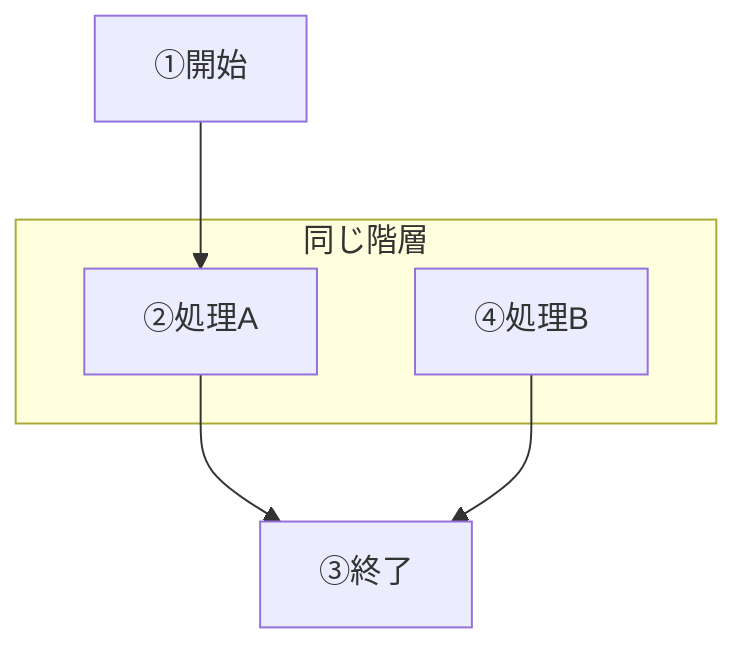
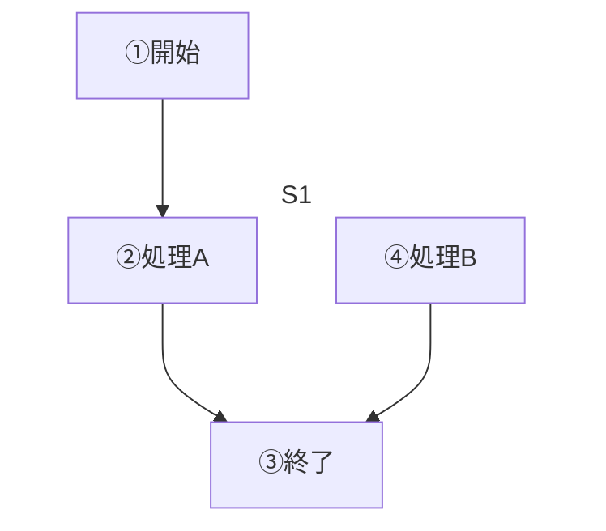
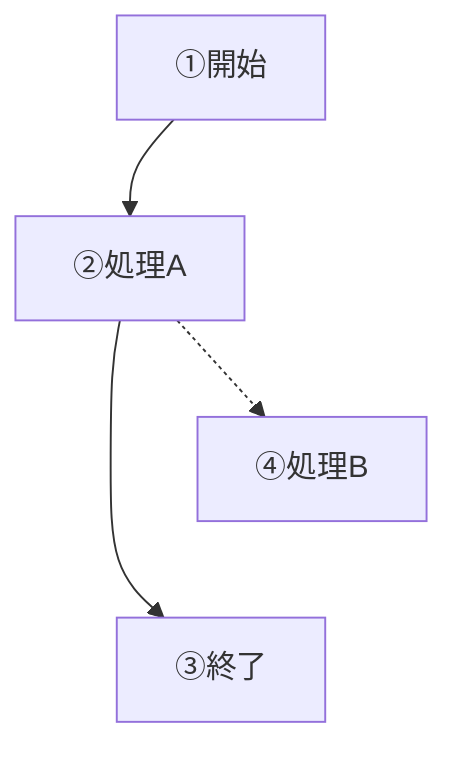
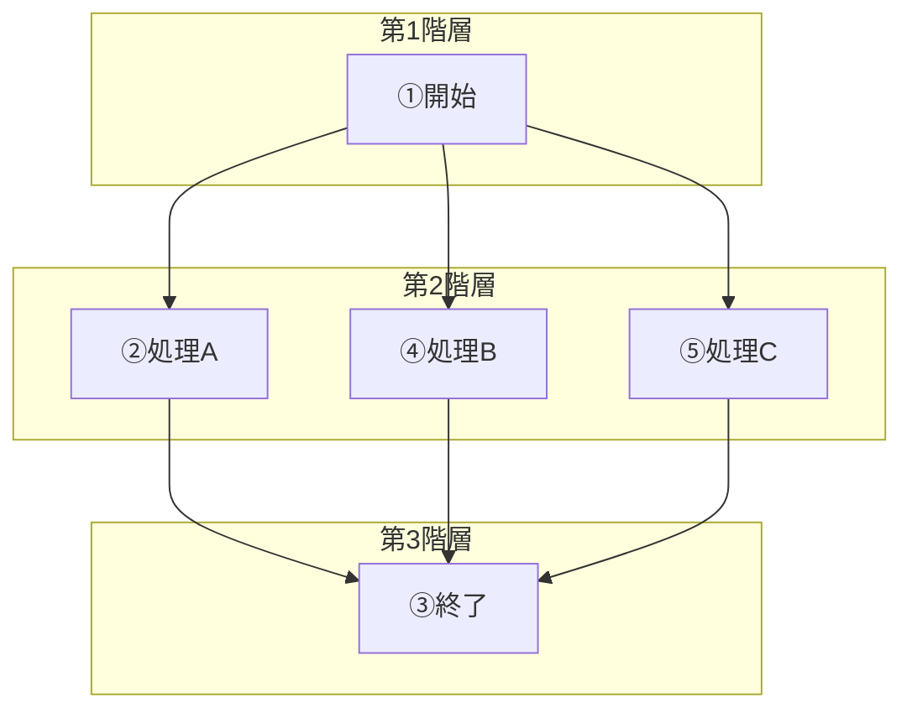
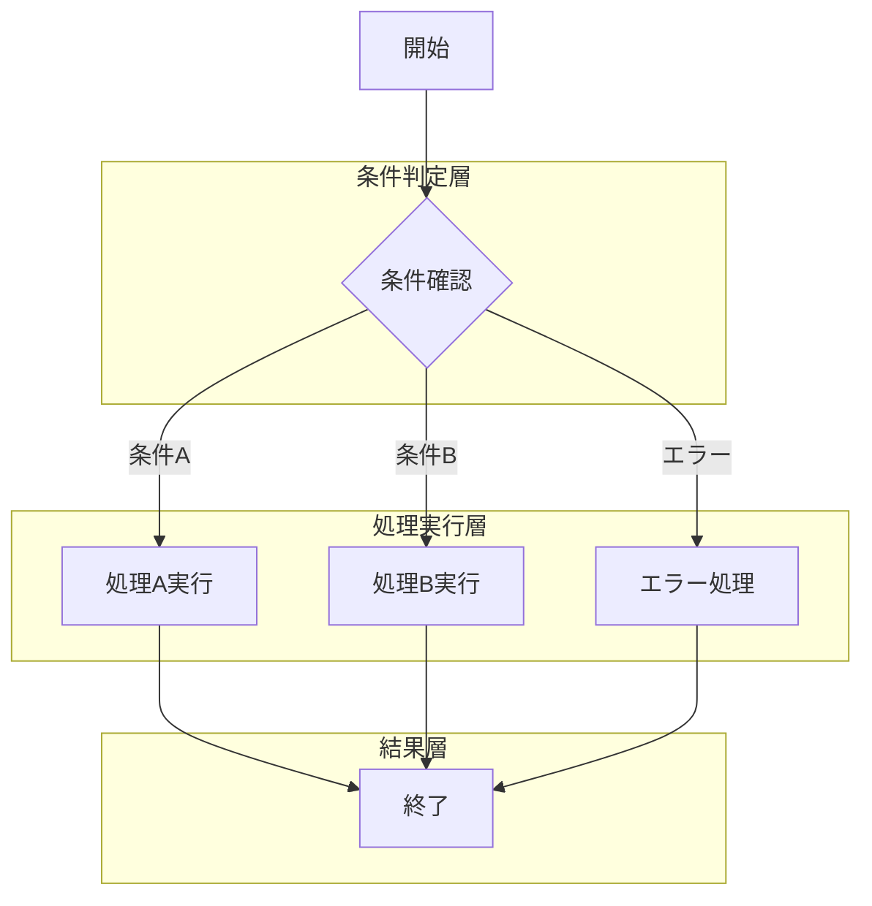
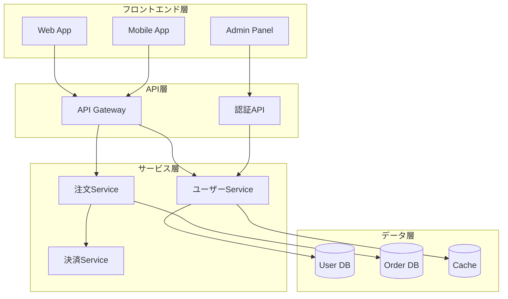
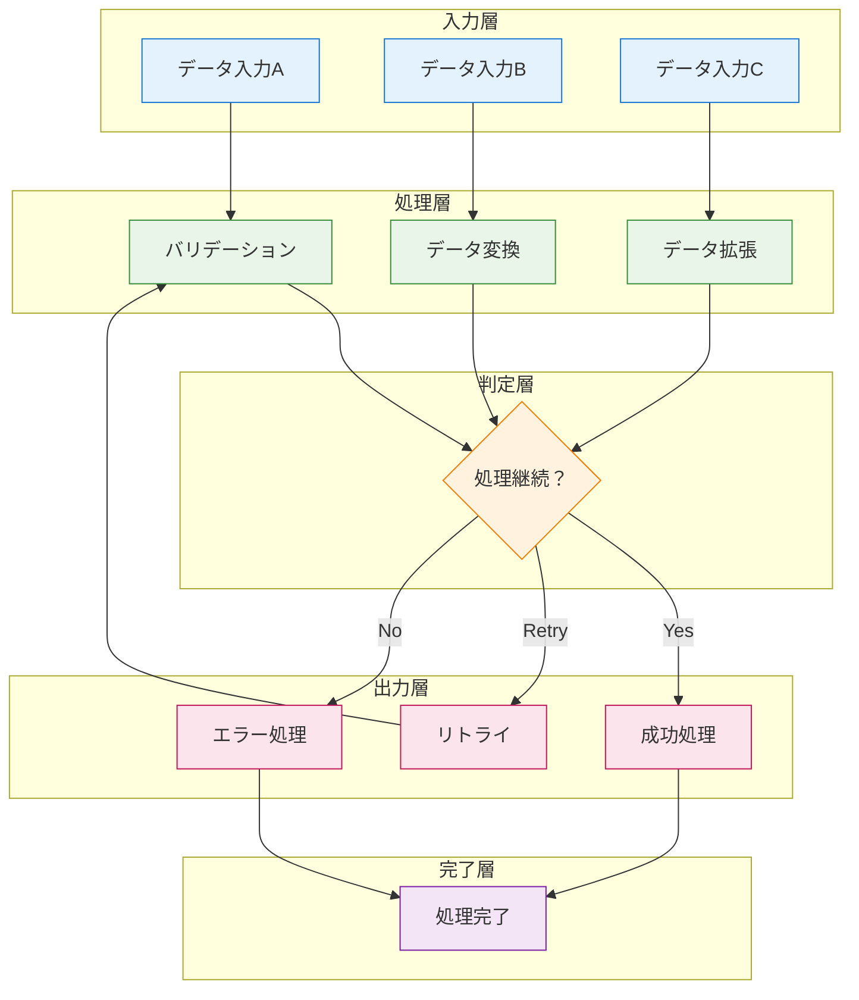
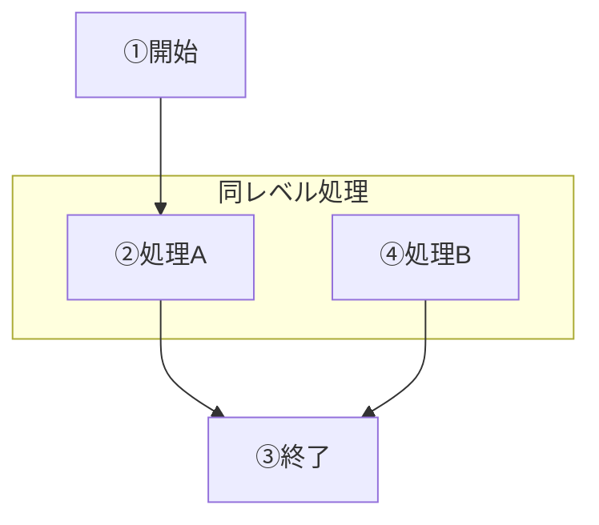

# Mermaid階層制御完全ガイド 🎯
## ノードの位置と階層を自在に操る技術

---

## 🎯 基本的な階層制御方法

### 1. サブグラフを使った階層制御（最も確実）

```
flowchart TD
    A[①開始]
    
    subgraph "同じ階層"
        direction LR
        B[②処理A]
        D[④処理B]
    end
    
    C[③終了]
    
    A --> B
    B --> C
    D --> C
```



### 2. 見えないサブグラフを使う（枠線なし）

```
flowchart TD
    A[①開始]
    
    subgraph S1
        direction LR
        B[②処理A]
        D[④処理B]
    end
    
    C[③終了]
    
    A --> B
    B --> C
    D --> C
    
    style S1 fill:#ffffff,stroke:#ffffff
```



---

## 🔧 高度な階層制御テクニック

### 3. 見えないリンクを使った位置調整

```
flowchart TD
    A[①開始] --> B[②処理A]
    A -.-> D[④処理B]
    B --> C[③終了]
    D --> C
    
    %% 見えないリンクで位置調整
    B -.-> D
    
    %% 見えないリンクを透明に
    linkStyle 1 stroke:none,fill:none
    linkStyle 3 stroke:none,fill:none
```



### 4. 複数の階層を明確に分ける

```
flowchart TD
    subgraph "第1階層"
        A[①開始]
    end
    
    subgraph "第2階層"
        direction LR
        B[②処理A]
        D[④処理B]
        E[⑤処理C]
    end
    
    subgraph "第3階層"
        C[③終了]
    end
    
    A --> B
    A --> D
    A --> E
    B --> C
    D --> C
    E --> C
```



---

## 💡 実践的な階層制御パターン

### 5. 条件分岐での並列配置

```
flowchart TD
    Start[開始]
    
    subgraph "条件判定層"
        Condition{条件確認}
    end
    
    subgraph "処理実行層"
        direction LR
        ProcessA[処理A実行]
        ProcessB[処理B実行]
        ProcessC[エラー処理]
    end
    
    subgraph "結果層"
        End[終了]
    end
    
    Start --> Condition
    Condition -->|条件A| ProcessA
    Condition -->|条件B| ProcessB
    Condition -->|エラー| ProcessC
    ProcessA --> End
    ProcessB --> End
    ProcessC --> End
```



### 6. システムアーキテクチャでの階層分け

```
flowchart TD
    subgraph "フロントエンド層"
        direction LR
        WebApp[Web App]
        MobileApp[Mobile App]
        AdminPanel[Admin Panel]
    end
    
    subgraph "API層"
        direction LR
        Gateway[API Gateway]
        Auth[認証API]
    end
    
    subgraph "サービス層"
        direction LR
        UserService[ユーザーService]
        OrderService[注文Service]
        PaymentService[決済Service]
    end
    
    subgraph "データ層"
        direction LR
        UserDB[(User DB)]
        OrderDB[(Order DB)]
        Cache[(Cache)]
    end
    
    WebApp --> Gateway
    MobileApp --> Gateway
    AdminPanel --> Auth
    
    Gateway --> UserService
    Gateway --> OrderService
    Auth --> UserService
    
    OrderService --> PaymentService
    UserService --> UserDB
    OrderService --> OrderDB
    UserService --> Cache
```



---

## 🎨 階層制御のベストプラクティス

### 7. 美しいレイアウトのコツ

```
flowchart TD
    %% 階層1: 入力
    subgraph "入力層"
        direction LR
        Input1[データ入力A]
        Input2[データ入力B]
        Input3[データ入力C]
    end
    
    %% 階層2: 処理
    subgraph "処理層"
        direction LR
        Validate[バリデーション]
        Transform[データ変換]
        Enrich[データ拡張]
    end
    
    %% 階層3: 分岐
    subgraph "判定層"
        Decision{処理継続？}
    end
    
    %% 階層4: 出力
    subgraph "出力層"
        direction LR
        Success[成功処理]
        Retry[リトライ]
        Error[エラー処理]
    end
    
    %% 階層5: 終了
    subgraph "完了層"
        End[処理完了]
    end
    
    Input1 --> Validate
    Input2 --> Transform
    Input3 --> Enrich
    
    Validate --> Decision
    Transform --> Decision
    Enrich --> Decision
    
    Decision -->|Yes| Success
    Decision -->|Retry| Retry
    Decision -->|No| Error
    
    Success --> End
    Retry --> Validate
    Error --> End
    
    %% スタイリング
    classDef inputLayer fill:#e3f2fd,stroke:#1976d2
    classDef processLayer fill:#e8f5e8,stroke:#388e3c
    classDef decisionLayer fill:#fff3e0,stroke:#f57c00
    classDef outputLayer fill:#fce4ec,stroke:#c2185b
    classDef endLayer fill:#f3e5f5,stroke:#7b1fa2
    
    class Input1,Input2,Input3 inputLayer
    class Validate,Transform,Enrich processLayer
    class Decision decisionLayer
    class Success,Retry,Error outputLayer
    class End endLayer
```



---

## 📝 階層制御チートシート

### 基本パターン

| 目的 | 手法 | コード例 |
|------|------|----------|
| 同じ階層に配置 | `subgraph + direction LR` | `subgraph "層"<br/>direction LR<br/>A[項目1]<br/>B[項目2]<br/>end` |
| 見えない枠線 | `style サブグラフ名` | `style "層" fill:none,stroke:none` |
| 階層間の接続 | 通常の矢印 | `A --> B` |
| 位置微調整 | 見えないリンク | `linkStyle 番号 stroke:none` |

### よく使う階層パターン

```
%% 3層アーキテクチャ
subgraph "プレゼンテーション層"
    UI[UI Components]
end
subgraph "ビジネスロジック層"
    Service[Business Logic]
end
subgraph "データアクセス層"
    DB[Database]
end
```

```
%% 並列処理パターン
subgraph "並列実行"
    direction LR
    Task1[タスク1]
    Task2[タスク2]
    Task3[タスク3]
end
```

---

## 💡 プロからのコツ

### ✅ Do（推奨）
- **subgraphを積極活用**: 最も確実な階層制御
- **direction LR指定**: 横並び配置で美しく
- **意味のある層名**: 理解しやすい名前を付ける
- **スタイリング統一**: 層ごとに色分けで視認性向上

### ❌ Don't（非推奨）
- **複雑な見えないリンク**: メンテナンス性が悪化
- **無意味な階層分け**: 過度な分割は理解を阻害
- **不統一なスタイル**: 層ごとの一貫性を保つ

---

## 🎯 あなたの例を解決

```
flowchart TD
    A[①開始]
    
    subgraph "同レベル処理"
        direction LR
        B[②処理A]
        D[④処理B]
    end
    
    C[③終了]
    
    A --> B
    B --> C
    D --> C
```



**Perfect! これで②と④が同じ階層に配置されました！** 🎉
