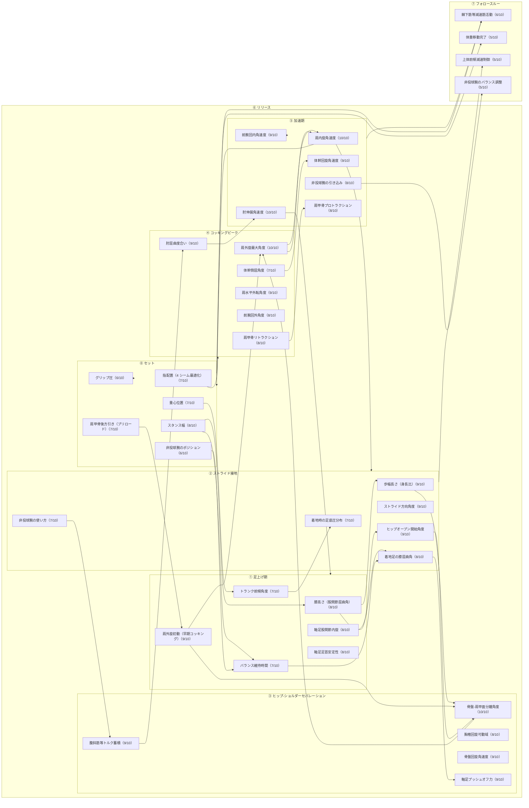

```mermaid
flowchart LR
%% フェーズ別重要要素分析
subgraph G1 ["⓪ セット"]
A1["グリップ圧（6/10）"]
A2["指配置（4 シーム最適化）（7/10）"]
A3["スタンス幅（8/10）"]
A4["重心位置（7/10）"]
A5["肩甲骨後方引き（プリロード）（7/10）"]
A6["非投球腕のポジション（6/10）"]
end

    subgraph G2 ["① 足上げ期"]
        B1["膝高さ（股関節屈曲角）（8/10）"]
        B2["トランク前傾角度（7/10）"]
        B3["軸足股関節内旋（8/10）"]
        B4["肩外旋初動（早期コッキング）（9/10）"]
        B5["バランス維持時間（7/10）"]
        B6["軸足足首安定性（8/10）"]
    end

    subgraph G3 ["② ストライド接地"]
        C1["歩幅長さ（身長比）（9/10）"]
        C2["ストライド方向角度（9/10）"]
        C3["着地足の膝屈曲角（8/10）"]
        C4["ヒップオープン開始角度（9/10）"]
        C5["着地時の足底圧分布（7/10）"]
        C6["非投球腕の使い方（7/10）"]
    end

    subgraph G4 ["③ ヒップ-ショルダーセパレーション"]
        D1["骨盤-肩甲面分離角度（10/10）"]
        D2["腹斜筋等トルク蓄積（9/10）"]
        D3["胸椎回旋可動域（8/10）"]
        D4["骨盤回旋角速度（9/10）"]
        D5["軸足プッシュオフ力（9/10）"]
    end

    subgraph G5 ["④ コッキングピーク"]
        E1["肩外旋最大角度（10/10）"]
        E2["肘屈曲度合い（9/10）"]
        E3["肩甲骨リトラクション（8/10）"]
        E4["肩水平外転角度（9/10）"]
        E5["前腕回外角度（8/10）"]
        E6["体幹側屈角度（7/10）"]
    end

    subgraph G6 ["⑤ 加速期"]
        F1["肩内旋角速度（10/10）"]
        F2["肘伸展角速度（10/10）"]
        F3["体幹回旋角速度（9/10）"]
        F4["前腕回内角速度（9/10）"]
        F5["非投球腕の引き込み（8/10）"]
        F6["肩甲骨プロトラクション（8/10）"]
    end

    subgraph G7 ["⑥ リリース"]
        G1["手首屈曲角度・速度（9/10）"]
        G2["指先離脱速度ベクトル（8/10）"]
        G3["リリースタイミング精度（9/10）"]
        G4["リリース高さ（8/10）"]
        G5["ボール回転数・軸（8/10）"]
        G6["前腕回内完了度（8/10）"]
    end

    subgraph G8 ["⑦ フォロースルー"]
        H1["棘下筋等減速筋活動（6/10）"]
        H2["体重移動完了（5/10）"]
        H3["上体前傾減速制御（5/10）"]
        H4["非投球腕のバランス調整（5/10）"]
    end

    %% 基本フロー
    A3 --> B1
    B1 --> C1
    C1 --> D1
    D1 --> E1
    E1 --> F1
    F1 --> G1
    G1 --> H2

    %% 追加キネティックチェーン連動
    A3 --> B5
    A4 --> B2
    A5 --> B4
    A6 --> B5
    A1 --> G1
    A2 --> G5

    B1 --> C3
    B2 --> C5
    B3 --> C4
    B5 --> C3
    B4 --> D1
    B4 --> E1

    C3 --> D5
    C4 --> D1
    C6 --> D2

    D2 --> E2

    E1 --> F1
    E2 --> F2
    E6 --> F3
    E3 --> F6

    F1 --> G3
    F2 --> G2
    F4 --> G6
    F5 --> H4

    G3 --> H3
    G6 --> H1
    G1 --> H1
```
