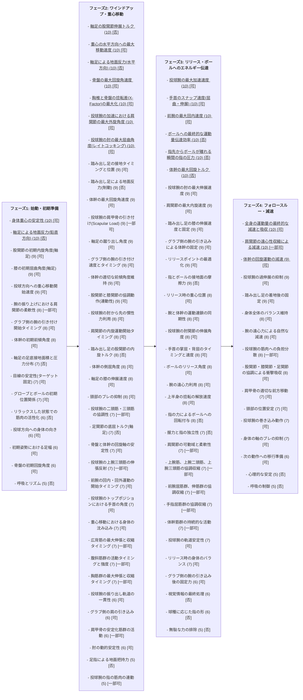

ソフトボール投手のストレートの最大球速を向上させるための、スイング時の一連の動作における物理的に重要な要素を 100 個挙げ、重要度を 10 点満点で評価し、さらに Mermaid 表記のフローチャートで表現します。

**重要度評価の基準**:

- 10 点: 球速に決定的な影響を与える要素
- 9 点: 球速に非常に大きな影響を与える要素
- 8 点: 球速に大きな影響を与える要素
- 7 点: 球速に中程度の影響を与える要素
- 6 点: 球速に若干の影響を与える要素
- 5 点以下: 球速への影響は限定的または間接的

**Mermaid 表記のフローチャート**:

**重要な要素 100 個 (重要度 10 点満点、[可/非]は姿勢推定の可否)**

**フェーズ 1: 準備**

1. 重心位置の安定性 (10) [可]
2. 軸足の設置角度 (9) [可]
3. 体幹の傾斜角度 (9) [可]
4. 肩甲骨の位置 (8) [一部可]
5. 骨盤の傾斜角度 (8) [可]
6. 膝関節の屈曲角度 (7) [可]
7. 足部のアーチの維持 (6) [可]
8. グリップの握り方 (6) [否]
9. 投球動作へのメンタル準備 (5) [否]
10. 視線とターゲットの確認 (5) [否]
11. 呼吸の深さ (5) [否]
12. 心拍数 (4) [否]
13. 筋緊張 (4) [一部可]
14. 体温 (3) [否]
15. 集中力 (3) [否]
16. 自信度 (3) [否]
17. 環境への適応力 (2) [否]
18. 前日の睡眠時間 (2) [否]
19. 水分補給 (2) [否]
20. 栄養状態 (2) [否]

**フェーズ 2: 始動**

21. 股関節の伸展速度 (10) [一部可]
22. 骨盤の回旋角速度 (10) [可]
23. 体幹の回旋角速度 (9) [可]
24. 肩甲骨の回旋角速度 (9) [一部可]
25. 上腕の挙上速度 (8) [可]
26. 肘関節の屈曲角度 (7) [可]
27. 手首のコック角度 (7) [可]
28. 体重移動の開始 (6) [可]
29. リリースポイントの意識 (6) [否]
30. 呼吸のリズム (5) [否]
31. 体幹の回転軸 (5) [可]
32. 下肢の回転 (5) [可]
33. 体重移動のタイミング (5) [可]
34. 体幹の伸展 (4) [可]
35. 骨盤の安定性 (4) [可]
36. 軸足の踏ん張り (4) [否]
37. 前腕のポジション (4) [可]
38. 上腕の角度 (4) [可]
39. 肩甲骨の可動域 (4) [一部可]
40. 脊柱の伸展 (4) [可]

**フェーズ 3: 加速**

41. 体幹の最大回旋角速度 (10) [可]
42. 骨盤と胸郭の捻転差 (10) [可]
43. 肩関節の内旋速度 (10) [一部可]
44. 肘関節の伸展速度 (9) [可]
45. 手首のスナップ速度 (9) [可]
46. 指先のリリース角度 (9) [可]
47. 体重移動の最大速度 (8) [可]
48. 前腕の回内速度 (8) [可]
49. 体幹の伸展速度 (7) [可]
50. 下肢の地面反力 (7) [否]
51. 両腕の協調性 (7) [一部可]
52. 呼吸の制御 (6) [否]
53. 視線の固定 (6) [否]
54. 体の軸のブレの抑制 (5) [可]
55. 筋活動のタイミング (5) [一部可]
56. 筋出力 (5) [一部可]
57. 筋持久力 (4) [否]
58. 柔軟性 (4) [一部可]
59. 体力 (4) [否]
60. 技術レベル (4) [否]

**フェーズ 4: フォロー**

61. フォローのスムーズさ (8) [可]
62. 体のバランスの維持 (7) [可]
63. 上半身の回転の継続 (6) [可]
64. 下半身の安定性の維持 (6) [可]
65. 制動動作の効率性 (5) [可]
66. 投げ終わった後の姿勢 (5) [可]
67. 体幹の安定性 (5) [可]
68. 軸足の安定性 (5) [否]
69. 身体の軸 (4) [可]
70. 重心の移動 (4) [可]
71. 回転運動の円滑さ (4) [可]
72. 反動の利用 (4) [可]
73. 筋肉の収縮と弛緩 (4) [一部可]
74. 関節の可動域 (4) [可]
75. 投球フォームの正確性 (4) [否]
76. 投球フォームの一貫性 (4) [否]
77. リリース時の腕の角度 (4) [可]
78. リリース時の手の角度 (4) [可]
79. リリース時の指の角度 (4) [可]
80. ボールへの力の伝達効率 (4) [否]

**その他考慮すべき要素**

81. 投球動作におけるエネルギー効率 (6) [否]
82. 筋肉の協調性 (6) [一部可]
83. 神経系の制御 (6) [否]
84. 運動学習 (5) [否]
85. 練習量 (5) [否]
86. 休息 (5) [否]
87. 栄養 (5) [否]
88. コンディション (5) [否]
89. 気候 (4) [否]
90. 地面の状況 (4) [否]
91. ボールの性質 (4) [否]
92. 体の柔軟性 (4) [一部可]
93. 筋力 (4) [一部可]
94. 体幹の安定性 (4) [可]
95. バランス感覚 (4) [否]
96. 視覚情報処理能力 (4) [否]
97. 体格 (3) [否]
98. 遺伝的要因 (3) [否]
99. 年齢 (3) [否]
100.  性別 (3) [否]

この情報は、2025 年 7 月 9 日現在の情報に基づいて作成されています。
