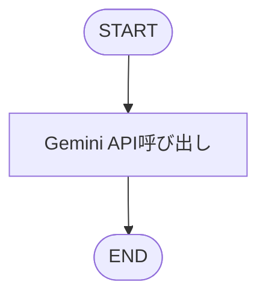
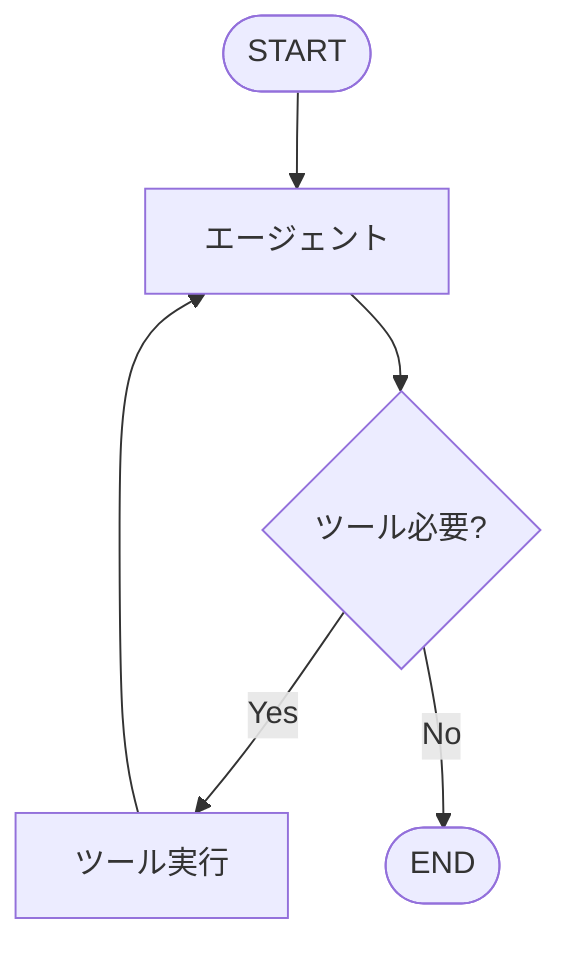
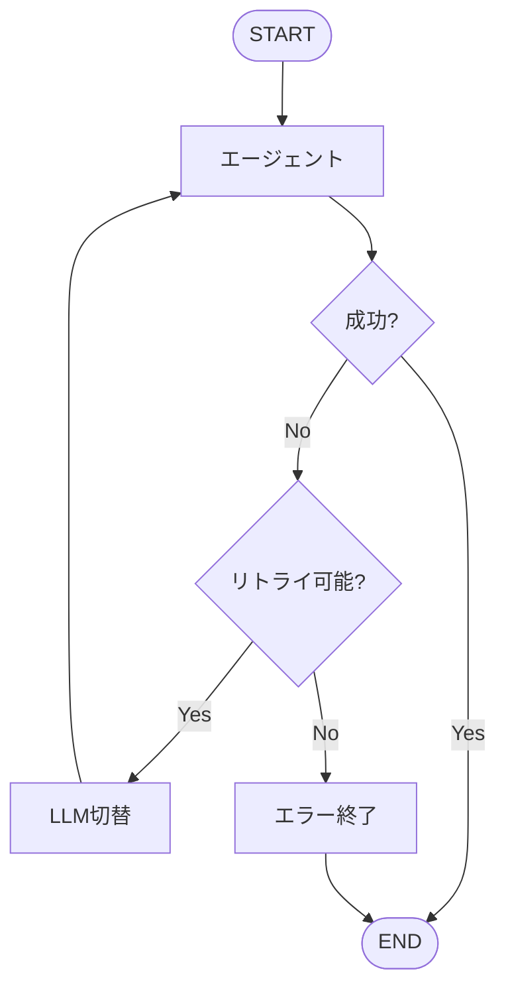
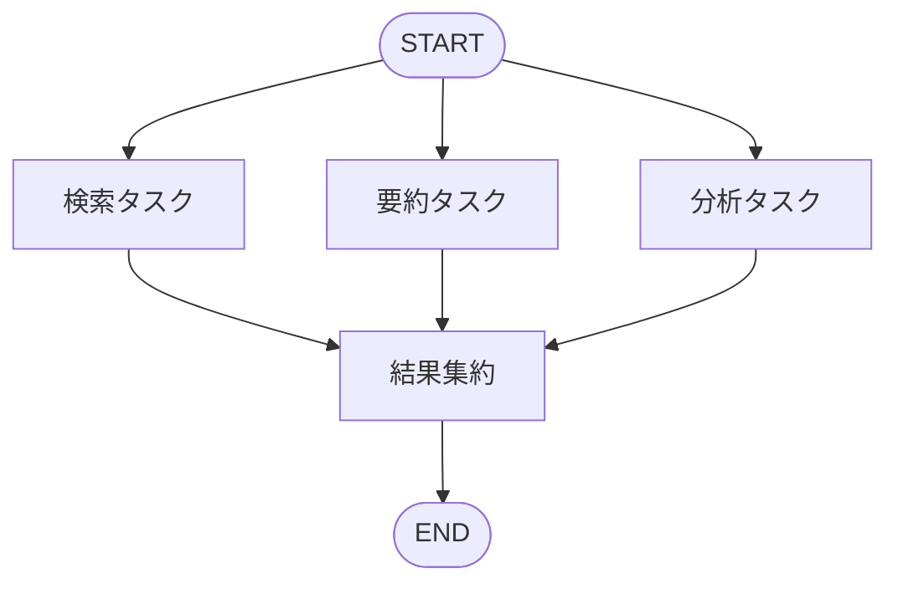
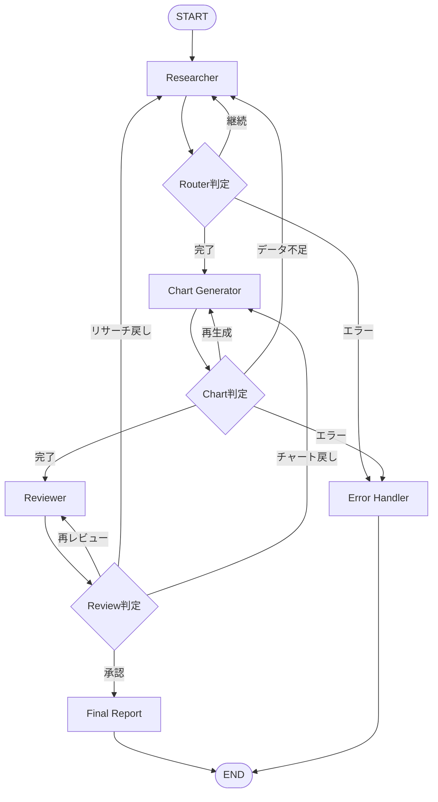

# LangGraph 完全マスターガイド 🚀

**Python 開発者のための実践的入門書**

---

## 📚 目次

- [第 1 章: 最小構成の実装](#第1章-最小構成の実装)
- [第 2 章: 条件分岐とツール統合](#第2章-条件分岐とツール統合)
- [第 3 章: ループ処理とエラーハンドリング](#第3章-ループ処理とエラーハンドリング)
- [第 4 章: 並列処理と非同期実行](#第4章-並列処理と非同期実行)
- [第 5 章: 複雑な分岐と実践的システム](#第5章-複雑な分岐と実践的システム)
- [付録: トラブルシューティング](#付録-トラブルシューティング完全版)

---

# 第 1 章: 最小構成の実装

## 🎯 学習目標

- StateGraph の基本構造を理解
- Start → Process → End の最小フローを構築
- グラフ可視化と実行パターンをマスター

## 📦 環境セットアップ

### 必要なパッケージのインストール

```bash
# 基本パッケージ
pip install langgraph langchain-google-genai langchain-community

# 可視化用
pip install pygraphviz pillow
# pygraphvizが動かない場合
pip install grandalf

# 検索用（第2章以降）
pip install tavily-python

# 非同期処理用（第4章以降）
pip install aiohttp

# エラーハンドリング用
pip install tenacity
```

### API キー設定

```python
import os

# Google AI Studio API
os.environ["GOOGLE_API_KEY"] = "your-google-api-key"

# Tavily Search API（第2章以降）
os.environ["TAVILY_API_KEY"] = "your-tavily-api-key"
```

## 🏗️ 最小構成の実装

### ステップ 1: 必要なモジュールのインポート

```python
from typing import TypedDict
from langgraph.graph import StateGraph, START, END
from langchain_google_genai import ChatGoogleGenerativeAI
from langchain_core.messages import HumanMessage
```

**各モジュールの役割**:

- `TypedDict`: ステートの型定義（型安全性）
- `StateGraph`: グラフの作成
- `START, END`: グラフの開始・終了ノード
- `ChatGoogleGenerativeAI`: Gemini API 接続
- `HumanMessage`: ユーザーメッセージの構造化

### ステップ 2: ステート定義

```python
class State(TypedDict):
    """
    ワークフロー全体で共有される状態

    Attributes:
        input: ユーザーからの入力テキスト
        output: LLMからの出力テキスト
    """
    input: str
    output: str
```

**ステート設計の原則**:

- ✅ 必要最小限のフィールドのみ定義
- ✅ 型ヒントを明示（デバッグが容易）
- ✅ ドキュメント文字列で役割を記述

### ステップ 3: LLM 初期化

```python
# Gemini LLMの初期化
llm = ChatGoogleGenerativeAI(
    model="gemini-2.0-flash-exp",
    temperature=0.7,
    max_tokens=1024
)
```

### ステップ 4: ノード関数の定義

```python
def call_gemini(state: State) -> dict:
    """Gemini APIを呼び出すノード関数"""
    user_input = state["input"]
    response = llm.invoke([HumanMessage(content=user_input)])
    return {"output": response.content}
```

### ステップ 5: グラフの構築

```python
# StateGraphインスタンスを作成
workflow = StateGraph(State)

# ノードを追加
workflow.add_node("gemini", call_gemini)

# フローを定義
workflow.add_edge(START, "gemini")
workflow.add_edge("gemini", END)

# グラフをコンパイル
app = workflow.compile()
```

## 🎨 グラフ可視化

### 可視化の実装

```python
from IPython.display import Image, display

def visualize_and_save_graph(app, filename="workflow_graph.png"):
    """ワークフローグラフを可視化してPNG保存"""
    try:
        png_data = app.get_graph().draw_mermaid_png()
        with open(filename, "wb") as f:
            f.write(png_data)
        print(f"✅ グラフを '{filename}' に保存しました")
    except Exception as e:
        print(f"ℹ️ PNG保存失敗: {e}")
        print("📝 ASCII版グラフ:")
        print(app.get_graph().draw_ascii())
```

### グラフ構造



## ▶️ 実行方法

### 汎用実行関数

```python
def run_workflow(app, initial_state: dict, verbose=True):
    """LangGraphワークフロー実行（全章共通）"""
    if verbose:
        print("=" * 60)
        print("🚀 ワークフロー実行開始")
        print("=" * 60)
        print(f"📥 初期入力: {initial_state}")

    result = app.invoke(initial_state)

    if verbose:
        print("=" * 60)
        print("✅ ワークフロー完了")
        print("=" * 60)
        print(f"📤 結果:\n{result['output']}")

    return result
```

## 🎯 完全なコード例

```python
"""
LangGraph 最小構成 - 完全実装
Start → Gemini → Output
"""

import os
from typing import TypedDict
from langgraph.graph import StateGraph, START, END
from langchain_google_genai import ChatGoogleGenerativeAI
from langchain_core.messages import HumanMessage

# APIキー設定
os.environ["GOOGLE_API_KEY"] = "your-key-here"

# ステート定義
class State(TypedDict):
    input: str
    output: str

# LLM初期化
llm = ChatGoogleGenerativeAI(
    model="gemini-2.0-flash-exp",
    temperature=0.7
)

# ノード関数
def call_gemini(state: State) -> dict:
    user_input = state["input"]
    response = llm.invoke([HumanMessage(content=user_input)])
    return {"output": response.content}

# グラフ構築
workflow = StateGraph(State)
workflow.add_node("gemini", call_gemini)
workflow.add_edge(START, "gemini")
workflow.add_edge("gemini", END)
app = workflow.compile()

# 実行
if __name__ == "__main__":
    result = run_workflow(app, {
        "input": "LangGraphの特徴を3つ教えてください"
    })
```

---

# 第 2 章: 条件分岐とツール統合

## 🎯 学習目標

- 条件分岐（`add_conditional_edges`）の実装
- 外部ツール（Tavily 検索）の統合
- エージェントパターンの理解

## 🛠️ ツール統合の基礎

### ステート定義（メッセージベース）

```python
from typing import Annotated
import operator

class AgentState(TypedDict):
    messages: Annotated[list, operator.add]
```

### ツール設定

```python
from langchain_community.tools.tavily_search import TavilySearchResults
from langgraph.prebuilt import ToolNode

search_tool = TavilySearchResults(
    max_results=3,
    search_depth="advanced"
)

tools = [search_tool]

llm_with_tools = ChatGoogleGenerativeAI(
    model="gemini-2.0-flash-exp",
    temperature=0
).bind_tools(tools)
```

### エージェントノードの実装

```python
def agent_node(state: AgentState) -> dict:
    """エージェント: 次のアクションを決定"""
    messages = state["messages"]
    response = llm_with_tools.invoke(messages)
    return {"messages": [response]}

def should_continue(state: AgentState) -> str:
    """条件分岐: ツール実行 or 終了"""
    last_message = state["messages"][-1]

    if hasattr(last_message, "tool_calls") and last_message.tool_calls:
        return "tools"

    return END
```

### グラフ構築

```python
workflow = StateGraph(AgentState)

workflow.add_node("agent", agent_node)
workflow.add_node("tools", ToolNode(tools))

workflow.add_edge(START, "agent")

workflow.add_conditional_edges(
    "agent",
    should_continue,
    {
        "tools": "tools",
        END: END
    }
)

workflow.add_edge("tools", "agent")

app = workflow.compile()
```

### グラフ構造



---

# 第 3 章: ループ処理とエラーハンドリング

## 🎯 学習目標

- リトライロジックの実装
- 429 エラー（Rate Limit）対策
- 複数 LLM プロバイダーのフォールバック

## 🛡️ エラーハンドリング戦略

### 拡張ステート定義

```python
class RobustState(TypedDict):
    messages: Annotated[list, operator.add]
    retry_count: int
    error_log: list
    current_llm: str
```

### 複数 LLM 設定

```python
llm_primary = ChatGoogleGenerativeAI(
    model="gemini-2.0-flash-exp",
    temperature=0.7
)

llm_backup = ChatGoogleGenerativeAI(
    model="gemini-1.5-pro",
    temperature=0.7
)
```

### リトライ付きノード

```python
from tenacity import retry, stop_after_attempt, wait_exponential

@retry(
    stop=stop_after_attempt(3),
    wait=wait_exponential(multiplier=1, min=4, max=10)
)
def call_llm_with_retry(messages: list, llm):
    return llm.invoke(messages)

def robust_agent_node(state: RobustState) -> dict:
    retry_count = state.get("retry_count", 0)
    current_llm = state.get("current_llm", "primary")

    try:
        llm = llm_primary if current_llm == "primary" else llm_backup
        response = call_llm_with_retry(state["messages"], llm)
        return {
            "messages": [response],
            "retry_count": 0
        }
    except Exception as e:
        if retry_count < 2:
            return {
                "retry_count": retry_count + 1,
                "current_llm": "backup"
            }
        else:
            error_msg = AIMessage(content="システムエラーが発生しました")
            return {"messages": [error_msg]}
```

### グラフ構造



---

# 第 4 章: 並列処理と非同期実行

## 🎯 学習目標

- 並列ノード実行
- 非同期処理による高速化
- 複数 API 呼び出しの最適化

## 🚀 並列処理の実装

### 並列処理用ステート

```python
import asyncio

class ParallelState(TypedDict):
    query: str
    search_results: list
    summary_results: list
    analysis_results: list
    final_output: str
```

### 並列実行ノード

```python
async def search_task(state: ParallelState) -> dict:
    """検索タスク"""
    await asyncio.sleep(1)
    search_tool = TavilySearchResults(max_results=3)
    results = search_tool.invoke({"query": state["query"]})
    return {"search_results": results}

async def summary_task(state: ParallelState) -> dict:
    """要約タスク"""
    await asyncio.sleep(1)
    prompt = f"次のクエリを要約: {state['query']}"
    response = await llm_primary.ainvoke([HumanMessage(content=prompt)])
    return {"summary_results": [response.content]}

async def analysis_task(state: ParallelState) -> dict:
    """分析タスク"""
    await asyncio.sleep(1)
    prompt = f"次のクエリを分析: {state['query']}"
    response = await llm_primary.ainvoke([HumanMessage(content=prompt)])
    return {"analysis_results": [response.content]}
```

### グラフ構築（並列）

```python
workflow = StateGraph(ParallelState)

workflow.add_node("search", search_task)
workflow.add_node("summary", summary_task)
workflow.add_node("analysis", analysis_task)
workflow.add_node("aggregate", aggregate_results)

# 並列エントリーポイント
workflow.add_edge(START, "search")
workflow.add_edge(START, "summary")
workflow.add_edge(START, "analysis")

# 集約ノードへ
workflow.add_edge("search", "aggregate")
workflow.add_edge("summary", "aggregate")
workflow.add_edge("analysis", "aggregate")

workflow.add_edge("aggregate", END)

app = workflow.compile()
```

### グラフ構造



### 並列処理の効果

- **逐次実行**: 3 秒（1 秒 × 3 タスク）
- **並列実行**: 1.2 秒（最も遅いタスク + オーバーヘッド）
- **速度向上**: 約 2.5 倍

---

# 第 5 章: 複雑な分岐と実践的システム

## 🎯 学習目標

- 10 以上の条件分岐を持つ複雑なワークフロー
- マルチエージェントシステム
- 実践的なレート制限対策

## 🏗️ 複雑なステート定義

```python
from enum import Enum
from dataclasses import dataclass

class WorkflowStage(Enum):
    RESEARCH = "research"
    CHART = "chart"
    REVIEW = "review"
    COMPLETE = "complete"
    ERROR = "error"

class ComplexState(TypedDict):
    # 入力
    topic: str
    requirements: dict

    # 処理状態
    stage: str
    iteration: int
    max_iterations: int

    # エージェント結果
    research_data: list
    chart_data: dict
    review_feedback: list

    # エラー管理
    errors: list
    retry_count: int

    # レート制限対策
    last_api_call: float
    api_call_count: int
    current_llm_index: int

    # 最終結果
    final_report: str
    messages: Annotated[list, operator.add]
```

## 🛡️ レート制限マネージャー

```python
import time

class RateLimitManager:
    """APIレート制限管理"""

    def __init__(self, calls_per_minute=10, llms=None):
        self.calls_per_minute = calls_per_minute
        self.min_interval = 60.0 / calls_per_minute
        self.llms = llms or [llm_primary, llm_backup]
        self.current_llm_index = 0

    async def wait_if_needed(self, last_call_time: float):
        """必要に応じて待機"""
        if last_call_time > 0:
            elapsed = time.time() - last_call_time
            if elapsed < self.min_interval:
                wait_time = self.min_interval - elapsed
                await asyncio.sleep(wait_time)

    def get_llm(self, error_count: int = 0):
        """エラー回数に応じてLLMを切り替え"""
        if error_count > 2:
            self.current_llm_index = (self.current_llm_index + 1) % len(self.llms)
        return self.llms[self.current_llm_index]

rate_limiter = RateLimitManager(calls_per_minute=15)
```

## 📊 エージェントノードの実装

### Researcher エージェント

```python
async def researcher_node(state: ComplexState) -> dict:
    """リサーチャー: トピックを調査"""
    await rate_limiter.wait_if_needed(state.get("last_api_call", 0))

    try:
        search_tool = TavilySearchResults(max_results=3)
        search_results = search_tool.invoke({"query": state["topic"]})

        llm = rate_limiter.get_llm(state.get("retry_count", 0))

        prompt = f"""
        トピック: {state['topic']}
        検索結果: {search_results}

        上記を分析し、3つの重要なポイントをまとめてください。
        """

        response = await llm.ainvoke([HumanMessage(content=prompt)])

        research_data = state.get("research_data", [])
        research_data.append({
            "iteration": state.get("iteration", 0),
            "content": response.content
        })

        return {
            "research_data": research_data,
            "stage": WorkflowStage.RESEARCH.value,
            "last_api_call": time.time(),
            "api_call_count": state.get("api_call_count", 0) + 1,
            "messages": [response]
        }
    except Exception as e:
        return {
            "errors": state.get("errors", []) + [str(e)],
            "retry_count": state.get("retry_count", 0) + 1,
            "stage": WorkflowStage.ERROR.value
        }
```

### Router ノード

```python
def researcher_router(state: ComplexState) -> str:
    """リサーチ後のルーティング判定"""
    iteration = state.get("iteration", 0)
    max_iterations = state.get("max_iterations", 3)
    errors = state.get("errors", [])

    if len(errors) > 0:
        retry_count = state.get("retry_count", 0)
        if retry_count < 3:
            return "researcher"
        else:
            return "error_handler"

    if iteration < max_iterations:
        return "researcher"

    return "chart_generator"
```

## 🎨 グラフ構造（全体像）



## 🔀 条件分岐の詳細

**10 以上の分岐ポイント**:

1. **Researcher Router**

   - 継続 → Researcher
   - 完了 → Chart Generator
   - エラー → Error Handler

2. **Chart Router**

   - 再生成 → Chart Generator
   - データ不足 → Researcher
   - 完了 → Reviewer
   - エラー → Error Handler

3. **Review Router**

   - 再レビュー → Reviewer
   - リサーチ要求 → Researcher
   - チャート修正 → Chart Generator
   - 承認 → Final Report

4. **エラー判定**（各ノードで）
   - リトライ可能 → 該当ノード
   - リトライ上限 → Error Handler

**合計**: 15 以上の条件分岐経路

---

# 付録: トラブルシューティング完全版

## ❌ よくあるエラーと解決策

### 1. 429 Rate Limit Error

**エラー**: `google.api_core.exceptions.ResourceExhausted: 429`

**解決策**:

```python
# 解決策1: レート制限マネージャー
rate_limiter = RateLimitManager(calls_per_minute=10)

# 解決策2: 指数バックオフ
@retry(
    wait=wait_exponential(multiplier=1, min=4, max=60),
    stop=stop_after_attempt(5)
)
def call_api():
    return llm.invoke(messages)

# 解決策3: 複数APIキー
api_keys = ["key1", "key2", "key3"]
current_key_index = 0

def get_llm():
    global current_key_index
    os.environ["GOOGLE_API_KEY"] = api_keys[current_key_index]
    current_key_index = (current_key_index + 1) % len(api_keys)
    return ChatGoogleGenerativeAI(model="gemini-2.0-flash-exp")
```

### 2. タイムアウトエラー

**エラー**: `asyncio.TimeoutError`

**解決策**:

```python
llm = ChatGoogleGenerativeAI(
    model="gemini-2.0-flash-exp",
    request_timeout=60,
    max_retries=3
)

async def call_with_timeout(llm, messages, timeout=30):
    try:
        return await asyncio.wait_for(
            llm.ainvoke(messages),
            timeout=timeout
        )
    except asyncio.TimeoutError:
        return await call_with_timeout(llm, messages, timeout * 1.5)
```

### 3. メモリ不足

**解決策**:

```python
def cleanup_state(state: dict) -> dict:
    """古いメッセージを削除"""
    if len(state.get("messages", [])) > 50:
        state["messages"] = state["messages"][-20:]
    return state
```

### 4. グラフ可視化エラー

**解決策**:

```python
# 代替手段1: grandalf
pip install grandalf

# 代替手段2: ASCII表示
print(app.get_graph().draw_ascii())

# 代替手段3: Mermaid
mermaid_code = app.get_graph().draw_mermaid()
print(mermaid_code)
```

## 💡 ベストプラクティス

### ステート設計

```python
# ✅ 良い例
class State(TypedDict):
    user_input: str
    llm_output: str
    error_count: int

# ❌ 悪い例
class State(TypedDict):
    data: dict
    stuff: list
```

### エラーハンドリング

```python
def safe_node(state: State) -> dict:
    try:
        result = risky_operation(state)
        return {"output": result}
    except Exception as e:
        return {
            "errors": state.get("errors", []) + [str(e)],
            "retry_count": state.get("retry_count", 0) + 1
        }
```

## 📊 パフォーマンス最適化

### キャッシング

```python
from functools import lru_cache

@lru_cache(maxsize=100)
def cached_llm_call(prompt: str) -> str:
    return llm.invoke([HumanMessage(content=prompt)]).content
```

### バッチ処理

```python
inputs = [{"input": f"質問{i}"} for i in range(10)]
results = await asyncio.gather(*[
    app.ainvoke(inp) for inp in inputs
])
```

---

## 🎓 まとめ

### 習得した内容

✅ **第 1 章**: 最小構成 - Start → Process → End  
✅ **第 2 章**: 条件分岐とツール統合  
✅ **第 3 章**: ループとエラーハンドリング  
✅ **第 4 章**: 並列処理と非同期実行  
✅ **第 5 章**: 10 以上の分岐を持つ複雑なシステム

### 実践的スキル

- ✅ レート制限対策（429 エラー回避）
- ✅ 複数 LLM のフォールバック
- ✅ 非同期並列処理による高速化
- ✅ 複雑な条件分岐とルーティング
- ✅ マルチエージェント協調システム

**これで、LangGraph の完全マスター完了です！Perfect! 🎉**
